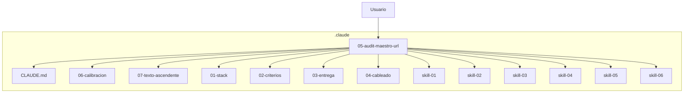
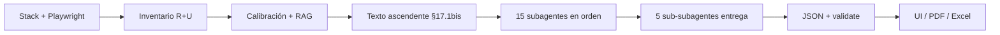

# Diagrama de orquestación — Claude Code (lc-inapi-app)

## Qué es

Mapa visual del workflow PTD-LC v3.0 (**51** `LC-*`): prompts 01–07, skills 01–06, **§17.1bis** (texto ascendente), **15 subagentes** (indicadores) y **5 sub-subagentes** (entrega).

## Cableado `.claude/`

| Pieza | Rol |
| --- | --- |
| `CLAUDE.md` | Constitución · §5 · **§17** · §12 · §19–§23 |
| `prompts/01`…`07` | Orquestación → criterios → entrega → cableado → **maestro** → calibración → **texto ascendente** |
| `skills/01`…`06` | Documentos/RAG · lenguaje CMS · subagentes · Xenova · calibración · texto ascendente |
| Texto ascendente | §17.1bis — palabra→párrafo (Paso D0) |
| Subagentes | §17.1 — un indicador IEW/IESD por vez (orden 1→15) |
| Sub-subagentes | §17.2 — calidad de textos, tono, veracidad, Excel, higiene |
| Frontend / MEI | Consumen JSON |

## Flujo 1 URL

## Etapa D0 — Análisis textual ascendente

Palabra/concepto → frase → oración → párrafo/etapas → forma.  
Prompt: `07-analisis-texto-ascendente.md` · Skill: `06-analisis-texto-ascendente.md` · CLAUDE.md §17.1bis.

## Etapa D — Subagentes (evaluación)

Orden: Fiabilidad → … → Archivo (tabla CLAUDE.md §17.1).  
Skill: `03-instrucciones-subagentes-instrumentos.md`. Consumen el mapa D0.

## Etapa E — Sub-subagentes (entrega)

1 Evidencia · 2 Lenguaje · 3 Veracidad · 4 Estructura Excel · 5 Higiene/sensibles.  
Skills: `02`, `05` · Prompt `03`.

## Multi-URL

Repetir Prompt 5 una vez por URL (orden `mei-meta-mei-urls.ts`). Leer Prompt 6 y ejecutar D0 en cada sesión.

## Recordatorio

**Prompts disparan · CLAUDE.md regula · skills especializan · D0 mapea texto · subagentes evalúan · sub-subagentes pulen · RAG fundamenta · frontend muestra.**

- Maestro: `../prompts/05-audit-maestro-url.md`  
- Calibración: `../prompts/06-calibracion-hallazgos.md`  
- Texto ascendente: `../prompts/07-analisis-texto-ascendente.md`
