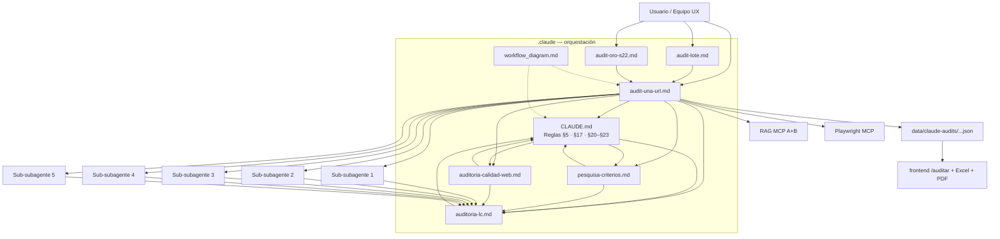
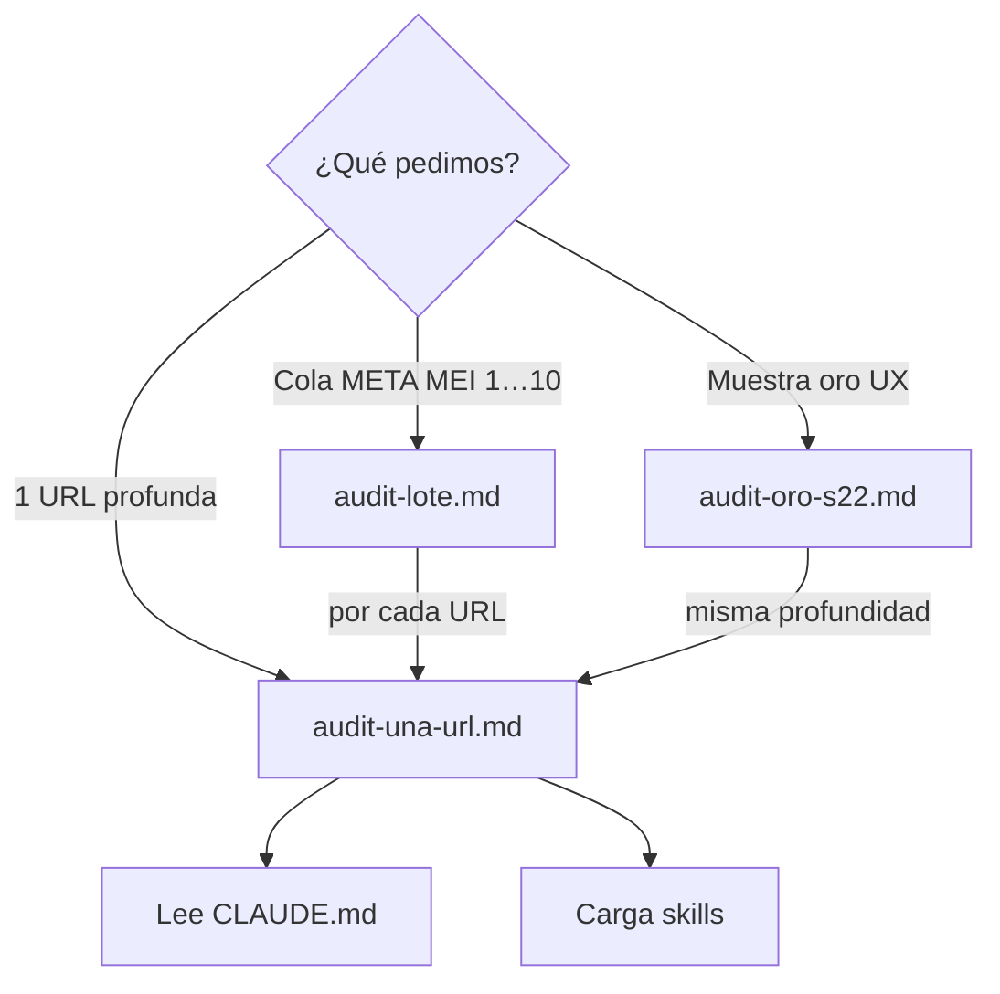
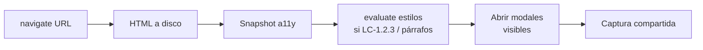
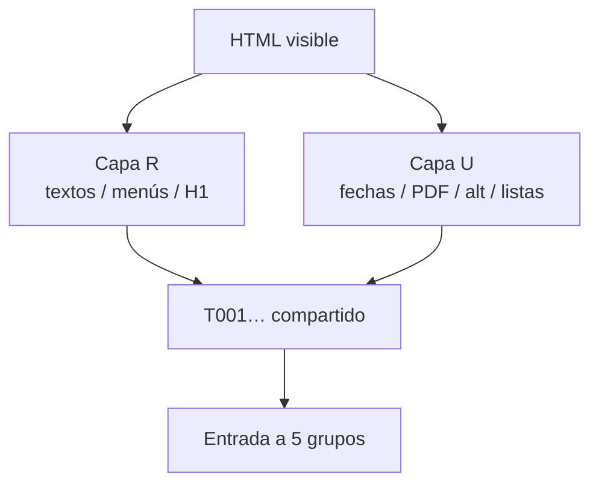
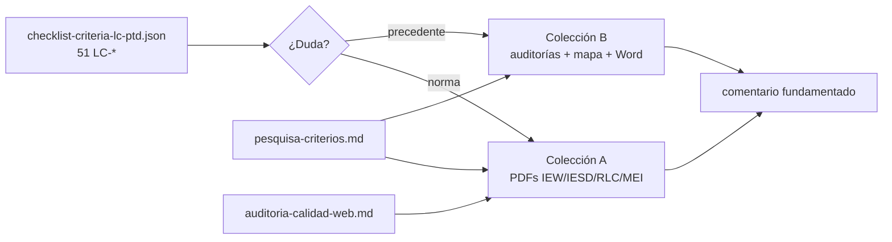
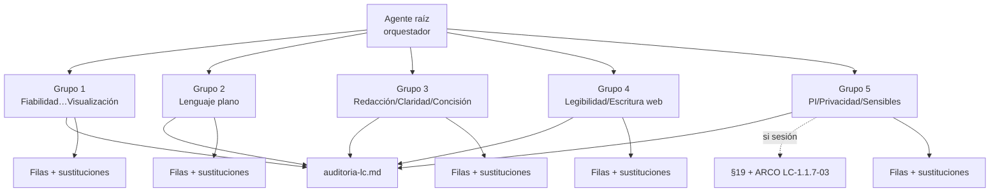
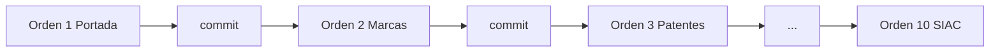

# Diagrama de orquestación — Claude Code (lc-inapi-app)

## Qué es este documento

Mapa visual y narrativo del **workflow de orquestación** que ejecuta Claude Code al auditar URLs INAPI con el checklist PTD-LC v3.0 (**51** criterios `LC-*`).

## Para qué se utiliza

- Entender de un vistazo **quién hace qué**: agente raíz, prompts, skills, reglas (§5), sub-subagentes (§17), RAG, frontend.
- Onboarding de quien lee el repo sin haber corrido aún una auditoría.
- Recordatorio operativo antes de pegar `audit-una-url.md` o coordinar un lote.

## Objetivo

Dejar explícito el flujo **1 URL = 1 sesión**, la captura única, el inventario R+U, las consultas RAG, los **5 sub-subagentes**, la consolidación CMS-first y el cableado a UI/Excel/PDF.

## Importancia en la orquestación

Sin este mapa es fácil mezclar lotes, omitir skills o tratar A–H como vigentes. Con él, Claude Code y el equipo humano comparten el mismo contrato: **prompts disparan · CLAUDE.md regula · skills especializan · sub-subagentes evalúan · RAG fundamenta · frontend muestra**.

---

## 0. Mapa de cableado (toda la carpeta `.claude/`)

| Pieza | Rol | Invoca / conversa con |
| --- | --- | --- |
| **`CLAUDE.md`** | Constitución del proyecto: dominio, checklist 51, **reglas permanentes (§5)**, workflows §12–§14, **sub-subagentes §17**, sesión §19, calibración §20–§21, entrega CMS §22, alcance §23 | Carga skills; apunta a prompts; define grupos 1–5 |
| **`prompts/audit-una-url.md`** | Prompt maestro canónico (1 URL) | Lee CLAUDE §12/§17/§20–§23; carga `auditoria-lc` (+ calidad-web / pesquisa); lanza 5 sub-subagentes; escribe JSON → frontend |
| **`prompts/audit-lote.md`** | Coordinador multi-sesión (cola 1…10) | Por cada URL delega en `audit-una-url.md`; usa orden de `mei-meta-mei-urls.ts` |
| **`prompts/audit-oro-s22.md`** | Muestra calibrada UX (Portada + noticia / plantillas) | Misma profundidad que `audit-una-url`; énfasis §22 |
| **`skills/auditoria-lc.md`** | Cómo inventariar y evaluar los 51 `LC-*` | Usado por **cada** sub-subagente + agente raíz; estados/severidad/CMS |
| **`skills/auditoria-calidad-web.md`** | Marco normativo IEW/IESD/RLC/MEI | Fundamento de `comentario` / `nota_final_tic`; RAG A |
| **`skills/pesquisa-criterios.md`** | Cómo preguntar al catálogo + RAG A/B | Antes/durante evaluación de criterios dudosos |
| **`diagrams/workflow_diagram.md`** | Este archivo | Vista de todo el grafo |
| **Reglas** | = `CLAUDE.md` **§5** (y calibraciones §16, §19–§23) | No hay carpeta `/rules` separada: las reglas viven en CLAUDE.md |
| **Sub-subagentes** | = `CLAUDE.md` **§17** (5 grupos por indicadores) | Instrucciones en prompts Paso D + skill `auditoria-lc` |
| **Frontend** | `/auditar`, launch TS, MEI Excel/PDF | Consumen JSON tras Paso F (no auditan) |



---

## 1. Diagrama general — una URL de punta a punta

```mermaid
flowchart LR
  A[Preparación<br/>URL + tipo + fecha] --> B[Captura Playwright<br/>HTML + a11y]
  B --> C[Inventario R+U<br/>T001…]
  C --> D[RAG A/B + catálogo 51]
  D --> E[5 sub-subagentes<br/>en paralelo]
  E --> F[Consolidación raíz<br/>51 LC-* + sustituciones]
  F --> G[Gate §22.12 + validate]
  G --> H[Cable launch + MEI]
  H --> I[Commit atómico]
  I --> J[Siguiente URL<br/>audit-lote]
```



### Qué ocurre (lenguaje claro)

1. **Preparación:** se elige **una** URL (p. ej. Portada). Se fija `tipo_pagina`, fecha, slug, si hay sesión login.
2. **Captura:** Playwright abre la página **una sola vez** y guarda el HTML (y accesibilidad / estilos si hace falta).
3. **Inventario:** el agente raíz lista lo **visible** en dos capas (redacción R y formato U).
4. **RAG + catálogo:** se leen los 51 criterios en disco y se consultan fragmentos normativos (A) y precedentes (B).
5. **Cinco especialistas:** cada sub-subagente evalúa solo su bloque de indicadores `LC-*`.
6. **Consolidación:** el raíz une 51 filas, propone textos para CMS, aplica cruces y patrones.
7. **Validación:** `validate:claude-audits` + reescritura si el copy no sirve a un editor.
8. **Cableado:** el JSON pasa a existir para la UI (`/auditar/resultado`), Excel MEI y PDF.
9. **Commit:** una URL = un commit; recién ahí se abre la siguiente.

**Importancia:** concentra el contexto en una página, evita “cumple por fatiga” y entrega un JSON completo y accionable.

---

## 2. Etapa — Disparo del prompt (qué documento se pega)



| Documento | Ejecuta | Resuelve | Importancia |
| --- | --- | --- | --- |
| `audit-una-url.md` | Pasos A–F | Una auditoría JSON v3.0 completa | **Canónico** — todo lo demás delega aquí |
| `audit-lote.md` | Secuencia + aislamiento | Orden Portada→Marcas→…→SIAC | Evita mezclar páginas en un solo prompt |
| `audit-oro-s22.md` | Énfasis §22 + ids fijos | Calibración para reunirse con UX | Portada = orden 1; noticia = orden **9** (no es “paso 2”) |

---

## 3. Etapa — Captura (Paso A)



**Invoca:** Playwright MCP (CLAUDE.md §8 / §11).  
**Ejecuta:** una navegación; HTML en `auditorias/htmls/`.  
**Resuelve:** evidencia real de lo que ve el ciudadano.  
**Importancia:** sin captura única, los 5 grupos inventarían estados distintos.

---

## 4. Etapa — Inventario R+U (Paso B)



**Invoca:** skill `auditoria-lc.md` Fase 0; reglas VISIBLE de CLAUDE.md §20.  
**Ejecuta:** numeración `Tnnn` con ancla HTML; ausencias explícitas; anonimización si §19.  
**Resuelve:** mapa de hallazgos antes de puntuar.  
**Importancia:** CMS luego dirá “dónde mirar”; TI tendrá línea HTML como apoyo.

---

## 5. Etapa — RAG y catálogo (Paso C)



**Invoca:** MCP `rag-auditoria`; skills pesquisa + calidad-web.  
**Ejecuta:** queries puntuales (no PDFs enteros); exige `ingest:b` si el repo cambió.  
**Resuelve:** por qué incumple y cómo se resolvió antes.  
**Importancia:** coherencia normativa + calibración INAPI sin alucinar KB ni citas.

---

## 6. Etapa — Sub-subagentes (Paso D / CLAUDE.md §17)



| Grupo | Qué evalúa | Qué resuelve |
| --- | --- | --- |
| 1 | `LC-1.1.1/2/4`, `LC-1.3.*` | Completitud, fecha, objetividad, archivo; **visualización = ¿hay apoyos visibles?** (no `alt`) |
| 2 | `LC-1.1.3-01…06` | Legible, **jerga en títulos/menú/tooltip**, siglas, tono |
| 3 | Redacción / claridad / concisión | Ortografía, oraciones, párrafos |
| 4 | Legibilidad / escritura web | Espacios, **títulos claros**, PDF, escaneo texto+tarjetas (no grilla UI) |
| 5 | PI / privacidad / sensibles | RUN, ARCO, licencias; crítico con sesión |

**Reglas que aplican aquí (§5 + §20.6):** estados solo `cumple` \| `incumple` \| `no_aplica`; `severidad` solo en incumple (UI: Cumple con observaciones / Medianamente cumple / No cumple); cobertura 1:1 → `sustituciones[]`; CMS primero.

**Importancia:** profundidad por indicador sin diluir el contexto de 51 preguntas en una sola pasada.

---

## 7. Etapa — Consolidación, gate CMS y cierre (Pasos E–F)

```mermaid
flowchart TD
  MERGE[Unir 51 LC-*] --> CRUZ[Cruces §20.3<br/>mismo nodo]
  CRUZ --> PAT[patron_sistema Layout]
  PAT --> SUB[sustituciones[] CMS-first]
  SUB --> GATE[Gate §22.12<br/>casillas / realismo]
  GATE --> VAL[validate:claude-audits]
  VAL --> CAB[Cable launch + mei-meta-mei-urls]
  CAB --> GIT[Commit por URL]
  GIT --> FE[Frontend /auditar<br/>Excel · PDF]
  GIT --> ING[Opcional ingest:b]
```

**Invoca:** CLAUDE.md §20.3, §22, §23; schemas Zod; scripts validate; archivos `frontend/src/lib/*launch*` y `mei-meta-mei-urls.ts`.  
**Ejecuta:** un solo JSON canónico; % con `summarizeEvaluations`; sin score US/SE.  
**Resuelve:** entrega que un editor Sitefinity entiende *dónde* y *qué* cambiar.  
**Importancia:** conecta la orquestación IA con el producto que ve INAPI.

---

## 8. Etapa — Multi-URL (audit-lote)



Cada caja interna = ciclo completo de las secciones 1–7. **No** se reutiliza el inventario entre URLs.

---

## 9. Estados y severidad (contrato transversal)

```mermaid
flowchart LR
  E{estado JSON}
  E -->|cumple| UI1[Cumple]
  E -->|no_aplica| UI2[No aplica]
  E -->|incumple| SEV{severidad}
  SEV -->|baja| UI3[Cumple con observaciones]
  SEV -->|media| UI4[Medianamente cumple]
  SEV -->|alta| UI5[No cumple]
  SEV --> SUST[sustituciones[] obligatoria]
```

Nunca `null`. Las etiquetas intermedias **no** son un cuarto estado JSON.

---

## 10. Cómo “conversan” las piezas (resumen operativo)

1. El usuario pega un **prompt** → el prompt ordena leer **CLAUDE.md** (reglas + §17).  
2. El raíz carga **skills** según la tarea (lc siempre; calidad-web para norma; pesquisa para RAG).  
3. Los **sub-subagentes** reciben el mismo inventario y devuelven solo su bloque.  
4. El raíz consolida con **reglas §5/§20/§22** y escribe el JSON.  
5. El **frontend** no decide criterios: solo muestra lo cableado en launch/MEI.  
6. El **diagrama** (este archivo) no ejecuta nada: alinea a humanos y a Claude Code sobre el grafo vigente.

---

## Referencias rápidas

- Constitución: `../CLAUDE.md`
- Prompt canónico: `../prompts/audit-una-url.md`
- Skills: `../skills/`
- RAG: `../../rag/README.md` · `bun run ingest:b`
- Orden META MEI: `../../src/lib/mei-export/mei-meta-mei-urls.ts`
