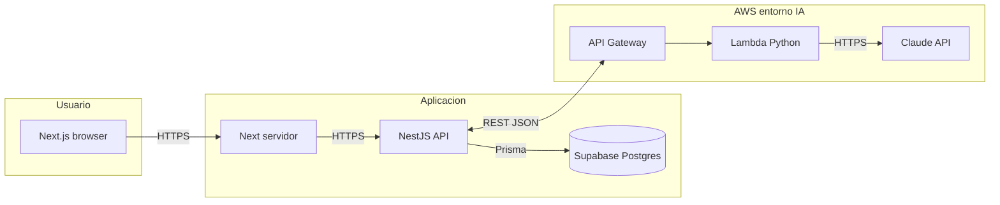

# Arquitectura del sistema
## MVP — Aplicativo de Auditoría de Lenguaje Claro INAPI

| Metadatos | Detalle |
| --- | --- |
| **Versión** | 0.4 |
| **Tipo** | Web app — Next.js (App Router) + API NestJS (Prisma) + Postgres/Auth (Supabase) + **servicio de evaluación LC (Python en AWS Lambda, detrás de API Gateway) + Claude API** |
| **Gestor de paquetes** | Bun |

Fuente de acuerdos de reunión y roles: [Propuesta técnica integral](PROPUESTA_TECNICA_INTEGRAL.md).

---

## 1. Visión general

### 1.1 Objetivo (runtime con backend y LLM)

El flujo productivo acordado expone el **servicio Python** en **AWS** detrás de **API Gateway**; **NestJS** invoca ese endpoint con **REST/JSON**, valida la respuesta y persiste en **Supabase** vía Prisma.

**Alternativas** si Lambda no encaja (timeouts, payload, cold start): **ECS/Fargate** o **EC2** para el mismo código Python; el contrato Nest ↔ servicio de evaluación sigue siendo HTTP/JSON.

### 1.2 Fase mock (Fase 1 producto)

Hasta aprobar el mock de UI:

- **No** hay llamadas productivas a Supabase ni a Claude desde la app demo.
- Contratos y datos: **`data/checklist-criteria.json`**, futuros **`data/audit-fixtures/*.json`**, [`src/schemas/checklist.ts`](../src/schemas/checklist.ts).
- Next en `frontend/` sirve flujo **ingreso → estado de carga (copy honesto) → resultado** con datos generados o importados desde fixtures validados.

### 1.3 Monorepo: layout objetivo vs actual

| Objetivo ([propuesta técnica integral](PROPUESTA_TECNICA_INTEGRAL.md)) | Estado actual del repo |
| --- | --- |
| `apps/frontend/` | [`frontend/`](../frontend/) en la raíz (workspace Bun) |
| `apps/backend-api/` | Pendiente (Fase 2) |
| `apps/evaluation-service/` | Pendiente (Fase 2) |
| `packages/contracts/` (Zod compartido) | [`src/schemas/`](../src/schemas/) + alias `@contracts/*` en `frontend/tsconfig.json` |

La migración física a `apps/` y `packages/contracts/` es **decisión de Fase 2** o PR de reestructura; no bloquea el mock en Fase 1.

### 1.4 Desarrollo local

- **Bun** en la raíz para frontend y scripts de validación de datos.
- **Docker** (recomendado en la propuesta técnica): levantar el **servicio Python** de evaluación con la misma imagen o Dockerfile que se usará en AWS, para alinear parseo y dependencias con Camila sin instalar Python globalmente en cada máquina.

---

## 2. Decisiones de stack (resumen)

| Capa | Elección | Notas |
| --- | --- | --- |
| Framework | **Next.js** (última estable, App Router) | Turbopack en `next dev` (default en versiones recientes) |
| Lenguaje | TypeScript estricto | Compartir esquemas Zod FE/BE |
| UI | Tailwind + shadcn/ui + **Design system** INAPI/Gobierno ([`DESIGN_SYSTEM.md`](DESIGN_SYSTEM.md)) | Fase 1: alinear tokens y tipografía al MVP |
| Formularios | React Hook Form + Zod | Misma fuente de verdad que mocks |
| Datos | **Supabase** (Postgres) + **Prisma** en Nest | Mismo motor; ORM y migraciones en el servicio API ([ADR 0005](adr/0005-api-backend-nestjs-prisma.md)) |
| API de aplicación | **NestJS** (Node.js) | Dominio, persistencia, orquestación hacia API Gateway |
| Evaluación LC + LLM | **Python** (Lambda) + **Claude API** | Tras API Gateway; [ADR 0006](adr/0006-lc-evaluation-python-claude-aws.md); validación contractual [ADR 0004](adr/0004-llm-checklist-evaluation-and-versioning.md) |
| Runtime local / CI | **Bun** | `bun install`, `bun run`, lockfile `bun.lock` |
| Infra compartida | **AWS** (API Gateway + Lambda por defecto; ECS/EC2 si aplica) | Detalle y preguntas abiertas en ADR 0006 y propuesta técnica |

Detalle en [docs/adr/0002-stack-next-bun-supabase.md](adr/0002-stack-next-bun-supabase.md), [docs/adr/0004-llm-checklist-evaluation-and-versioning.md](adr/0004-llm-checklist-evaluation-and-versioning.md), [docs/adr/0005-api-backend-nestjs-prisma.md](adr/0005-api-backend-nestjs-prisma.md) y [docs/adr/0006-lc-evaluation-python-claude-aws.md](adr/0006-lc-evaluation-python-claude-aws.md).

---

## 3. Contratos de datos

- **Catálogo:** `checklistCriteriaFileSchema` ↔ `data/checklist-criteria.json`.
- **Evaluación:** `criterionEvaluationSchema` × 39.
- **Auditoría persistida o mock:** `auditRecordSchema` / `strictAuditRecordSchema` (consistencia resumen vs. detalle).
- **Fixtures:** JSON versionado bajo `data/audit-fixtures/` (convención en roadmap), validados en CI o script local igual que el catálogo.

Implementación actual de esquemas: [`src/schemas/checklist.ts`](../src/schemas/checklist.ts) (equivalente conceptual a `packages/contracts` del monorepo objetivo).

---

## 4. Flujo principal (runtime objetivo)

1. Usuario autenticado (Supabase Auth; método a definir con TI: magic link, Google workspace, etc.).
2. Ingresa URL o elige URL prioritaria (inventario interno; ver `url_index` en [DATABASE.md](DATABASE.md)).
3. **NestJS** ejecuta **captura**; se muestra texto para confirmación (vía Next).
4. NestJS llama al **API Gateway** (REST/JSON) con texto y metadatos de checklist/prompt; **Lambda (Python)** invoca **Claude**, valida y devuelve JSON contractual.
5. NestJS valida de nuevo con Zod (`strictAuditRecordSchema` cuando sea registro completo) → reintento o degradación si falla ([ADR 0004](adr/0004-llm-checklist-evaluation-and-versioning.md)).
6. Usuario revisa **texto propuesto** y hallazgos.
7. **NestJS** guarda en Postgres (Prisma); histórico por URL; export.

---

## 5. Seguridad

- **RLS** en todas las tablas con datos de usuario/auditoría.
- **Service role** de Supabase y **claves Anthropic** solo en entorno servidor (Nest y/o secreto de Lambda); **nunca** en el cliente ni en variables `NEXT_PUBLIC_*`.
- **Autenticación Nest ↔ API Gateway** (API keys, IAM, mTLS o JWT de servicio): por definir con TI y Camila (ver ADR 0006).
- Logs sin contenido sensible completo (opcional: hash del texto).

---

## 6. Observabilidad

- Métricas de latencia por etapa: captura, **API Gateway + Lambda**, Claude, persistencia.
- Traza `audit_id` en logs de Nest y correlación con solicitudes al servicio de evaluación.

---

*Ver también [DATABASE.md](DATABASE.md). El índice de ADR está en el [README.md](../README.md) en la raíz del repositorio.*
