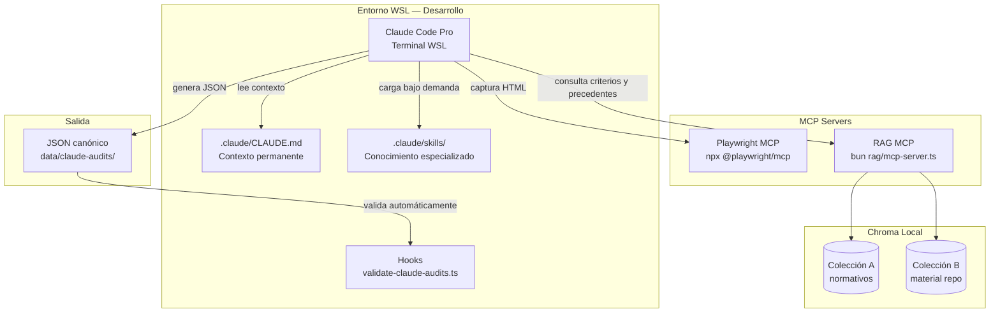

# Arquitectura del sistema
## MVP — Aplicativo de Auditoría de Lenguaje Claro INAPI

| Metadatos | Detalle |
| --- | --- |
| **Versión** | 1.0.0 |
| **Tipo** | Web app — Next.js (Vercel) + Claude Code Pro (orquestador local, WSL) + Chroma RAG (local / servidor TI) + Playwright MCP + @xenova/transformers |
| **Gestor de paquetes** | Bun |
| **Última actualización** | 2026-07-21 |

Propuesta técnica y acuerdos: [PROPUESTA_TECNICA_INTEGRAL.md](PROPUESTA_TECNICA_INTEGRAL.md).
Decisiones clave: [ADR 0008](adr/0008-typescript-sobre-python-para-rag.md) · [ADR 0009](adr/0009-claude-code-pro-como-orquestador.md) · [ADR 0010](adr/0010-rag-local-chroma-xenova-transformers.md).

---

## 1. AI Stack — 5 capas

### Capa 1 — Infraestructura

| Entorno | Tecnología |
| --- | --- |
| Desarrollo | WSL local (Ubuntu, Bun, Node 20) |
| Frontend | Vercel (tier gratuito) |
| Backend futuro | Railway (tier gratuito) — fase posterior, no bloqueante |
| BD futura | Supabase (PostgreSQL 16, tier gratuito) — fase posterior |
| Producción IA | Servidor interno TI de INAPI (Octavio) — fase final |

Chroma corre como proceso local en desarrollo (`chroma run --path ./rag/chroma_db --port 8000`) y se copia al servidor TI en producción. **Ningún documento interno sale a internet.**

### Capa 2 — Modelo

| Componente | Tecnología |
| --- | --- |
| Embeddings | `@xenova/transformers` (NPM) — modelo `Xenova/paraphrase-multilingual-MiniLM-L12-v2` (~400 MB, offline en CPU) |
| Análisis LC | Claude Code Pro (suscripción existente, sin API key, sin costo adicional) |

### Capa 3 — Data (dos colecciones Chroma, completamente aisladas)

**Colección A — documentos normativos** (fuente: `documentos/`, en `.gitignore`):
- `calidad-web-2.0.pdf`, `meta-mei.pdf`, `ui-kit-gobierno-3.0.1.pdf`
- `instrumento-evaluacion-sitios-web.pdf`, `instrumento-evaluacion-servicios-digitales-transaccionales.pdf`
- `lenguaje-claro-recomendaciones.pdf`

**Colección B — material de trabajo del repo**:
- `data/checklist-criteria.json` (fuente de verdad de los 39 criterios)
- `data/claude-audits/**/*.json` (JSONs canónicos históricos)
- `prompts/claude-code/*.md` y `prompts/devtools/*.md` (cuando existan)
- `docs/adr/*.md`

**Nunca entran al RAG:** datos de usuarios INAPI, RUT/RUN de personas, solicitudes de marca, resultados del buscador de anterioridades, credenciales.

### Capa 4 — Orquestación

Componentes:

| Componente | Descripción |
| --- | --- |
| **Claude Code Pro** | Orquestador principal; corre en terminal WSL |
| **CLAUDE.md** | Contexto permanente del proyecto en cada sesión |
| **Skills** | `.claude/skills/auditoria-lc.md`, `auditoria-calidad-web.md`, `pesquisa-criterios.md` |
| **Subagents** | Un subagente por URL para auditorías en paralelo |
| **Hooks** | Validación automática de JSONs al guardarse |
| **Playwright MCP** | Navega URLs, extrae HTML completo |
| **RAG MCP** | Expone colecciones A y B a Claude Code como herramientas de búsqueda semántica |
| **LangChain.js** | Orquesta los pipelines RAG (TypeScript, no Python) |

### Capa 5 — Aplicación

| Componente | Estado |
| --- | --- |
| `/auditar` en Next.js | Operativo en Vercel |
| JSONs canónicos | 9 URLs operativas en `data/claude-audits/` (piloto junio 2026) |
| Informes PDF | `GET /api/claude-audits/[id]/export/pdf` operativo |
| Excel consolidado MEI INAPI | Procedimiento y plantilla en [`plantilla-excel-mei-bcd.md`](plantilla-excel-mei-bcd.md); flujo DevTools en [`stack-orquestación.md`](stack-orquestación.md) |

---

## 2. Historial de fases completadas

### 2.1 Fase 1 — Mock UX (completada)

- No hay llamadas productivas a Supabase ni a Claude desde la app.
- Contratos: `data/checklist-criteria.json`, `data/audit-fixtures/*.json`, `src/schemas/checklist.ts`.
- Next en `frontend/` sirve flujo: portal `/` → ingreso URL `/auditar` → resultado `/auditar/resultado`.
- Inventario mock 22 URLs Clarity con `type_url` y filtros en `/auditar`.

### 2.2 Fase 1.5 — Piloto auditoría con Claude (completada, 2026-06-08)

- **Evaluación:** Proyecto Claude en interfaz web; el operador exporta JSON y lo versiona en `data/claude-audits/`.
- **Adaptador:** `src/schemas/claude-audit-pilot.ts` (`parseClaudeAuditFile` → `strictAuditRecordSchema`).
- **API:** `GET /api/claude-audits/[id]` y `GET /api/claude-audits/[id]/export/pdf`.
- **UI:** acordeón piloto en `/auditar`; resultado con siete bloques y PDF descargable.
- **9 URLs operativas** (7 `sitioweb` + 2 `tramites`).

### 2.3 CI y despliegue (operativo)

- **Vercel:** root `frontend`, install/build desde raíz del monorepo con Bun.
- **GitHub Actions:** `typecheck:all` + `lint` en cada push/PR.

---

## 3. Contratos de datos

- **Catálogo:** `checklistCriteriaFileSchema` ↔ `data/checklist-criteria.json` (fuente de verdad de los 39 criterios).
- **Evaluación por criterio:** `criterionEvaluationSchema` × 39 (incluye `severidad` y `comentario` opcionales).
- **Auditoría completa:** `strictAuditRecordSchema` — 7 secciones (datos, resumen, pasos, criterios, observaciones por severidad, sustituciones 1:1, nota TIC).
- **Validación:** Zod en `src/schemas/checklist.ts`; script `validate:claude-audits`; Hooks automáticos al guardar.
- **Modelo lógico de datos y parseo:** [ADR 0007](adr/0007-modelo-datos-parseo-pre-conexiones.md) (diagrama ER, mapeo Zod ↔ columnas Postgres, pendiente actualización de flujo).

---

## 4. Flujo principal (pipeline de auditoría automatizado)

1. Claude Code Pro recibe la URL a auditar.
2. **Playwright MCP** navega la URL y extrae el HTML completo.
3. **RAG MCP** consulta la Colección B (criterios, precedentes) y la Colección A (fuentes normativas) para proveer contexto semántico relevante.
4. Claude Code Pro analiza el HTML contra los 39 criterios del checklist v1.1, apoyado en el contexto del `CLAUDE.md` y las Skills cargadas.
5. Claude Code Pro genera el JSON canónico (`strictAuditRecordSchema`) y lo guarda en `data/claude-audits/`.
6. El Hook valida automáticamente el JSON con `validate-claude-audits.ts`; si falla, Claude Code Pro corrige antes de finalizar.
7. El operador verifica en `/auditar/resultado` y descarga el informe PDF.

Para lotes de URLs, los pasos 1–6 corren en paralelo con subagents (un subagente por URL).

---

## 5. Seguridad

Ver [SECURITY.md](SECURITY.md) para el detalle completo. Resumen:

- Todo el procesamiento de IA corre localmente en WSL; ningún documento interno sale a internet.
- `documentos/` y `rag/chroma_db/` están en `.gitignore`; los PDFs y vectores no se versionan.
- Los embeddings se generan con `@xenova/transformers` en CPU local, sin llamadas a APIs externas.
- Claude Code Pro lee los documentos como texto en el contexto local de la sesión; no los envía a Anthropic.
- Datos que nunca entran al RAG: RUT/RUN, solicitudes de marca, credenciales.

---

## 6. Layout del repo (estado actual vs. objetivo)

| Directorio | Estado | Descripción |
| --- | --- | --- |
| `frontend/` | Operativo | Next.js App Router, workspace Bun |
| `src/schemas/` | Operativo | Esquemas Zod compartidos (equivalente a `packages/contracts`) |
| `data/` | Operativo | Checklist, fixtures, JSONs canónicos |
| `docs/` | Operativo | ADRs, ARCHITECTURE, ROADMAP, etc. |
| `.claude/` | **Por crear — Fase 0** | `CLAUDE.md` y Skills |
| `rag/` | **Por crear — Fase 2** | Workspace TypeScript: ingesta, query, MCP server |
| `documentos/` | **Por crear localmente** | PDFs normativos (gitignored, nunca al repo) |

---

*Ver también [DATABASE.md](DATABASE.md) · [ROADMAP.md](ROADMAP.md) · [SECURITY.md](SECURITY.md). El índice de ADR está en el [README.md](../README.md).*
