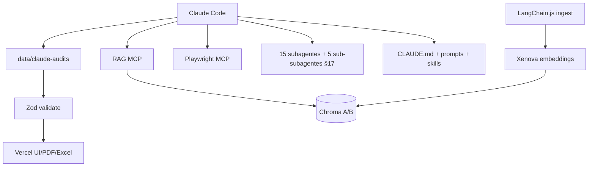

# Arquitectura del sistema
## MVP — Aplicativo de Auditoría de Lenguaje Claro INAPI

| Metadatos | Detalle |
| --- | --- |
| **Versión** | 2.0.0 |
| **Última actualización** | 2026-08-21 |
| **Tipo** | Web app — Next.js (Vercel) + Claude Code (orquestador PC/WSL) + Chroma RAG + Playwright MCP + @xenova/transformers + LangChain.js |
| **Gestor de paquetes** | Bun |
| **Checklist vigente** | PTD-LC **v3.0** — **51** criterios `LC-*` |
| **Muestra META MEI** | **10 URLs** (`mei-meta-mei-urls.ts`) |

Propuesta técnica: [PROPUESTA_TECNICA_INTEGRAL.md](PROPUESTA_TECNICA_INTEGRAL.md).  
ADR clave: [0008](adr/0008-typescript-sobre-python-para-rag.md) · [0009](adr/0009-claude-code-pro-como-orquestador.md) · [0010](adr/0010-rag-local-chroma-xenova-transformers.md) · [0011](adr/0011-worker-local-on-demand-vercel.md).  
Despliegue: [despliegue/despliegue-hibrido.md](despliegue/despliegue-hibrido.md).

**Propuestas antiguas (no se implementan):** NestJS, Prisma, Supabase Auth/Postgres, AWS Lambda/API Gateway, Claude API de pago, Firebase — ver [ADR 0002](adr/0002-stack-next-bun-supabase.md) (obsoleto en datos), [ADR 0006](adr/0006-lc-evaluation-python-claude-aws.md).

---

## 1. AI Stack — 5 capas (vigente)

### Capa 1 — Infraestructura

| Entorno | Tecnología |
| --- | --- |
| Desarrollo / auditoría | WSL o PC INAPI (Bun, Claude Code, Chroma `:8000`) |
| Frontend | **Vercel** (Next.js App Router) |
| Código y CI | **GitHub** + GitHub Actions |
| Persistencia MVP | Archivos JSON en el repo (`data/claude-audits/`, `data/jobs/`) |
| Login | **Ninguno** — acceso libre personal INAPI |

### Capa 2 — Modelo

| Componente | Tecnología |
| --- | --- |
| Orquestación / análisis LC | **Claude Code** (cuenta institucional) |
| Embeddings | **`@xenova/transformers`** — `Xenova/paraphrase-multilingual-MiniLM-L12-v2` (CPU, offline) |

### Capa 3 — Data (RAG + catálogo)

**Colección A** (`ingest:a`): PDFs en `documentos/` (gitignore) — Meta MEI, RLC, IEW, IESD, UI Kit.  
**Colección B** (`ingest:b`): catálogo `checklist-criteria-lc-ptd.json`, mapa PTD, Word extraído, JSON de auditorías, ADRs, skills/prompts relevantes.

**Catálogo máquina:** 51 preguntas `LC-*` · `version_checklist: "3.0"`.  
Históricos 39/47 A–H = solo legado.

### Capa 4 — Orquestación

```mermaid
flowchart TD
  CC[Claude Code]
  CM[CLAUDE.md + prompts + skills]
  SA[15 subagentes + 5 sub-subagentes §17]
  PW[Playwright MCP]
  RAG[RAG MCP]
  CH[(Chroma A/B)]
  XE[Xenova embeddings]
  LC[LangChain.js ingest]
  Z[Zod validate]
  JSON[data/claude-audits]
  V[Vercel UI/PDF/Excel]

  CC --> CM
  CC --> SA
  CC --> PW
  CC --> RAG
  RAG --> CH
  LC --> XE --> CH
  CC --> JSON --> Z --> V
```

| Componente | Descripción |
| --- | --- |
| Claude Code | Orquesta captura, RAG, evaluación 51 criterios, JSON |
| CLAUDE.md / prompts / skills | Contrato editorial y operativo |
| §17 | **15** subagentes (1 indicador LC) + **5** sub-subagentes de entrega CMS |
| Playwright MCP | HTML/DOM real (y sesión ClaveÚnica si aplica) |
| LangChain.js | Pipeline de **ingesta** (troceo → embed → Chroma) |
| Xenova | Embeddings locales |
| Chroma + MCP | Búsqueda semántica A/B |
| Zod / Hooks | `validate:claude-audits` |

### Capa 5 — Aplicación

| Componente | Estado |
| --- | --- |
| `/auditar`, historial, MEI | Operativo |
| 10 URLs META MEI | Cable en `mei-meta-mei-urls.ts` |
| PDF / Excel | APIs + `export:mei-xlsx` |
| Worker on-demand | `audit-jobs` + worker PC (ADR 0011) |

---

## 2. Historial breve

| Fase | Qué quedó |
| --- | --- |
| Mock UX | Fixtures Zod, inventario Clarity |
| Piloto 1.5 | JSON + PDF (9 URLs junio); evolucionó a META MEI 10 |
| Claude Code + RAG | Stack actual §17 + Chroma + Playwright |
| Nest/AWS/Supabase | **Retirados** como plan de producto |

---

## 3. Contratos de datos

- Catálogo: `data/checklist-criteria-lc-ptd.json` + Zod en `src/schemas/checklist.ts` (**51** `LC-*`).  
- Auditoría: JSON canónico en `data/claude-audits/` + `claude-audit-pilot.ts`.  
- Validación: `bun run validate:claude-audits`.  
- Parseo/embeddings: [ADR 0007](adr/0007-modelo-datos-parseo-pre-conexiones.md).

---

## 4. Flujo de una auditoría (1 URL)

1. Prompt `05-audit-maestro-url` (una sola URL; leer Prompt 6).
2. Playwright captura HTML (+ a11y).  
3. Inventario visible + catálogo 51 + consultas RAG A/B.  
4. Cinco sub-subagentes §17.  
5. Consolidación CMS (§22) → JSON → Zod.  
6. Cable UI / PDF / Excel / commit.

Lotes META MEI: repetir Prompt `05-audit-maestro-url`. Worker: claim job → mismo §17.

---

## 5. Seguridad

Ver [SECURITY.md](SECURITY.md). Resumen: procesamiento local; `documentos/` y `chroma_db/` fuera de git; Xenova offline; sin PII en RAG; sin login MVP.

---

## 6. Layout del repo

| Directorio | Estado |
| --- | --- |
| `frontend/` | Next operativo |
| `src/schemas/`, `src/lib/` | Zod, MEI, worker helpers |
| `data/` | Catálogo, auditorías, jobs, fixtures |
| `.claude/` | CLAUDE.md, prompts, skills, diagramas |
| `rag/` | ingest A/B, MCP, Chroma path |
| `documentos/` | PDFs locales (gitignore) |
| `docs/` | ADR, PRD, roadmap, despliegue |

---

*Ver [DATABASE.md](DATABASE.md) · [ROADMAP.md](ROADMAP.md) · [README.md](../README.md).*
