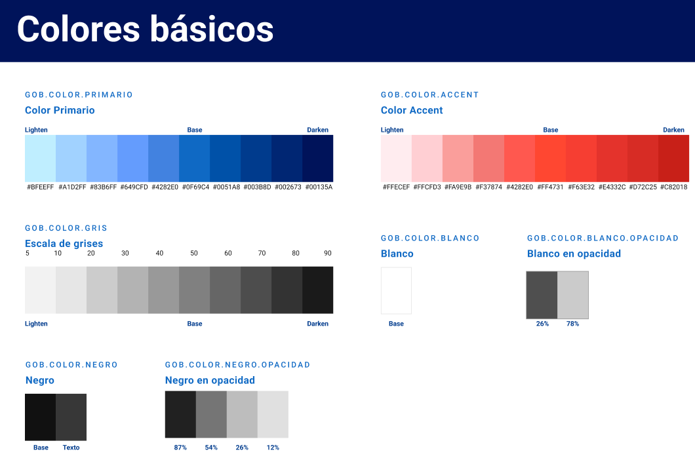
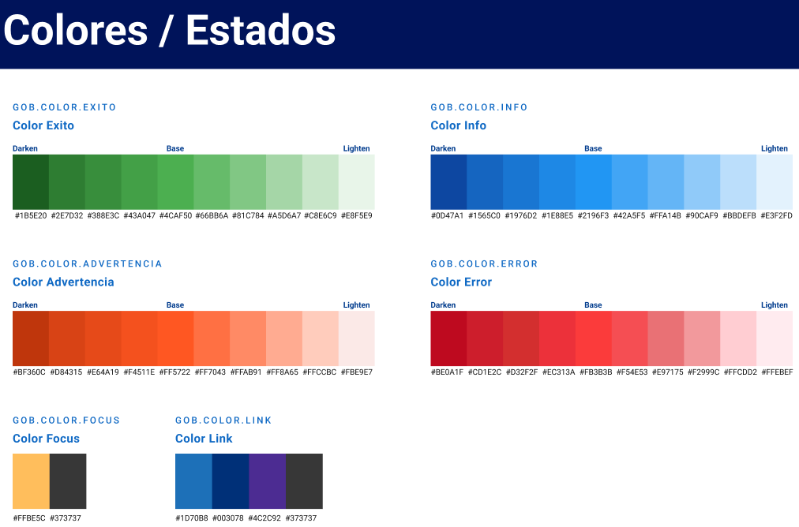

# Design system (UI)
## MVP — aplicativo de auditoría de lenguaje claro INAPI

| Metadatos | Detalle |
| --- | --- |
| **Versión** | 0.3.2 |
| **Fuente visual institucional** | UI Kit v3.0.1 — Secretaría de Gobierno (Transformación Digital). Documento base: [docs/uikit_gob/UI KIT v3.0.1.pdf](uikit_gob/UI%20KIT%20v3.0.1.pdf). **Valores hex** de este archivo provienen de las láminas oficiales del kit (capturas / PDF) revisadas en mayo 2026. |
| **Stack UI previsto** | Next.js · Tailwind CSS · shadcn/ui · Lucide React |

Este documento no reproduce el kit completo. Define lo **imprescindible** para el MVP: **color (hex)**, tipografía, espaciado, grilla, efectos, objetivos táctiles y accesibilidad. El resto de componentes se incorpora solo si el flujo lo exige.

---

## 1. Filosofía

- **Herramienta de trabajo:** priorizar lectura de tablas, citas y estados de auditoría; evitar estética promocional.
- **Coherencia institucional:** tokens `GOB.COLOR.*`, Roboto Slab / Roboto Sans y grilla del **UI Kit v3.0.1**.
- **Evidencia visible:** jerarquía tipográfica y espacial que destaque hallazgos y porcentajes de cumplimiento.

---

## 2. Color — básicos (`GOB.COLOR`)

### 2.1 Primario (`GOB.COLOR.PRIMARIO`)

| Variante | Hex |
| --- | --- |
| Lighten 1 | `#BFEEFF` |
| Lighten 2 | `#A1D2FF` |
| Lighten 3 | `#83B6FF` |
| Lighten 4 | `#649CFD` |
| **Base** | **`#4282E0`** |
| Darken 1 | `#0F69C4` |
| Darken 2 | `#0051A8` |
| Darken 3 | `#003B8D` |
| Darken 4 | `#002673` |
| Darken 5 | `#00135A` |

### 2.2 Accent (`GOB.COLOR.ACCENT`)

| Variante | Hex |
| --- | --- |
| Lighten 1 | `#FFECEF` |
| Lighten 2 | `#FFCFD3` |
| Lighten 3 | `#FA9E9B` |
| Lighten 4 | `#F37874` |
| **Base** | **`#FF4731`** |
| Darken 1 | `#F63E32` |
| Darken 2 | `#E4332C` |
| Darken 3 | `#D72C25` |
| Darken 4 | `#C82018` |

**Nota de calidad del arte:** en una lámina del kit, un swatch de la escala *accent* aparece etiquetado con **`#4282E0`** (color del primario base). Ese valor es **inconsistente** con el tono rojizo del muestreo; **no usar `#4282E0` como rojo accent**. Ante duda, muestrear el color del PNG oficial o el token en Figma.

### 2.3 Gris (`GOB.COLOR.GRIS`)

Escala nominal del kit (de claro a oscuro): **5 · 10 · 20 · 30 · 40 · 50 (base) · 60 · 70 · 80 · 90**.  
Los **hex por paso** no estaban legibles en la captura utilizada; completar desde el PDF/Figma oficial y volcar aquí en una futura revisión (v0.4).

### 2.4 Blanco y negro

| Token | Valor |
| --- | --- |
| `GOB.COLOR.BLANCO` / Base | `#FFFFFF` |
| `GOB.COLOR.BLANCO` opacidad (referencias kit) | **26 %** y **78 %** sobre el fondo que corresponda |
| `GOB.COLOR.NEGRO` opacidad | **87 %**, **54 %**, **26 %**, **12 %** |
| Texto sobre fondos (ver §2.7) | `#FFFFFF` o `#373737` |

---

## 3. Color — estados (`GOB.COLOR` semánticos)

Orden de lectura en lámina: del tono más oscuro (izquierda) al más claro (derecha). **Base** es el token central de cada familia.

### 3.1 Éxito (`GOB.COLOR.EXITO`)

`#1B5E20` · `#2E7D32` · `#388E3C` · `#43A047` · **`#4CAF50` (base)** · `#66BB6A` · `#81C784` · `#A5D6A7` · `#C8E6C9` · `#E8F5E9`

### 3.2 Info (`GOB.COLOR.INFO`)

`#0D47A1` · `#1565C0` · `#1976D2` · `#1E88E5` · **`#2196F3` (base)** · `#42A5F5` · `#64B5F6` · `#90CAF9` · `#BBDEFB` · `#E3F2FD`

### 3.3 Advertencia (`GOB.COLOR.ADVERTENCIA`)

`#BF360C` · `#D84315` · `#E64A19` · `#F4511E` · **`#FF5722` (base)** · `#FF7043` · `#FFAB91` · `#FF8A65` · `#FFCCBC` · `#FBE9E7`

### 3.4 Error (`GOB.COLOR.ERROR`)

`#BE0A1F` · `#CD1E2C` · `#D32F2F` · `#EC313A` · **`#FB3B3B` (base)** · `#F54E53` · `#E97175` · `#F2999C` · `#FFCDD2` · `#FFEBEF`

### 3.5 Focus (`GOB.COLOR.FOCUS`)

| Uso | Hex |
| --- | --- |
| Anillo / resalte cálido | `#FFBE5C` |
| Contraste neutro | `#373737` |

### 3.6 Enlaces (`GOB.COLOR.LINK`)

| Rol | Hex |
| --- | --- |
| Primario | `#1D70B8` |
| Oscuro | `#003078` |
| Visitado / morado | `#4C2C92` |
| Neutro / contexto | `#373737` |

---

## 4. Texto accesible — *Texto (AA)*

El kit recomienda **dos** colores de texto para garantizar contraste sobre fondos de marca y de estado:

| Token | Hex | Uso |
| --- | --- | --- |
| Blanco / base | `#FFFFFF` | Sobre fondos **oscuros** de primario, accent, neutro, éxito, info, error y advertencia |
| Negro / texto | `#373737` | Sobre fondos **claros** de las mismas familias y sobre blanco |

Regla práctica: si el fondo es tono **darken** o **base** saturado → preferir **texto blanco**; si el fondo es **lighten** o pastel → preferir **`#373737`**.

---

## 5. Mapeo a la app de auditoría (producto)

| Token de producto | Hex recomendado (MVP) | Notas |
| --- | --- | --- |
| `color.primary` | `#4282E0` (base primario) | Hover/active: `#0F69C4` o darken adyacente |
| `color.primary-contrast` | `#FFFFFF` | Texto sobre botón primario sólido |
| `color.accent` | `#FF4731` | CTAs secundarios de alta visibilidad si aplica |
| `color.success` | `#4CAF50` | Estado **Aprobado** (91–100 %) |
| `color.warning` | `#FF5722` | **Aceptado con observaciones** (81–90 %) |
| `color.danger` | `#FB3B3B` | **Rechazado** (1–80 %), errores |
| `color.info` | `#2196F3` | Banners informativos |
| `color.text` | `#373737` | Cuerpo principal |
| `color.surface` | `#FFFFFF` | Superficie por defecto (tema claro) |
| `color.link` | `#1D70B8` | Enlaces; visitado `#4C2C92` |
| `color.focus-ring` | `#FFBE5C` | Anillo foco visible + borde `#373737` si hace falta doble indicación |

---

## 6. Visualización de datos (referencia)

Solo si el MVP incluye gráficos o dashboards. Paletas del kit:

### 6.1 Cualitativa (18 colores listados)

`#FA4D56` · `#6929C4` · `#198038` · `#009D9A` · `#000070` · `#D3354F` · `#FAE250` · `#C9EE63` · `#61B258` · `#70D1F0` · `#4A62D1` · `#A56EFF` · `#DD45DF` · `#F1C0D3` · `#F9D9B6` · `#FEFACD` · `#BDFDC8` · `#D7BFFA`

### 6.2 Secuencial (azul, 10 pasos)

`#001141` · `#001D6C` · `#002D9C` · `#005DDA` · `#0043CE` · `#0F62FE` · `#4589FF` · `#78A9FF` · `#D0E2FF` · `#EDF5FF`

### 6.3 Grupo fijo (4 variables)

`#000070` · `#6929C4` · `#009D9A` · `#D7BFFA`

### 6.4 Divergente (11 pasos)

`#294090` · `#3A6EAE` · `#5D9BC7` · `#88C3DC` · `#B9E1EE` · `#E8EAC5` · `#FFD581` · `#FFAA5C` · `#F97145` · `#DC2D2A` · `#9D0024`

**Uso:** cualitativa para categorías; secuencial para mapas de calor / un solo eje; divergente para dispersión con centro neutro. Detalle de gráficos por tipo en la lámina *Color / Data visualization* del kit.

---

## 7. Tema claro / oscuro (referencia)

El kit incluye comparación **Light theme / Dark theme** para primario, sobre-primario, accent, éxito, error y focus. Algunas etiquetas hex en esa lámina **repiten valores** que no coinciden con el color mostrado (por ejemplo primario en modo oscuro). **Regla:** para implementación web, priorizar las tablas de las secciones **2** y **3** de este documento; usar la lámina light/dark solo como guía visual hasta contar con tokens exportados oficialmente.

---

## 8. Tokens — efectos (bordes, radios, elevación)

| Categoría | Valores del kit |
| --- | --- |
| **Elevación** | Niveles **Elevation-01** a **Elevation-05** (sombras progresivas; valores CSS exactos en Figma o anexo de tokens si el PDF los numera). |
| **Grosor de borde** | **1 px**, **2 px**, **3 px**, **4 px** |
| **Border radius** | **0 px**, **4 px**, **8 px**, **16 px**, **24 px** |

Implementación sugerida: variables `--elevation-01` … `--elevation-05` en CSS, o plugin de Tailwind, calibradas contra el PNG del kit.

---

## 9. Tipografía

### 9.1 Familias

| Familia | Rol |
| --- | --- |
| **Roboto Slab** | Encabezados institucionales |
| **Roboto Sans** | UI, cuerpo, enlaces y botones |

Carga sugerida: `next/font/google` con pesos **400, 500, 700** según tablas.

### 9.2 Reglas de accesibilidad (kit)

- Párrafos: mínimo recomendado **16 px** (1 rem).
- No usar texto regular **por debajo de 12 px**; evitar fuentes *display* para cuerpo.
- **Line-height ≥ 1,5 ×** tamaño de fuente; en las tablas siguientes el kit usa **1,5** de forma uniforme.

### 9.3 Roboto Slab — encabezados (desktop y mobile)

*En la lámina del kit, L / M / S coinciden en desktop y mobile; solo **Heading-XL** cambia de tamaño.*

| Estilo | Desktop | Mobile |
| --- | --- | --- |
| Heading-XL | 48 px (3 rem), weight **400**, lh **1,5** | 32 px (2 rem), weight **400**, lh **1,5** |
| Heading-L | 36 px (2,25 rem), **500**, lh 1,5 | Igual que desktop |
| Heading-M | 31 px (2 rem), **500**, lh 1,5 | Igual |
| Heading-S | 25 px (1,6 rem), **500**, lh 1,5 | Igual |

### 9.4 Roboto Sans — desktop

| Estilo | Tamaño | Peso | Line-height |
| --- | --- | --- | --- |
| Heading-XL | 48 px (3 rem) | Bold **700** | 1,5 |
| Heading-L | 36 px (2,25 rem) | Medium **500** | 1,5 |
| Heading-M | 31 px (2 rem) | **500** | 1,5 |
| Heading-S | 19 px (1,6 rem) | **500** | 1,5 |
| Body-L | 24 px (1,5 rem) | 400 / **700** | 1,5 |
| Body-M | 19 px (1,1875 rem) | 400 / **700** | 1,5 |
| Body-S | 16 px (0,875 rem) | 400 / **700** | 1,5 |
| Body-XS | 14 px (0,875 rem) | 400 / **700** | 1,5 |
| Body-button | 19 px (1,1875 rem) | **500** | 1,5 |
| Body-button-small | 16 px (1,1875 rem) | **500** | 1,5 |
| Body-Link | 19 px (1,1875 rem) | **500** | 1,5 |
| Body-Link-Bold | 19 px (1,1875 rem) | **500** | 1,5 |
| Body-Link-Small | 16 px (1 rem) | **400** | 1,5 |

### 9.5 Roboto Sans — mobile

| Estilo | Tamaño | Peso | Line-height |
| --- | --- | --- | --- |
| Heading-XL | 32 px (2 rem) | **400** | 1,5 |
| Heading-L | 24 px (1,5 rem) | **500** | 1,5 |
| Heading-M | 18 px (1,125 rem) | **500** | 1,5 |
| Heading-S | 16 px (1 rem) | **500** | 1,5 |
| Body-L | 18 px (1,125 rem) | 500 / **700** | 1,5 |
| Body-M | 16 px (1,1875 rem) | 400 / **700** | 1,5 |
| Body-S | 14 px (0,875 rem) | 400 / **700** | 1,5 |
| Body-XS | 12 px (0,875 rem) | 400 / **700** | 1,5 |
| Body-button | 16 px (1 rem) | **500** | 1,5 |
| Body-button-small | 16 px (1 rem) | **500** | 1,5 |
| Body-Link | 16 px (1 rem) | **500** | 1,5 |
| Body-Link-Small (Regular) | 14 px | **400** | 1,5 |
| Body-Link-Small (Bold) | 14 px | **700** | 1,5 |

**Nota de implementación:** en algunas láminas móviles del kit aparecen conversiones **px → rem** poco estándar (p. ej. 16 px etiquetados como 1,6 rem). En código se recomienda **normalizar a 16 px = 1 rem** salvo corrección explícita del equipo de diseño.

### 9.6 Códigos de criterio y citas

Monoespaciada secundaria (`ui-monospace` o sistema) solo para IDs (`B3`) y extractos cortos; párrafos largos en **Roboto Sans**.

---

## 10. Espaciado (`Token / Espaciado`)

Escala única del kit (px):

**4 · 8 · 12 · 16 · 24 · 36 · 48 · 64**

Mapeo sugerido a variables: `--space-1` = 4px … `--space-8` = 64px (o nombres semánticos `xs` … `3xl`). No introducir pasos intermedios no definidos en el kit (p. ej. 20 px) salvo excección documentada en ADR.

---

## 11. Grilla y responsividad

### 11.1 Tabla de layout (kit)

| Categoría | Pantalla (dp) | Margen | Cuerpo (área útil) | Columnas |
| --- | --- | --- | --- | --- |
| Extra-small (phone) | 0–599 | 16 dp | Escalado (fluido) | **4** |
| Small (tablet) | 600–904 | 32 dp | Fluido | **8** |
| Small (tablet) | 905–1239 | Fluido | **840 dp** fijo | **12** |
| Medium (laptop) | 1240–1439 | 200 dp | Fluido | **12** |
| Large (desktop) | 1440+ | Fluido | **1040** dp (ancho de cuerpo) | **12** |

En **CSS / Tailwind**, usar **px** equivalentes a **dp** en web (`1dp ≈ 1px` en media estándar). Breakpoints sugeridos: **`min-width: 600px`**, **`905px`**, **`1240px`**, **`1440px`**. Contenedores máx.: **`max-width: 840px`** y **`1040px`** donde la tabla fija cuerpo.

### 11.2 Nombres de dispositivo (diagrama de grilla)

**4K** y **Desktop:** 12 columnas. **LG Tablet** y **Tablet:** 8 columnas. **Mobile:** 4 columnas. Variantes con sidebar / cabecera se toman del diagrama visual del kit.

### 11.3 Enfoque MVP

**Mobile-first;** validar tablas de hallazgos en 4 columnas y expandir a 12 en escritorio.

---

## 12. Objetivos táctiles y componentes base

- **Botones:** área mínima **44 × 44 px** (referencia AAA en el kit); **24 × 24 px** como mínimo AA citado en el mismo contexto.
- **Chips:** altura mínima clickeable **29 px** (WCAG **2.5.8** AA en la documentación del kit).
- **Enlaces:** variantes Large / Small del kit; texto descriptivo (alineado al checklist editorial INAPI).

Componentes shadcn previstos: `Button`, `Input`, `Form`, `Card`, `Table`, `Tabs`, `Dialog`, `Badge` / chip, `Textarea`.

---

## 13. Estados de aceptación de la auditoría (UI)

| Estado de negocio | Color base kit |
| --- | --- |
| `aprobado` | `#4CAF50` |
| `aceptado_con_observaciones` | `#FF5722` |
| `rechazado` | `#FB3B3B` |

---

## 14. Accesibilidad (mínimo)

- Contraste **WCAG 2.2**; usar combinaciones de la sección **4** y variantes *contraste* del kit en fondos problemáticos.
- `Dialog`: título accesible, foco atrapado, cierre con teclado; anillo foco `#FFBE5C` / `#373737` según contexto.
- Tablas: `scope="col"` en cabeceras.

---

## 15. Patrón UI: barras colapsables en `/auditar` (inventarios y listas)

**Uso:** agrupar en una sola pantalla (`/auditar`) varias **fuentes de información seccionada** sin competir con el **ingreso principal de URL** ni con los **tres atajos** editoriales. Ejemplos de contenido: tabla **~20 URLs** priorizadas por **Microsoft Clarity**; lista de **URLs más auditadas** por el equipo; **URLs con estados resueltos** (o equivalente de seguimiento LC). El patrón debe ser **reutilizable** para todas esas secciones.

| Criterio | Guía |
| --- | --- |
| **Estructura** | Cada bloque es una **barra colapsable** (accordion / disclosure): cabecera **siempre visible** como trigger; cuerpo con tabla o lista **solo al expandir**. |
| **Cabecera (cerrada)** | **Título claro y breve** (jerarquía tipográfica de subtítulo, p. ej. `text-base`/`font-semibold` o equivalente según tokens §9–10); alineación horizontal título + **icono de flecha hacia abajo** (o chevron) a la derecha o junto al título, indicando “hay más contenido”. Al abrir, la flecha puede rotar hacia arriba manteniendo el mismo icono para coherencia. |
| **Contraste** | Legible y **institucional**: fondo de cabecera/cuerpo con tokens existentes (`background`, `card`, `muted`, `border-border`, `foreground`); **evitar** bordes gruesos, sombras fuertes o saturación de **primario** en cada barra — contraste **claro pero no ruidoso** frente al lienzo `muted` de la página. |
| **Espaciado** | **Mismo `gap` vertical** entre cada barra colapsable (p. ej. un único valor de `gap-*` en el contenedor padre) para **aire visual consistente**; padding interno del panel desplegado alineado al resto del flujo (`/auditar`). |
| **Accesibilidad** | Trigger con `button` semántico o `aria-expanded` / `aria-controls` si se usa primitiva tipo Radix **Collapsible** / **Accordion**; foco visible con `--ring` §3.5; teclado (Enter/Espacio) para abrir/cerrar. |

Implementación sugerida en stack: primitiva **Accordion** o **Collapsible** de Radix (shadcn) + icono **Lucide** (`ChevronDown` / `ChevronUp`).

---

## 16. Alcance MVP vs. kit completo

No es obligatorio implementar drawer, steppers completos, todas las *cards* ni toda la iconografía. **Sí** es obligatorio: tokens de **color** (secciones 2–6), **texto AA**, **tipografía**, **espaciado**, **grilla**, **radios/bordes/elevación**, **táctil**, mapeo de **estados de auditoría** y, para **`/auditar`**, el patrón de **§15** cuando existan listas/inventarios en pantalla.

---

## 17. Referencias visuales y próxima revisión

### 17.1 Capturas en el repositorio

Las capturas del kit deben vivir en **`docs/uikit_gob/references/`** con los nombres indicados en [references/README.md](uikit_gob/references/README.md). Tras copiarlas desde tu equipo, quedan enlazadas aquí para revisión rápida (si el archivo aún no existe, el enlace se completará al añadir el PNG).

| Lámina | Archivo |
| --- | --- |
| Colores básicos | [colores-basicos.png](uikit_gob/references/colores-basicos.png) |
| Colores / estados | [colores-estados.png](uikit_gob/references/colores-estados.png) |
| Texto (AA) | [colores-texto-aa.png](uikit_gob/references/colores-texto-aa.png) |
| Data visualization | [colores-data-viz.png](uikit_gob/references/colores-data-viz.png) |
| Tema claro / oscuro | [tema-claro-oscuro.png](uikit_gob/references/tema-claro-oscuro.png) |
| Tokens / efectos | [tokens-efectos.png](uikit_gob/references/tokens-efectos.png) |
| Roboto Slab | [tipografia-roboto-slab.png](uikit_gob/references/tipografia-roboto-slab.png) |
| Roboto Sans | [tipografia-roboto-sans.png](uikit_gob/references/tipografia-roboto-sans.png) |
| Grilla (tabla) | [grilla-breakpoints.png](uikit_gob/references/grilla-breakpoints.png) |
| Grilla (diagramas) | [grilla-diagramas.png](uikit_gob/references/grilla-diagramas.png) |
| Token espaciado | [token-espaciado.png](uikit_gob/references/token-espaciado.png) |

Vista previa embebida (mismo criterio de rutas; útil en GitHub al tener los archivos):

### 17.2 Próxima revisión documental

- Añadir fila **hex por nivel** de `GOB.COLOR.GRIS` cuando se disponga de la lámina o export JSON oficial.
- Volcar valores CSS numéricos de **Elevation-01…05** si el kit los publica en texto.

---

*Design system v0.3.2 — UI Kit Gobierno de Chile v3.0.1. Incluye §15 (barras colapsables en `/auditar`), §17 con carpeta `references/` y enlaces a PNG; completar grises y sombras desde la fuente oficial en la siguiente iteración.*
