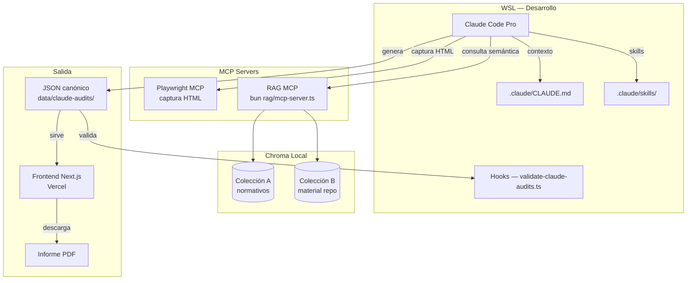

# Propuesta técnica integral v2.0
## Aplicativo de auditoría de Lenguaje Claro INAPI

| Metadatos | Detalle |
| --- | --- |
| **Versión** | 2.0 |
| **Fecha** | 2026-07-21 |
| **Reemplaza** | v1.0 (2026-05-15) — stack Python + NestJS + AWS, supersedido por ADR 0008, ADR 0009 y ADR 0010 |

---

## 1. Resumen de la visión

El objetivo es automatizar la auditoría editorial de URLs de `inapi.cl` y `tramites.inapi.cl` aplicando el checklist de Lenguaje Claro v1.1 (39 criterios A1–H1, derivado de Calidad Web 2.0, Meta MEI y Lenguaje Claro Chile). El resultado de cada auditoría es un **JSON canónico** con 7 secciones que alimenta el frontend en `/auditar/resultado` y genera el informe PDF institucional.

El sistema se organiza en **5 capas del AI Stack**: Infraestructura, Modelo, Data, Orquestación y Aplicación.

**Principios que no cambian sin nueva ADR:**
- Todo corre localmente en WSL; ningún documento interno sale a internet.
- TypeScript + Bun en todo el stack (sin mezclar lenguajes).
- Claude Code Pro como orquestador (suscripción existente, sin costo adicional).
- El JSON canónico y la validación Zod son la fuente de verdad de la salida.

---

## 2. Stack tecnológico

| Capa | Tecnología | Justificación |
| :--- | :--- | :--- |
| **Frontend** | Next.js (App Router) + Vercel | Operativo; Server Components, SEO, deploy gratuito |
| **Orquestador IA** | Claude Code Pro (WSL, terminal) | Suscripción existente; sin API key; cero costo adicional |
| **Captura HTML** | Playwright MCP (`npx @playwright/mcp`) | Navegación real de URLs; extracción de HTML completo |
| **Embeddings** | `@xenova/transformers` — modelo `Xenova/paraphrase-multilingual-MiniLM-L12-v2` | ~400 MB, offline en CPU, sin APIs externas, multilingüe |
| **Base vectorial** | Chroma (proceso local, puerto 8000) | Datos sensibles no salen de INAPI; copia directa al servidor TI |
| **Pipeline RAG** | LangChain.js (TypeScript) | Misma toolchain del monorepo; feature parity suficiente |
| **RAG MCP** | `bun rag/mcp-server.ts` | Expone Chroma a Claude Code como herramientas nativas |
| **Validación contratos** | Zod + `validate-claude-audits.ts` + Hooks | Automatiza la validación al guardar cada JSON |
| **Runtime** | Bun | Coherente con el monorepo existente; `bun.lock` único |
| **BD futura** | Supabase (PostgreSQL 16, tier gratuito) | Fase posterior; no bloquea las fases actuales |
| **Backend futuro** | Railway (tier gratuito) | Fase posterior; se re-evalúa cuando haya persistencia multiusuario |
| **Producción IA** | Servidor TI INAPI (Octavio) | Fase final; `chroma_db/` se copia, no hay que reingestar |

---

## 3. Estructura del repositorio (estado objetivo)

```
lc-inapi.app/
├── .claude/
│   ├── CLAUDE.md                    ← contexto permanente del proyecto
│   └── skills/
│       ├── auditoria-lc.md
│       ├── auditoria-calidad-web.md
│       └── pesquisa-criterios.md
│
├── .agents/
│   └── workflows/
│       ├── devlog-standard.md
│       └── git-commit-convention.md
│
├── .github/
│   └── workflows/
│       └── ci.yml
│
├── .gitignore                       ← incluye rag/chroma_db/ y documentos/
├── README.md
├── bun.lock
├── package.json
├── tsconfig.json
│
├── documentos/                      ← PDFs normativos, en .gitignore
│   (solo existe localmente y en servidor TI)
│
├── rag/                             ← workspace TypeScript para el RAG
│   ├── package.json
│   ├── tsconfig.json
│   ├── ingest-a.ts                  ← ingesta colección A (PDFs normativos)
│   ├── ingest-b.ts                  ← ingesta colección B (material del repo)
│   ├── query.ts                     ← consulta y prueba de las colecciones
│   ├── mcp-server.ts                ← servidor MCP que Claude Code consume
│   └── chroma_db/                   ← generado al ingestar, en .gitignore
│       ├── coleccion_a/
│       └── coleccion_b/
│
├── data/
│   ├── checklist-criteria.json      ← fuente de verdad 39 criterios
│   ├── audit-fixtures/
│   ├── claude-audits/               ← JSONs canónicos (piloto + producción)
│   │   └── urls-clarity/
│   └── ux/
│
├── docs/
│   ├── adr/                         ← ADRs 0001–0010
│   ├── despliegue/
│   ├── development/
│   └── [resto de docs]
│
├── frontend/                        ← Next.js, sin cambios estructurales
│
└── src/
    └── schemas/                     ← Zod: fuente de verdad de contratos JSON
```

---

## 4. Diagrama de arquitectura



---

## 5. Flujo de datos (auditoría automatizada)

1. **Entrada:** Claude Code Pro recibe la URL objetivo.
2. **Captura:** Playwright MCP navega la URL y devuelve el HTML completo.
3. **Contexto semántico:** RAG MCP consulta Colección B (criterios v1.1, precedentes de auditorías) y Colección A (fuentes normativas) y devuelve fragmentos relevantes.
4. **Análisis:** Claude Code Pro evalúa el HTML contra los 39 criterios, usando el contexto del `CLAUDE.md`, las Skills cargadas y los fragmentos del RAG.
5. **Salida:** Claude Code Pro genera el JSON canónico (`strictAuditRecordSchema`) con 7 secciones y lo guarda en `data/claude-audits/`.
6. **Validación automática:** el Hook ejecuta `validate-claude-audits.ts`; si falla la validación Zod, Claude Code corrige antes de finalizar.
7. **Presentación:** el frontend lee el JSON desde `GET /api/claude-audits/[id]` y muestra el resultado en `/auditar/resultado`; el PDF se genera bajo demanda.

Para lotes, los pasos 1–6 corren en **paralelo con subagents** (un subagente por URL).

---

## 6. Procedimiento de implementación (4 fases)

### Fase 0 — Contexto (sin instalar nada)
1. Crear `.claude/CLAUDE.md` con contexto permanente del proyecto.
2. Crear las 3 Skills en `.claude/skills/`.
3. Verificar `.gitignore` (`rag/chroma_db/` y `documentos/` ya incluidos).
4. ADRs y docs actualizados (este PR).

**Resultado:** Claude Code ya tiene contexto completo del proyecto desde la primera sesión.

### Fase 1 — MCP Playwright (captura de HTML)
1. `claude mcp add playwright npx @playwright/mcp@latest`
2. Probar captura de una URL del inventario Clarity.
3. Verificar que el HTML se guarda en `auditorias/htmls/`.

**Resultado:** Claude Code puede navegar URLs y extraer HTML.

### Fase 2 — RAG (colecciones A y B)
1. Crear `rag/` con `package.json` y `tsconfig.json`.
2. `bun install` en `rag/`.
3. Levantar Chroma local: `chroma run --path ./rag/chroma_db --port 8000`.
4. Poner PDFs en `documentos/` (localmente, nunca al repo).
5. `bun run ingest:b` (primero — los datos ya existen en el repo).
6. `bun run ingest:a` (segundo — requiere los PDFs locales).
7. Probar con `bun run query "criterio D7 encabezados mayúsculas"`.
8. `claude mcp add rag-auditoria bun /ruta/rag/mcp-server.ts`.

**Resultado:** Claude Code puede consultar criterios y precedentes semánticamente.

### Fase 3 — Flujo completo de auditoría
1. Probar flujo con una URL: Playwright → RAG → análisis → JSON.
2. Validar que el JSON generado pasa `validate-claude-audits.ts`.
3. Escalar a lote de URLs con subagents en paralelo.
4. Verificar que los Hooks validan JSONs automáticamente.

**Resultado:** auditoría completa automatizada de principio a fin.

### Fase 4 — Producción (servidor TI)
1. Coordinar con Álvaro / Bernarda / Octavio la viabilidad del servidor interno.
2. Copiar `rag/chroma_db/` al servidor (no hay que reingestar).
3. Levantar `mcp-server.ts` como servicio en el servidor TI.
4. Configurar Claude Code para apuntar al servidor remoto.

**Resultado:** el equipo completo puede usar el RAG desde sus máquinas.

---

## 7. Decisiones técnicas clave (no revertir sin nueva ADR)

| Decisión | Detalle | ADR |
| --- | --- | --- |
| TypeScript sobre Python | Todo el RAG y la orquestación en TypeScript + Bun | [ADR 0008](adr/0008-typescript-sobre-python-para-rag.md) |
| Claude Code Pro (sin API de pago) | Suscripción existente; cero costo adicional en esta fase | [ADR 0009](adr/0009-claude-code-pro-como-orquestador.md) |
| @xenova/transformers (no HuggingFace Python) | Embeddings en Node.js, offline, sin servidor adicional | [ADR 0010](adr/0010-rag-local-chroma-xenova-transformers.md) |
| Chroma local (no Pinecone ni Qdrant Cloud) | Datos sensibles no salen de INAPI | [ADR 0010](adr/0010-rag-local-chroma-xenova-transformers.md) |
| Retrieval semántico simple (no híbrido BM25+Dense) | Chroma default suficiente; búsqueda exacta de códigos la resuelve Claude Code desde el JSON | [ADR 0010](adr/0010-rag-local-chroma-xenova-transformers.md) |
| LangChain.js (no LangChain Python) | Misma razón que TypeScript sobre Python | [ADR 0008](adr/0008-typescript-sobre-python-para-rag.md) |
| Dos colecciones Chroma aisladas | Barrera arquitectónica, no solo regla de configuración | [ADR 0010](adr/0010-rag-local-chroma-xenova-transformers.md) |

---

## 8. Seguridad y datos sensibles

- Todo corre localmente en WSL. Ningún documento interno sale a internet.
- Los PDFs normativos están en `.gitignore` (`documentos/` no va al repo).
- `rag/chroma_db/` está en `.gitignore` (los vectores no van al repo).
- Claude Code no envía los documentos a Anthropic — los lee como texto en el contexto local de la sesión.
- Los embeddings se generan con `@xenova/transformers` en local, sin llamadas a APIs externas.
- Las URLs auditadas son sitios públicos de INAPI — no hay datos personales en los HTMLs capturados (salvo el caso G1, que se detecta como incumplimiento, no se almacena).
- **Nunca entran al RAG:** RUT/RUN de usuarios, solicitudes de marca, credenciales, tokens de sesión.

---

*Ver también [ARCHITECTURE.md](ARCHITECTURE.md) · [ROADMAP.md](ROADMAP.md) · [SECURITY.md](SECURITY.md).*
