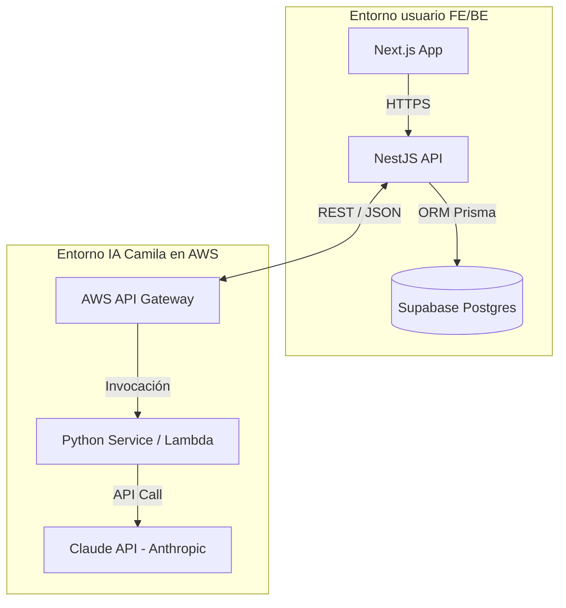

# Propuesta técnica integral: aplicativo de auditoría LC INAPI

Este documento consolida la visión técnica, la estructura del proyecto y los acuerdos de colaboración para el desarrollo del MVP de lenguaje claro (LC).

## 1. Resumen de la visión

El objetivo es construir una plataforma web robusta que automatice la auditoría de textos bajo el checklist de lenguaje claro INAPI, utilizando inteligencia artificial (Claude API) orquestada por un servicio especializado en Python y una API de dominio en NestJS.

### 1.1 Estado del repositorio (vs monorepo propuesto)

La **§3** describe el **layout objetivo** del monorepo. En el repo **actual** (Fase 1 mock + **Fase 1.5** piloto Claude sin backend) la estructura difiere hasta integrar Nest y el servicio Python:

| Elemento propuesto (§3) | Ubicación actual en el repo | Notas |
| --- | --- | --- |
| `apps/frontend/` | [`frontend/`](../frontend/) en la raíz | Next.js (App Router), workspace Bun; ver `package.json` raíz. |
| `apps/backend-api/` | *No creado* | NestJS + Prisma: Fase 2 del [roadmap](ROADMAP.md). |
| `apps/evaluation-service/` | *No creado* | Python + Claude: Fase 2; despliegue preferente AWS (API Gateway + Lambda), ver §4. |
| `packages/contracts/` | [`src/schemas/`](../src/schemas/) (+ datos en [`data/`](../data/)) | Esquemas Zod compartidos; el frontend importa vía alias `@contracts/*` en `frontend/tsconfig.json`. |

La **migración de carpetas** hacia `apps/` y `packages/contracts/` se hará en **Fase 2** o en un **PR dedicado** de reestructura, una vez cerrado el mock de UI y acordada la convención de workspaces con el equipo.

---

## 2. Roles y stack tecnológico definitivo

| Capa | Responsable | Tecnología | Justificación UX / técnica |
| :--- | :--- | :--- | :--- |
| **Frontend** | **Tú** | Next.js (App Router) | Reactividad, SEO y velocidad de carga (Server Components). |
| **Backend API** | **Tú** | NestJS + Prisma | Tipado estricto (TS), escalabilidad y facilidad para manejar reglas de negocio. |
| **Persistencia** | **Tú / Camila** | Supabase (Postgres) | Auth integrado, RLS para seguridad de datos y facilidad de hosting. |
| **Servicio IA** | **Camila** | Python + Claude API | Ecosistema líder en IA, parseo eficiente y manejo de prompts complejos. |
| **Infraestructura** | **Camila** | AWS (Lambda / API Gateway) | Independencia de despliegue, escalado bajo demanda y costos controlados. |

---

## 3. Estructura de proyecto (monorepo propuesto)

```text
lc-inapi-app/
├── apps/
│   ├── frontend/             # Next.js: interfaz de usuario y dashboard.
│   ├── backend-api/          # NestJS: orquestador, reglas de negocio y Prisma.
│   └── evaluation-service/   # Python: motor de IA y lógica de Claude (Camila).
├── packages/
│   └── contracts/            # Esquemas Zod compartidos (capa de verdad).
├── docs/                     # Documentación, ADRs y este resumen.
├── data/                     # Catálogo de criterios LC v1.1 y fixtures.
└── package.json              # Configuración de workspaces (Bun).
```

---

## 4. Arquitectura y flujo de datos

### Diagrama de arquitectura (infraestructura)



### Flujo de secuencia (el viaje del dato)

1. **Captura:** el usuario ingresa una URL; NestJS captura el texto.
2. **Solicitud:** NestJS envía el texto al servicio de Python en AWS.
3. **Procesamiento:** Python orquesta el prompt para Claude, recibe la respuesta y aplica un **parseo eficiente** (validación rigurosa).
4. **Respuesta:** Python devuelve un JSON alineado al contrato de datos.
5. **Cierre:** NestJS valida el resultado con Zod y lo guarda en Supabase vía Prisma.

---

## 5. Guía de colaboración con especialista IA (Camila)

### Cuestionario estratégico

* **Servicio AWS:** ¿Lambda o ECS? (Importante para límites de tiempo y costos).
* **Contratos:** ¿usarás **Pydantic** para asegurar que el JSON de salida sea estable?
* **Seguridad:** ¿cómo autenticamos la llamada entre NestJS y el servicio de AWS?
* **DB:** ¿necesitas acceso de escritura a Supabase o el backend (BE) se encarga de todo el guardado?

### El rol de Docker

Se recomienda usar Docker para:

1. **Local dev:** poder correr el servicio Python en el escritorio sin configurar entornos Python a mano.
2. **Consistencia:** asegurar que el parseo en AWS sea idéntico al de desarrollo local.

---

## 6. Consideraciones de restricciones (workarounds)

* **Entorno corporativo:** dado el bloqueo de terminales y SSL, este documento sirve como transferencia de conocimiento hacia el entorno de desarrollo real (desktop / Cursor).
* **Git:** el control de versiones se centraliza en el entorno de desarrollo sin restricciones para evitar problemas de permisos de usuario.
* **Instalación:** en oficina puede usarse Bun solo para inspección visual; la ejecución completa conviene en el entorno sin restricciones.

---

*Documento generado el 2026-05-15 para la transición al entorno de desarrollo final. Actualizado el 2026-05-16: sección estado del repositorio y nombre de archivo corregido (`PROPUESTA`).*
