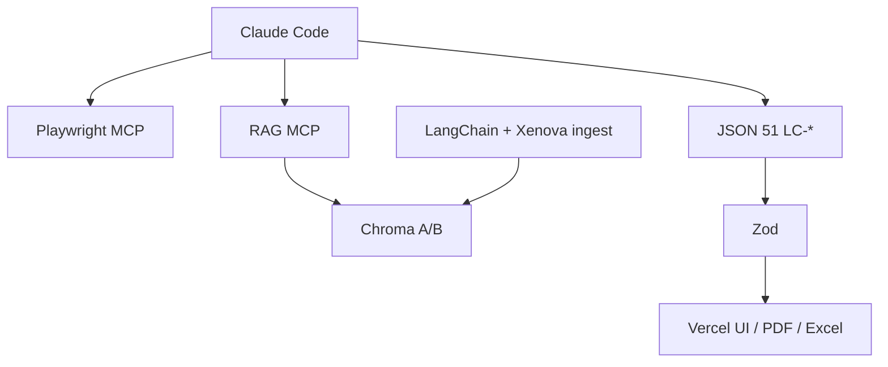

# Propuesta técnica integral v3.0
## Aplicativo de auditoría de Lenguaje Claro INAPI

| Metadatos | Detalle |
| --- | --- |
| **Versión** | 3.0 |
| **Fecha** | 2026-08-21 |
| **Reemplaza** | v2.0 (2026-07-21) y v1.0 (Python + Nest + AWS) |

---

## 1. Visión (lenguaje claro)

Auditar URLs de `inapi.cl` / `tramites.inapi.cl` con el instrumento **Lenguaje claro PTD v3.0** (**51** criterios `LC-*`), producir **JSON canónico**, **PDF** y **Excel MEI**, sin login y sin backend Nest/AWS.

**Stack que importa:** Claude Code · Playwright MCP · Chroma · Xenova · LangChain.js (ingesta) · Zod · Next/Vercel · GitHub.

**Propuestas antiguas (archivo, no plan):** Claude API, Python/Pydantic, Nest, Prisma, Supabase Auth, AWS Lambda — [ADR 0006](adr/0006-lc-evaluation-python-claude-aws.md).

---

## 2. Stack tecnológico vigente

| Capa | Tecnología | Notas |
| --- | --- | --- |
| Frontend | Next.js + Vercel | UI, PDF, Excel, jobs delgados |
| Código / CI | GitHub + Actions | `typecheck:all`, `lint` |
| Orquestador | Claude Code (institucional) | §17, skills, prompts, CLAUDE.md |
| Captura | Playwright MCP | DOM real; sesión ClaveÚnica si aplica |
| Embeddings | `@xenova/transformers` | Offline CPU — [ADR 0007](adr/0007-modelo-datos-parseo-pre-conexiones.md) |
| Vectores | Chroma local | Colecciones A/B — [ADR 0010](adr/0010-rag-local-chroma-xenova-transformers.md) |
| Ingesta | LangChain.js + `ingest:a` / `ingest:b` | Troceo → embed → Chroma |
| Contratos | Zod + `validate:claude-audits` | 51 `LC-*`, v3.0 |
| Runtime | Bun | Monorepo |
| Auth / Nest / AWS | — | **No** en este MVP |

---

## 3. Estructura relevante del repo

```
.claude/          CLAUDE.md, prompts, skills, diagrams
rag/              ingest-a/b, mcp-server, chroma_db/ (gitignore)
documentos/       PDFs normativos (gitignore)
data/
  checklist-criteria-lc-ptd.json   ← 51 LC-* v3.0
  claude-audits/                   ← JSON por URL
  jobs/                            ← cola on-demand
frontend/         Next.js
src/schemas/      Zod
docs/             ADR, PRD, arquitectura, despliegue
```

---

## 4. Diagrama


```mermaid
flowchart TD
  CC[Claude Code] --> PW[Playwright MCP]
  CC --> RAG[RAG MCP]
  RAG --> CH[Chroma A/B]
  IN[LangChain + Xenova ingest] --> CH
  CC --> JSON[JSON 51 LC-*]
  JSON --> Z[Zod]
  Z --> FE[Vercel UI / PDF / Excel]
```

---

## 5. Flujo de una auditoría

1. URL (META MEI o ingreso libre en dominios permitidos).  
2. Playwright captura HTML.  
3. RAG aporta fragmentos A/B.  
4. Cinco sub-subagentes §17 evalúan indicadores LC.  
5. Consolidación CMS (§22) → JSON v3.0.  
6. Zod → UI / PDF / Excel / commit.

Muestra institucional: **10 URLs** (`mei-meta-mei-urls.ts`).

---

## 6. Procedimiento (estado)

| Fase | Estado |
| --- | --- |
| 0 Contexto Claude | Hecho |
| 1 Playwright MCP | Hecho |
| 2 RAG A/B + Xenova | Hecho |
| 3 Flujo §17 + validate | Hecho / en uso META MEI |
| 3.3 Captura autenticada | Documentado / parcial |
| 4 Worker on-demand | ADR 0011 + contratos |
| Nest/AWS/Supabase | **Retirado** |

---

## 7. Decisiones que no se revierten sin nueva ADR

| Decisión | ADR |
| --- | --- |
| TypeScript/Bun, no Python motor | 0008 |
| Claude Code, no Claude API operativa | 0009 · 0011 |
| Xenova + Chroma local | 0010 · 0007 |
| LangChain.js en ingesta | 0008 · 0010 |
| Zod contract-first | 0003 · 0004 |
| Sin Nest / sin login MVP | 0009 · 0011 |

---

## 8. Referencias

[ARCHITECTURE.md](ARCHITECTURE.md) · [PRD.md](PRD.md) · [ROADMAP.md](ROADMAP.md) · [despliegue/despliegue-hibrido.md](despliegue/despliegue-hibrido.md) · [checklist-ptd-v2-mapa.md](checklist-ptd-v2-mapa.md)
