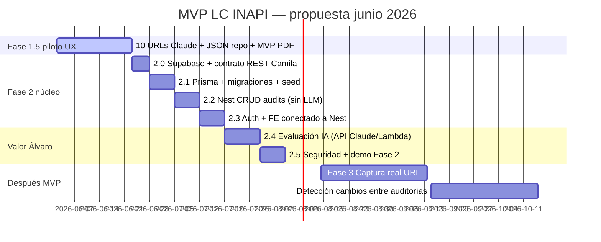

# Propuesta — Análisis LC de URLs INAPI

| Metadatos | Detalle |
| --- | --- |
| **Fecha** | 2026-06-02 |
| **Autor** | Fernando Arriagada Castillo |
| **Audiencia** | Álvaro González López, Equipo UX (Bernarda, Camila), liderazgo proyecto |
| **Objetivo de la reunión** | Consolidar alcance post-MVP mock, validar prioridades de producto y decidir lineamientos técnicos (incl. proveedor LLM) para Fase 2 |
| **Documentos base** | [`fase2-implementacion.md`](fase2-implementacion.md), [`diagramas_procesos.md`](diagramas_procesos.md), [`ux/inventario-urls-clarity.md`](ux/inventario-urls-clarity.md), [`ROADMAP.md`](ROADMAP.md) |

---

## 1. Resumen ejecutivo

El aplicativo debe ser un **medio para un fin**: ayudar a **mejorar el lenguaje claro** en las URLs prioritarias de INAPI, con **reportes accionables** (pantalla + **PDF**), sin convertirse en un producto costoso de mantener.

**Estado hoy (Fase 1 cerrada en repo):** mock de alta fidelidad con **22 URLs** Calidad Web (Clarity + criterio editorial), tabla única en `/auditar`, fichas por URL, filtros por tipo (`tramites` / `sitioweb`) y estado LC, contratos Zod y fixtures validados. **No hay backend productivo ni evaluación real con IA todavía.**

**Acuerdo post-reunión (2026-06-02):** etapa intermedia **Fase 1.5** en [`ROADMAP.md`](ROADMAP.md) — piloto **10 URLs** con **Claude** (Proyecto), informe en MVP + **PDF** + HTML con sustituciones a TIC, **sin** backend productivo ni sync automático con el agente. Fase 2 (Supabase, Nest, Lambda) entra tras cerrar el piloto.

**Proveedor LLM del piloto:** **Claude** (comparación home documentada en [`Comparación Auditoría URL Home INAPI Gemini-Claude.md`](Comparación%20Auditoría%20URL%20Home%20INAPI%20Gemini-Claude.md)). Gemini institucional queda como opción de costo para **Fase 2** (Lambda), sujeta a piloto técnico posterior.

---

## 2. Lo que ya existe (síntesis)

### 2.1 Producto mock (Fase 1)

| Capacidad | Estado | Referencia |
| --- | --- | --- |
| Inventario **22 URLs** (ranks 1–20 Trámites, 21–22 Sitio Web) | Implementado en UI + JSON maestro | [`data/ux/clarity-fichas-mock.json`](../data/ux/clarity-fichas-mock.json) |
| Priorización por tráfico Clarity + criterio editorial | Documentado | [`ux/inventario-urls-clarity.md`](ux/inventario-urls-clarity.md) |
| Ficha por URL: contexto, observaciones, historial mock | `/auditar/inventario/clarity/[rank]` | Design system §13.1, §15 |
| Resultado mock: 39 criterios, severidad, barra %, pasos a seguir | `/auditar/resultado` | Fixtures + `strictAuditRecordSchema` |
| Tres atajos editoriales (peor / intermedio / mejor LC) | `/auditar` | §1 inventario URLs |
| Despliegue demo + CI | Vercel + GitHub Actions | [`despliegue/despliegue-hibrido.md`](despliegue/despliegue-hibrido.md) |

### 2.2 Trabajo del 2026-06-01 (flujos y Fase 2)

Se documentó la **arquitectura objetivo** y los **flujos ejecutables** para estudiar e implementar backend y base de datos:

- **[`fase2-implementacion.md`](fase2-implementacion.md):** sub-fases 2.0–2.5 (Supabase, Nest+Prisma, Auth, Lambda Python, seguridad), decisiones MVP (Vercel, Railway, Supabase Auth, API Gateway + Lambda), criterios de éxito y plan de estudio.
- **[`diagramas_procesos.md`](diagramas_procesos.md):** diagramas Mermaid de arquitectura, REST, Postgres, Prisma, Gateway, Lambda, auth doble (JWT usuario + API Key servicio), flujo completo de auditoría, parseo en cadena y **export PDF (Fase 4)** como referencia técnica.

**Nota:** esos documentos asumen **Claude API** (ADR 0006). La propuesta de esta reunión incluye **revisar Gemini** sin cambiar la topología (Nest → Gateway → Lambda → LLM → Nest persiste).

### 2.3 Fase 1.5 (acordada 2026-06-02)

| Entregable | Estado | Referencia |
| --- | --- | --- |
| Piloto **10 URLs** (no cola única de 22) | En curso | [`flujo-piloto-10-urls-claude-mvp.md`](flujo-piloto-10-urls-claude-mvp.md) |
| Comparación Gemini vs Claude (home) | Documentado | [`Comparación Auditoría URL Home INAPI Gemini-Claude.md`](Comparación%20Auditoría%20URL%20Home%20INAPI%20Gemini-Claude.md) |
| UI piloto + PDF en MVP | Pendiente implementación | ROADMAP Fase 1.5 |
| Acta y devlog | 2026-06-02 | [`development/DEVLOG.md`](development/DEVLOG.md#devlog-2026-06-02-fase-1-5-piloto-claude) |

### 2.4 Pendiente en roadmap (post-piloto)

- **Demo interna UX** — puede cerrarse en paralelo al piloto.
- **Fases 2–4** — sin backend productivo en código hasta cierre Fase 1.5.

---

## 3. Alineamiento con la reunión del 2026-06-01 (Álvaro)

| Tema de la reunión | Postura de Álvaro | Implicación para la propuesta |
| --- | --- | --- |
| **22 URLs y foco LC** | El sistema debe servir para corregir lenguaje claro en el sitio, más allá de las 7 URLs iniciales | Mantener inventario de **22 URLs** como **cola de trabajo** del MVP; no ampliar UI con más acordeones ni productos paralelos |
| **Memoria / historial** | Validó registrar **fecha de última revisión** y trazabilidad por ejecución | En Fase 2: cada evaluación real crea fila en `audits` con `evaluated_at` y `evaluator_user_id` (JWT) |
| **Conteo de auditorías** | Cuestionó el valor del número si no hay cambios reales entre ejecuciones | **Dejar de destacar** «Auditorías (ref.)» como KPI en UI; priorizar **estado LC actual**, **%** y **última revisión**; el conteo puede derivarse del historial real cuando exista BD |
| **Login** | Necesario para saber **quién** audita y qué observaciones genera | **Supabase Auth** en Fase 2.3 (ya planificado); alinear copy del portal `/` con sesión real |
| **Medio, no fin** | Evitar desarrollo excesivo y costos de mantenimiento | Acotar Fase 2 al **camino crítico** (evaluar → guardar → ver → PDF); posponer captura automática (Fase 3) y «control de cambios» como producto |
| **Contexto y observaciones** | El contexto describe la página; las observaciones son hallazgos Clarity/editoriales | Conservar en ficha; en evaluación real, enriquecer con salida LLM (`observaciones_lc`, criterios con cita) |
| **Notas post-auditoría** | Preferiría **detección automática** de si se aplicaron mejoras (diff vs auditoría anterior) | **No MVP:** registrar como **backlog Fase 3+**; en MVP, notas manuales opcionales o solo texto propuesto del informe |
| **Gemini vs herramientas pagas** | Usar **Gemini** cuando sea posible para abaratar tokens en pruebas | Ver §5 — piloto antes de sustituir Claude en ADR |
| **Próxima sesión (hoy)** | Revisar documentos y consolidar alcance; invitar **Bernarda** y **Camila** | Esta propuesta es insumo; cerrar decisiones en §7 |

---

## 4. Propuesta de alcance MVP (lo fundamental)

### 4.1 Objetivo de producto (una frase)

**Auditar las 22 URLs prioritarias con el checklist LC de 39 criterios, entregar un informe revisable (web + PDF) y sostener el seguimiento del estado de cada URL — con usuarios identificados y costo controlado.**

### 4.2 Alcance IN (prioridad Álvaro)

| # | Entregable | Fase propuesta | Notas |
| --- | --- | --- | --- |
| 1 | **Evaluación LC real** de texto capturado (pegado o mock de captura) para URLs del inventario | 2.4 | Misma salida que fixtures: 39 criterios + texto propuesto |
| 2 | **Persistencia** en Supabase (`audits` + resultados) vía Nest + Prisma | 2.1–2.2 | Solo Nest escribe (regla ya documentada) |
| 3 | **Login** de auditores (cuentas equipo UX) | 2.3 | Trazabilidad `evaluator_user_id` |
| 4 | **Resultado en pantalla** con paridad al mock actual | 2.3 | `GET /audits/:id` |
| 5 | **Export PDF** del informe validado | **2.5** (adelantado desde Fase 4) | Flujo §11 [`diagramas_procesos.md`](diagramas_procesos.md); generación en Nest, no en Lambda |
| 6 | **Cola de trabajo 22 URLs** | Transversal | Tabla `/auditar` enlaza a auditoría nueva o última por URL (evolución incremental) |
| 7 | **Optimización editorial** | Proceso humano | Salida: pasos a seguir + texto propuesto + PDF para equipos de contenido |

### 4.3 Alcance OUT (explícito, para no dispersarse)

| Tema | Motivo |
| --- | --- |
| Segundo producto de «control de cambios» / diff automático entre auditorías | Acordado: no es objetivo actual |
| Captura automática Cheerio/Playwright | Fase 3; en MVP el texto puede pegarse o usar HTML mock |
| Histórico completo multi-URL en UI tipo analytics | Fase 4 / post-MVP |
| Métrica protagonista «N auditorías» sin cambio de estado | Feedback Álvaro 2026-06-01 |
| Login Google Workspace institucional | Dependencia TI 2027; MVP: Supabase Auth |
| Reestructura monorepo `apps/*` | Opcional; no bloquea primer E2E |

### 4.4 Ajustes sugeridos a la UI del inventario (mock → Fase 2)

| Columna / bloque actual | Propuesta |
| --- | --- |
| **Auditorías (ref.)** | Pasar a secundario o sustituir por «Última evaluación LC» (fecha real desde BD) cuando exista |
| **Última revisión (ref.)** | Mantener; alimentar desde `audits.evaluated_at` |
| **Estado / % LC (ref.)** | Mantener como indicador principal; actualizar tras cada evaluación real |
| **Historial en ficha** | Mostrar evaluaciones persistidas (fecha, evaluador, estado) en lugar de solo conteo mock |

---

## 5. Gemini vs Claude — evaluación y recomendación

### 5.1 Contexto

| Aspecto | Claude (plan actual) | Gemini (propuesta INAPI) |
| --- | --- | --- |
| **Coste** | API Anthropic de pago (tokens en staging/prod) | Cuenta **gratuita permanente** otorgada por INAPI |
| **Objetivo Álvaro** | — | Reducir costo en **pruebas de calidad** y piloto de las 22 URLs |
| **Arquitectura** | Lambda → Claude | Lambda → **Gemini API** (mismo contrato de salida) |
| **Documentación repo** | ADR 0006, `fase2-implementacion.md` | Requiere **ADR enmienda** o ADR 0008 si se adopta |

### 5.2 Criterios de decisión (para acordar hoy)

1. **Calidad:** en muestra de **3 URLs** (p. ej. ranks 1, 4 y 22), comparar salida JSON vs fixture editorial y revisión humana (Bernarda / equipo LC).
2. **Contrato:** la Lambda debe seguir devolviendo JSON alineado a `strictAuditRecordSchema` (39 criterios); el proveedor es intercambiable detrás de una capa `LLMClient` en Python.
3. **Límites de cuenta gratuita:** cuotas, tamaño de contexto, política de datos INAPI — validar con TI / responsable de la cuenta Gemini.
4. **Responsabilidad:** Camila mantiene Lambda + Gateway; cambio de SDK/clave en variables `GEMINI_API_KEY` vs `ANTHROPIC_API_KEY`.
5. **Plan B:** mantener abstracción para volver a Claude en staging si el piloto no alcanza ≥85 % acuerdo con criterio humano (meta PRD).

### 5.3 Recomendación propuesta

| Decisión | Propuesta |
| --- | --- |
| **MVP evaluación IA** | **Piloto Gemini** en sub-fase 2.4 (2–3 URLs, entorno staging) |
| **Documentación** | Actualizar ADR 0006 o crear **ADR 0008 — Proveedor LLM Gemini (MVP 2026)** tras piloto exitoso |
| **Topología** | **Sin cambio:** Next → Nest → API Gateway → Lambda Python → LLM → Nest → Postgres |
| **Coste operativo** | Gemini en piloto y primeras 22 URLs; revisar coste si escala fuera de cuota gratuita |

**No bloqueante para Fase 2.0–2.3:** Supabase, Prisma y Nest CRUD pueden avanzar con **fixtures** sin LLM; el piloto Gemini puede correr en paralelo con Camila en semana 5–6 del plan de [`fase2-implementacion.md`](fase2-implementacion.md).

---

## 6. Roadmap propuesto (consolidado junio 2026)

### Hitos verificables

| Hito | Criterio |
| --- | --- |
| **H1** | Usuario logueado crea `audit` en BD para una URL del inventario |
| **H2** | Evaluación IA completa 39 criterios y persiste (Gemini o Claude tras piloto) |
| **H3** | Misma URL muestra estado y fecha actualizados en tabla `/auditar` |
| **H4** | Editor descarga **PDF** del informe tras revisar en pantalla *(Fase 1.5 en MVP)* |
| **H5** | Piloto **10 URLs** + acta de aceptación calidad (Bernarda / UX) |

---

## 7. Decisiones para cerrar en la reunión del 2026-06-02

Marcar acuerdo del equipo:

| # | Pregunta | Opciones |
| --- | --- | --- |
| D1 | ¿Confirmamos el **MVP acotado** §4.2 como prioridad sobre funcionalidades secundarias? | **Sí** — Fase 1.5 antes que infra completa |
| D2 | ¿Las **22 URLs** son el alcance fijo del piloto o se priorizan subconjuntos por oleadas? | **Top 10** para TIC/UX; 22 como inventario de referencia |
| D3 | ¿**PDF** se adelanta a Fase 2.5 o permanece Fase 4? | **Adelantar** en Fase 1.5 (MVP, `@react-pdf/renderer`) |
| D4 | ¿**Piloto Gemini** autorizado antes de modificar ADR 0006? | **Claude** en piloto; Gemini como referencia comparativa |
| D5 | ¿Se **oculta o rebaja** la columna «Auditorías (ref.)» en la tabla del inventario? | Pendiente UX (no bloquea piloto) |
| D6 | ¿**Detección automática de cambios** queda explícitamente fuera del MVP? | **Sí**, backlog |
| D7 | ¿**Camila** confirma timeline Lambda con contrato JSON compartido (Zod)? | Post Fase 1.5 (Fase 2.4) |
| D8 | ¿**Bernarda** valida criterios de aceptación del piloto LLM (§5.2)? | En curso — lista 10 URLs + calibración |

---

## 8. Próximos pasos inmediatos (post-acuerdo Fase 1.5)

| Responsable | Acción | Plazo sugerido |
| --- | --- | --- |
| **Bernarda + equipo UX** | Cerrar lista oficial **10 URLs** del piloto | Inmediato |
| **Fernando** | Volcar JSON home en `data/claude-audits/`; completar 9 URLs restantes vía Claude | Fase 1.5 |
| **Fernando** | Implementar adaptador JSON, UI acordeón piloto, resultado piloto (7 bloques §4 flujo), API PDF | Fase 1.5 |
| **Equipo UX** | Revisar sustituciones y aprobar HTML corregido antes de TIC | Por URL |
| **Fernando** | DEVLOG y ROADMAP Fase 1.5 | Hecho 2026-06-02 |
| **Camila / Fernando** | Supabase + Lambda (Fase 2) | Tras cierre piloto 10 URLs |

---

## 9. Mensaje clave para liderazgo (Álvaro)

1. **Ya tenemos** el mapa de las 22 URLs y un mock creíble; el piloto operativo es **10 URLs** con entrega tangible a TIC.
2. **Lo que sigue (Fase 1.5)** es **auditar con Claude**, volcar JSON al MVP, **descargar PDF** y enviar **HTML con sustituciones** — sin esperar Supabase ni Lambda.
3. **Lo que evitamos** es un sistema caro de mantener: sin sync automático con el Proyecto Claude, sin producto paralelo de control de cambios, sin captura compleja hasta validar el informe LC.

---

## 10. Referencias rápidas

| Documento | Contenido |
| --- | --- |
| [`fase2-implementacion.md`](fase2-implementacion.md) | Plan detallado sub-fases 2.0–2.5, variables de entorno, criterios de éxito |
| [`diagramas_procesos.md`](diagramas_procesos.md) | Diagramas Mermaid para estudio e implementación |
| [`ux/inventario-urls-clarity.md`](ux/inventario-urls-clarity.md) | 22 URLs, `type_url`, ranks y métricas de referencia |
| [`adr/0006-lc-evaluation-python-claude-aws.md`](adr/0006-lc-evaluation-python-claude-aws.md) | Decisión actual LLM (a revisar si Gemini) |
| [`adr/0007-modelo-datos-parseo-pre-conexiones.md`](adr/0007-modelo-datos-parseo-pre-conexiones.md) | Parseo Zod ↔ Postgres |
| [`development/DEVLOG.md`](development/DEVLOG.md) | Bitácora de implementación |
| [`flujo-piloto-10-urls-claude-mvp.md`](flujo-piloto-10-urls-claude-mvp.md) | Flujo operativo Fase 1.5 |

---

## 11. Acta post-reunión 2026-06-02

| Tema | Acuerdo |
| --- | --- |
| Alcance inmediato | **10 URLs** para TIC antes de fin de año (lista a cerrar con Bernarda) |
| Proveedor piloto | **Claude** (Proyecto); comparación home en doc dedicado |
| Entregables TIC | **PDF** + **HTML** con sustituciones de texto (solo reemplazo de copy, no rediseño) |
| Integración app | Export JSON **manual** → repositorio → MVP; sin API Anthropic en Fase 1.5 |
| Persistencia | No obligatoria en esta etapa (velocidad > trazabilidad automática en Gems) |
| Fase siguiente | Fase 2 tras cierre piloto; ver [`ROADMAP.md`](ROADMAP.md) |

Bitácora: [DEVLOG 2026-06-02](development/DEVLOG.md#devlog-2026-06-02-fase-1-5-piloto-claude).

---

*Propuesta elaborada para la reunión del 2026-06-02. Acta §11 y decisiones §7 actualizadas tras reunión Equipo UX.*
