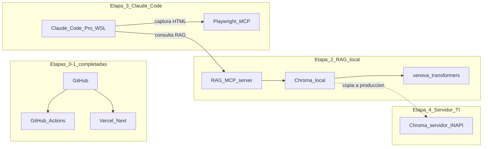

# Despliegue híbrido (Vercel + GitHub Actions + Supabase + Nest + AWS LC)

**Origen:** plan de trabajo alineado al acuerdo del equipo (referencia interna: plan Cursor `despliegue_híbrido_03b45f72`).

**Resumen:** despliegue por etapas — Next.js en Vercel (previews y producción del mock), GitHub Actions como CI u orquestación, Supabase al entrar Fase 2, API Nest en Railway o AWS según decisión, y pipeline LC en AWS según ADRs; incluye cuidados del monorepo Bun, fixtures (`LC_REPO_ROOT`) y documentación en repo.

**Seguridad complementaria:** [`../SECURITY.md`](../SECURITY.md).

---

## Checklist de etapas (seguimiento manual)

- [x] **Etapa 0:** alineación inicial con TI (decisión **Nest en Railway vs AWS** cuando exista código; no bloquea el mock). Cuentas **GitHub** y **Vercel** activas para Etapa 1; **Supabase** y **AWS** al arrancar Fase 2 según política INAPI. *(Anotar la decisión Nest en [`../ROADMAP.md`](../ROADMAP.md) o ADR breve cuando se formalice por escrito.)*
- [x] **Etapa 1.1:** proyecto Vercel con **Root Directory** `frontend`, **Install** `cd .. && bun install` y **Build** `cd .. && bun run build`; despliegue verificado en URL. **`LC_REPO_ROOT`** solo si `GET /api/audit-fixtures/...` no encontrara `data/` en runtime *(no requerido en el despliegue verificado a mayo 2026)*.
- [x] **Etapa 1.2:** workflow [`.github/workflows/ci.yml`](../../.github/workflows/ci.yml): `bun install --frozen-lockfile`, `bun run typecheck:all`, `bun run lint`; disparadores `push` a `main` y `feature/**`, `pull_request` a `main`, `workflow_dispatch`. Opción A (solo CI; deploy continúa en Vercel).
- [x] **Etapa 1.3:** verificación manual en URL desplegada: `/`, `/auditar`, mock, fixture por API e **importación JSON** (pegar contenido o archivo; ejemplos válidos en `data/audit-fixtures/*.json`).
- [x] **Etapa 1.4 (Fase 1.5 piloto):** verificación en Vercel de las **9 URLs** piloto: acordeón «URLs auditadas — piloto junio 2026» → `/auditar/resultado?claudeAudit=…` → **Descargar informe PDF** (`GET /api/claude-audits/[id]/export/pdf`). Misma dependencia de `data/claude-audits/` y `LC_REPO_ROOT` que fixtures *(verificado junio 2026)*.
- [ ] **Etapa 2:** proyecto Supabase + env en Vercel/Nest según `DATABASE.md` y ADR 0005.
- [ ] **Etapa 3:** desplegar Nest en Railway o AWS + CORS + variables a Supabase y AWS LC.
- [ ] **Etapa 4:** pipeline LC en AWS según ADR 0006 e integración Nest ↔ API Gateway.
- [x] **Etapa 5 (cierre Etapa 1):** README con sección despliegue y CI; ROADMAP y ARCHITECTURE actualizados; entrada en devlog *(2026-05-22)*.

---

## Contexto del repo (relevante para el plan)

- Monorepo **Bun** en raíz: [`package.json`](../../package.json) con `workspaces: ["frontend"]`, scripts `typecheck:all`, `build` → `bun run --cwd frontend build`.
- Next **App Router** y APIs de lectura en servidor: fixtures (`GET /api/audit-fixtures/[fixtureId]`) y piloto Claude (`GET /api/claude-audits/[id]`, `GET …/export/pdf`) leen `data/audit-fixtures/` y `data/claude-audits/` con `LC_REPO_ROOT ?? join(process.cwd(), "..")` — en Vercel hay que garantizar que exista **`data/`** en el árbol de despliegue y, si el `cwd` no es `frontend/`, definir **`LC_REPO_ROOT`** (ver [`data/audit-fixtures/README.md`](../../data/audit-fixtures/README.md)).
- Arquitectura objetivo ya descrita en [`../ARCHITECTURE.md`](../ARCHITECTURE.md), [`../ROADMAP.md`](../ROADMAP.md) y ADRs (p. ej. [ADR 0006](../adr/0006-lc-evaluation-python-claude-aws.md), [ADR 0005](../adr/0005-api-backend-nestjs-prisma.md)): **Nest + Prisma + Supabase**; evaluación LC vía **AWS** (API Gateway + Lambda + Claude).

---

## Etapa 0 — Alineación interna (sin código obligatorio)

- **Decisión TI / liderazgo:** ¿Nest en **Railway** (simplicidad) o **AWS** (misma nube que Lambda LC) cuando exista código? El mock de UX **no la bloquea**; conviene anotarla en [`../ROADMAP.md`](../ROADMAP.md) o ADR corto cuando se cierre.
- **Cuentas:** GitHub (repo), Vercel (equipo o proyecto), más adelante Supabase y AWS según política INAPI.
- **Costes:** asumir **tiers gratuitos / prueba** para demo UX; producción revisar precios oficiales de Vercel, Supabase, Railway/AWS y uso de Claude.

---

## Etapa 1 — Demo UX y CI: **Next en Vercel** + **GitHub Actions**

Objetivo: URL estable o preview por rama para Equipo UX; calidad reproducible en CI.

### 1.1 Proyecto Vercel (Next)

- Crear proyecto en **Vercel** importando el **mismo repo** de GitHub.
- **Root Directory:** `frontend` (o raíz del repo si preferís un `vercel.json` en raíz que delegue; lo habitual con monorepo es **root = `frontend`**).
- **Install:** debe ejecutar **`bun install` en la raíz del monorepo** (donde está el workspace), no solo dentro de `frontend` sin el lockfile raíz — en el panel de Vercel ajustar **Install Command** (p. ej. `cd .. && bun install` si el root del proyecto en Vercel es `frontend`, según cómo Vercel clone el repo; verificar en la primera build fallida y corregir).
- **Build Command:** coherente con [`package.json`](../../package.json) raíz (`bun run build` desde raíz ya delega en `frontend`) o equivalente explícito.
- **Variables de entorno en Vercel (Preview y Production):**
  - **`LC_REPO_ROOT`:** apuntando a la raíz del checkout donde existan `data/` y `src/` si en runtime `process.cwd()` no deja leer fixtures (probar `/api/audit-fixtures/...` tras el primer deploy).
- **Probar** en local el mismo comando que usará Vercel antes de confiar en el panel.

### 1.2 GitHub Actions (orquestación)

- Añadir workflow en **`.github/workflows/`** (p. ej. `ci.yml` o `frontend-ci.yml`):
  - **Disparadores:** `push` y `pull_request` a ramas acordadas; opcional `workflow_dispatch`.
  - **Pasos:** `checkout`, `setup-bun`, `bun install` (raíz), `bun run typecheck:all`, `bun run lint` (ya definido en raíz contra `frontend`).
- **Opción A (solo CI):** el deploy lo hace **Vercel** al hacer push (integración GitHub–Vercel); Actions solo valida.
- **Opción B (CI + deploy desde Actions):** tras el build, paso con **Vercel CLI** o acción oficial usando secretos `VERCEL_TOKEN` / IDs de proyecto en **GitHub → Settings → Secrets and variables → Actions** (todo el flujo “visible” desde la pestaña Actions).

Elegir A o B según preferencia de equipo (menos secretos vs. un solo sitio para ver pipelines).

### 1.3 Verificación funcional post-deploy

- Abrir `/`, `/auditar`, flujo **mock**, **fixture JSON** y **import JSON** en la URL de preview.
- Si fixtures devuelven 404: revisar logs del **route handler** y `LC_REPO_ROOT` / inclusión de `data/audit-fixtures/` en el artefacto desplegado.

---

## Etapa 2 — **RAG local** (Chroma + @xenova/transformers)

Entorno: WSL con Bun y Chroma instalados. Referencia: [ADR 0010](../adr/0010-rag-local-chroma-xenova-transformers.md).

- Crear workspace `rag/` con `package.json`, `tsconfig.json` y scripts `ingest:a`, `ingest:b`, `query`.
- `bun install` en `rag/` (instala `chromadb`, `@xenova/transformers`, `langchain`).
- Levantar Chroma local: `chroma run --path ./rag/chroma_db --port 8000`.
- Poner los 6 PDFs normativos en `documentos/` (local; en `.gitignore`; nunca al repo).
- `bun run ingest:b` → ingesta Colección B (material del repo; ya disponible).
- `bun run ingest:a` → ingesta Colección A (PDFs normativos).
- Verificar con `bun run query "criterio D7 encabezados mayúsculas"`.
- Registrar el MCP server: `claude mcp add rag-auditoria bun /ruta/rag/mcp-server.ts`.

**Verificación:** Claude Code responde preguntas sobre criterios usando el RAG MCP.

---

## Etapa 3 — **Flujo completo de auditoría** (Claude Code Pro + MCP)

Entorno: WSL con Claude Code Pro, Playwright MCP y RAG MCP configurados. Referencia: [ADR 0009](../adr/0009-claude-code-pro-como-orquestador.md).

- Probar flujo end-to-end con una URL: Playwright MCP captura HTML → RAG MCP provee contexto → Claude Code genera JSON canónico.
- Verificar que el JSON pasa `validate-claude-audits.ts` y los Hooks se disparan automáticamente.
- Probar lote de URLs con subagents en paralelo.
- Calibrar con Equipo UX (G1, D7, E3) y documentar reglas en el devlog.

**Verificación:** auditoría completa automatizada de principio a fin; JSON válido en `data/claude-audits/`; PDF descargable en el frontend.

---

## Etapa 4 — **Producción en servidor TI** (Chroma como servicio)

Entorno: servidor interno INAPI (Octavio). Referencia: [PROPUESTA_TECNICA_INTEGRAL.md](../PROPUESTA_TECNICA_INTEGRAL.md) §6 Fase 4.

- Coordinar con Álvaro / Octavio: viabilidad del servidor, puertos disponibles, OS, capacidad CPU (para `@xenova/transformers`).
- Copiar `rag/chroma_db/` al servidor (no hay que reingestar; los vectores son portables).
- Levantar `rag/mcp-server.ts` como servicio persistente en el servidor TI.
- Configurar Claude Code en cada equipo del equipo para apuntar al MCP server remoto (ajustar URL en `claude mcp add rag-auditoria`).
- Verificar flujo completo desde al menos dos máquinas distintas del equipo.

**Verificación:** el equipo completo puede auditar URLs sin depender del equipo de desarrollo encendido; `documentos/` y `chroma_db/` nunca salen al repo ni a internet.

---

## Etapa 5 — Documentación en el repo

**Estado (cierre Etapa 1, 2026-05-22):** completado en el sentido del mock y del CI — [`README.md`](../../README.md) (sección **Despliegue y CI**), [`docs/ROADMAP.md`](../ROADMAP.md), [`docs/ARCHITECTURE.md`](../ARCHITECTURE.md), [`docs/SECURITY.md`](../SECURITY.md) y [`docs/development/DEVLOG.md`](../development/DEVLOG.md) actualizados.

Para **Fase 2 y siguientes**, seguir ampliando README, roadmap y arquitectura cuando exista Nest en el diagrama de despliegue (p. ej. **Vercel (Next) → Nest → Supabase / AWS**).

---

## Orden recomendado de ejecución práctica

1. Etapa 0 (decisión Nest: anotar; no bloquea UX).
2. Etapa 1.1 → 1.3 (URL para UX + CI Actions).
3. Tras aprobación mock: Etapa 2 + 3 + 4 según roadmap de producto.
4. Etapa 5 en cada cierre relevante (commit/PR que ya comentasteis para documentación + devlog).

---

## Riesgos / puntos de atención

- **Monorepo Bun:** install/build en CI y en Vercel deben usar la **raíz** del workspace para no romper `@contracts/checklist`.
- **Fixtures en serverless:** dependen del filesystem del deploy y de `LC_REPO_ROOT`; validar en preview antes de la demo.
- **CORS y URLs:** cuando exista Nest, las previews de Vercel tienen dominios distintos a producción; hay que permitirlos explícitamente en Nest.
