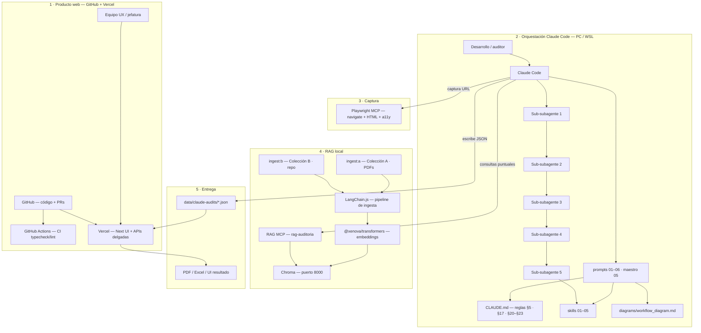
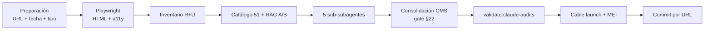

# Despliegue híbrido — guía en lenguaje claro

**Para quién es este documento:** alguien que ve el proyecto por primera vez (Equipo UX, jefatura, TI o desarrollo) y necesita entender **qué piezas hay**, **para qué sirven** y **en qué orden se activan**.

**Origen:** plan de trabajo alineado al acuerdo del equipo (referencia interna: plan Cursor `despliegue_híbrido_03b45f72`), actualizado al stack real: **Vercel + GitHub + Claude Code + Playwright + Chroma RAG** (sin Nest, Supabase Auth ni AWS LC).

**Seguridad complementaria:** [`../SECURITY.md`](../SECURITY.md).  
**Worker on-demand (Vercel ↔ PC):** [`tunel-vercel-worker-pc.md`](tunel-vercel-worker-pc.md) · [ADR 0011](../adr/0011-worker-local-on-demand-vercel.md).

---

## Resumen en una página

Este proyecto tiene **dos mundos** que conviven:

| Mundo | Qué es | Dónde corre hoy |
| --- | --- | --- |
| **Producto web** | Pantallas `/auditar`, PDF, Excel, historial | **Vercel** (UI) + código en **GitHub** |
| **Auditoría profunda** | Captura de URL, 51 criterios LC, JSON canónico | **PC / WSL** con **Claude Code**, Playwright y Chroma (RAG) |

**GitHub** guarda y valida el código. **Vercel** lo muestra en internet para que Equipo UX pruebe sin instalar nada.  
**Ninguno de los dos ejecuta hoy la auditoría larga (10–40 min):** eso lo hace Claude Code en el PC (ADR 0009 / 0011).

**MVP sin login:** cualquier persona de INAPI con la URL puede auditar. No hay Nest, Supabase Auth ni pipeline AWS: esas propuestas antiguas se **retiraron** del repo.

---

## 1. GitHub y Vercel — para qué sirven y por qué son indispensables

### 1.1 GitHub — el lugar del código y de la calidad

| Pregunta | Respuesta en lenguaje claro |
| --- | --- |
| **¿Para qué se ocupa?** | Guardar el historial del proyecto (commits, ramas, pull requests) y disparar **controles automáticos** cada vez que alguien sube cambios. |
| **¿Qué función cumple?** | Es la **fuente de verdad del código**: Next.js (`frontend/`), datos de auditorías (`data/`), orquestación Claude (`.claude/`), scripts y documentación (`docs/`). |
| **¿Por qué importa en este proyecto?** | Sin GitHub no hay colaboración segura ni rastro de qué versión de checklist o de auditoría se usó. Equipo UX y desarrollo miran el mismo repo. |
| **¿Qué lo hace único / indispensable aquí?** | Aquí viven los **JSON canónicos** y el **CI** (GitHub Actions): si el código no pasa `typecheck`/`lint`, no debería llegar a producción. Vercel **despliega**; GitHub **decide qué merece desplegarse**. |

**Pieza concreta en el repo:** [`.github/workflows/ci.yml`](../../.github/workflows/ci.yml) — al hacer `push` o `pull_request`, instala Bun y corre `typecheck:all` + `lint`.

### 1.2 Vercel — la vitrina en internet del aplicativo

| Pregunta | Respuesta en lenguaje claro |
| --- | --- |
| **¿Para qué se ocupa?** | Publicar el aplicativo Next.js en una **URL pública** (preview por rama o producción) sin que Equipo UX instale Node ni Bun. |
| **¿Qué función cumple?** | Sirve las pantallas (`/`, `/auditar`, resultado, PDF) y APIs delgadas de lectura (`/api/claude-audits/…`, fixtures, jobs). |
| **¿Por qué importa en este proyecto?** | Es el canal de **demo y revisión** con jefatura / Equipo UX. Cada PR puede tener su propia preview. |
| **¿Qué lo hace único / indispensable aquí?** | Conecta el monorepo a un **hosting listo para frontend serverless**. No sustituye a Claude Code: en Vercel el disco es **efímero** y no conviene correr auditorías de 10–40 min (Playwright + §17: texto ascendente + 15 subagentes + 5 sub-subagentes). Su valor único es **mostrar el producto** y, en el MVP on-demand, **encolar** trabajos para que un PC los ejecute (ADR 0011). |

**Configuración habitual:** Root Directory `frontend`; Install `cd .. && bun install`; Build `cd .. && bun run build` (desde la raíz del monorepo).

### 1.3 Diferencia clave (una frase)

- **GitHub** = “¿el código es correcto y versionado?”  
- **Vercel** = “¿puedo abrir el aplicativo en el navegador ahora?”  

Ambos son indispensables: uno sin el otro deja el proyecto sin control de cambios o sin URL de demo.

---

## 2. Checklist por etapas (seguimiento)

### Etapa 0 — Alineación (cuentas)

- [x] **Cuentas GitHub y Vercel** activas para desplegar el mock / piloto.  
  *Importancia MVP:* sin ellas no hay URL de demo ni CI.

### Etapa 1 — Demo UX + CI (completada en lo esencial)

- [x] **1.1** Proyecto Vercel (root `frontend`, Bun desde raíz); URL verificada. `LC_REPO_ROOT` solo si las APIs no encuentran `data/`.
- [x] **1.2** GitHub Actions: `bun install --frozen-lockfile`, `typecheck:all`, `lint`.
- [x] **1.3** Verificación manual: `/`, `/auditar`, fixtures, import JSON.
- [x] **1.4** Piloto 9 URLs en Vercel: tabla → resultado → PDF.

### Etapa 2 — RAG local (stack Claude; operativo en WSL)

- [x] Chroma + Colecciones A/B + LangChain.js + Xenova + MCP `rag-auditoria` (ver §7).  
  *Importancia MVP:* Claude Code **fundamenta** criterios con normativa y precedentes sin subir PDFs a Anthropic.

### Etapa 3 — Flujo completo Claude Code + MCP (operativo)

- [x] Playwright + RAG + §17 + validate + cable UI (ver §8).

### Etapa 4 — Chroma compartido en red interna (opcional / coordinación TI)

- [ ] Copiar `chroma_db` y servir MCP en red interna INAPI si varios PCs deben compartir el mismo RAG (ver §9).

### Etapa 5 — Documentación

- [x] README, ROADMAP, SECURITY, DEVLOG (cierre Etapa 1); mantener alineado a Claude Code / Vercel / RAG.

---

## 3. Contexto del repo — tres piezas y qué hace cada una

### 3.1 Monorepo Bun (raíz del proyecto)

| Elemento | Qué es | Qué hace |
| --- | --- | --- |
| [`package.json`](../../package.json) | Manifiesto del monorepo | Declara `workspaces: ["frontend"]` y scripts globales (`typecheck:all`, `build`, `validate:claude-audits`, `dev`). |
| `bun install` / lockfile | Instalación de dependencias | Una sola instalación desde la **raíz** alimenta frontend y herramientas. |
| `src/` | Código compartido (schemas Zod, scripts, export MEI) | Valida JSON de auditorías, genera Excel, worker de jobs. |
| `data/` | Datos versionados o locales | `claude-audits/`, fixtures, catálogo checklist 51 LC-*, jobs. |
| `rag/` | Workspace del RAG | Ingesta A/B, Chroma, MCP server; **LangChain.js** y `@xenova/transformers`. |
| `.claude/` | Orquestación Claude Code | Constitución, skills, prompts, diagrama. |

### 3.2 Next.js App Router y APIs de lectura en servidor

| Elemento | Qué es | Qué hace |
| --- | --- | --- |
| `frontend/` | Aplicativo Next | Pantallas del flujo auditar y consumo de APIs. |
| `GET /api/audit-fixtures/[id]` | API de fixtures | Lee JSON de ejemplo desde `data/audit-fixtures/`. |
| `GET /api/claude-audits/[id]` (+ PDF) | API del piloto / informes | Lee `data/claude-audits/` y genera PDF. |
| `LC_REPO_ROOT` | Variable de entorno | Dice dónde está la raíz del repo si en Vercel el `cwd` no encuentra `data/`. |
| `/api/audit-jobs` (MVP) | API delgada de cola | Crea/consulta jobs; el worker en PC hace el trabajo pesado. |

### 3.3 Stack que opera hoy (camino real)

| Elemento | Función | ¿Opera hoy? |
| --- | --- | --- |
| Claude Code + Playwright + Chroma (ADR 0009/0010/0011) | Orquestar auditoría 51 criterios LC | **Sí** |
| Vercel + GitHub Actions | UI/PDF + CI | **Sí** |
| Nest / Prisma / Supabase Auth / AWS Lambda LC | Backend antiguo con login y nube | **No** — documentos y ADR Nest **retirados**; no forman parte del MVP |

---

## 4. Diagrama general — producto web + orquestación de auditoría


```mermaid
flowchart TB
  subgraph producto["1 · Producto web — GitHub + Vercel"]
    direction TB
    UX[Equipo UX / jefatura]
    GH[GitHub — código + PRs]
    GHA[GitHub Actions — CI typecheck/lint]
    V[Vercel — Next UI + APIs delgadas]
    UX --> V
    GH --> GHA
    GH --> V
  end

  producto ~~~ orquestacion

  subgraph orquestacion["2 · Orquestación Claude Code — PC / WSL"]
    direction TB
    USER[Desarrollo / auditor]
    CC[Claude Code]
    PR1[prompts 01–06 · maestro 05]
    CM[CLAUDE.md — reglas §5 · §17 · §20–§23]
    SK[skills 01–05]
    DG[diagrams/workflow_diagram.md]
    USER --> CC
    CC --> PR1
    PR1 --> CM
    PR1 --> SK
    PR1 --> DG
    CC --> SA1[Sub-subagente 1]
    SA1 --> SA2[Sub-subagente 2]
    SA2 --> SA3[Sub-subagente 3]
    SA3 --> SA4[Sub-subagente 4]
    SA4 --> SA5[Sub-subagente 5]
    SA5 --> SK
  end

  orquestacion ~~~ captura

  subgraph captura["3 · Captura"]
    direction TB
    PW[Playwright MCP — navigate + HTML + a11y]
  end

  CC -->|captura URL| PW

  captura ~~~ rag

  subgraph rag["4 · RAG local"]
    direction TB
    INA[ingest:a — Colección A · PDFs]
    INB[ingest:b — Colección B · repo]
    LCJS[LangChain.js — pipeline de ingesta]
    XE["@xenova/transformers — embeddings"]
    CH[Chroma — puerto 8000]
    RM[RAG MCP — rag-auditoria]
    INA --> LCJS
    INB --> LCJS
    LCJS --> XE
    XE --> CH
    RM --> CH
  end

  CC -->|consultas puntuales| RM

  rag ~~~ salida

  subgraph salida["5 · Entrega"]
    direction TB
    JSON[data/claude-audits/*.json]
    PDF[PDF / Excel / UI resultado]
    JSON --> V
    V --> PDF
  end

  CC -->|escribe JSON| JSON
```

### 4.1 Qué muestra este diagrama (por secciones)

| Sección del diagrama | Función | Propósito | Qué problema resuelve |
| --- | --- | --- | --- |
| **Producto web** | Publicar y validar el código de la interfaz | Que UX abra una URL y CI frene regresiones | Demo sin instalar / builds rotos |
| **Orquestación Claude Code** | Constitución, prompts, skills; 5 especialistas | Auditar **una URL** con 51 LC v3.0 | Evaluación manual o superficial |
| **Reglas** | CLAUDE.md §5 (+ §16–§23); no hay carpeta `/rules` | Contrato único CMS-first | Cada sesión inventaba criterios |
| **Captura Playwright** | HTML/a11y real | Evidencia ciudadana | Auditar de memoria |
| **RAG A/B + LangChain + Xenova + Chroma** | Indexar normativa y precedentes | Fundamentar comentarios | Alucinaciones; PDFs fuera de internet |
| **Subagentes + sub-subagentes (§17)** | D0 texto ascendente + 15 indicadores + 5 de entrega | Profundidad y calidad CMS | Un solo agente se queda corto |
| **Salida JSON → Vercel** | Guardar y mostrar PDF/Excel | Entrega institucional | Hallazgo solo en el chat |

### 4.2 Diagrama del flujo de una auditoría (1 URL)


```mermaid
flowchart LR
  A[Preparación<br/>URL + fecha + tipo] --> B[Playwright<br/>HTML + a11y]
  B --> C[Inventario R+U]
  C --> D[Catálogo 51 + RAG A/B]
  D --> E[5 sub-subagentes]
  E --> F[Consolidación CMS<br/>gate §22]
  F --> G[validate:claude-audits]
  G --> H[Cable launch + MEI]
  H --> I[Commit por URL]
```

Detalle: [`.claude/diagrams/workflow_diagram.md`](../../.claude/diagrams/workflow_diagram.md).

---

## 5. Etapa 0 — Alineación interna

**Función:** tener cuentas GitHub y Vercel listas.  
**Qué resuelve:** “¿hay login?”, “¿la auditoría corre en Vercel?” → **no** / **no**.

---

## 6. Etapa 1 — Demo UX y CI (Vercel + GitHub Actions)

**Objetivo:** URL estable o preview; calidad reproducible.

- **Opción A (usada):** Actions solo CI; Vercel despliega al push.  
- Verificar `/`, fixtures, PDF; si 404 → `LC_REPO_ROOT` e inclusión de `data/`.

---

## 7. Etapa 2 — RAG local (Chroma + LangChain.js + Xenova)

Referencia: [ADR 0010](../adr/0010-rag-local-chroma-xenova-transformers.md).

| Pieza | Función |
| --- | --- |
| **Chroma** | Vectores locales `rag/chroma_db/` |
| **Colección A** (`ingest:a`) | PDFs normativos en `documentos/` (gitignore) |
| **Colección B** (`ingest:b`) | Catálogo LC, mapa, Word extraído, JSON, ADRs |
| **LangChain.js** | Troceo / pipeline de ingesta |
| **@xenova/transformers** | Embeddings offline en CPU |
| **MCP rag-auditoria** | Puente Claude Code ↔ Chroma |

```bash
chroma run --path ./rag/chroma_db --port 8000
cd rag && bun run ingest:b   # y ingest:a si hay PDFs
claude mcp add rag-auditoria bun /ruta/rag/mcp-server.ts
```

---

## 8. Etapa 3 — Flujo completo (Claude Code + MCP)

Referencias: [ADR 0009](../adr/0009-claude-code-pro-como-orquestador.md), [`.claude/CLAUDE.md`](../../.claude/CLAUDE.md).

| Pieza | Función |
| --- | --- |
| **CLAUDE.md** | 51 criterios, §5, §17, §22, §23 |
| **Prompts** | `01`…`06` (maestro = `05`) |
| **Skills** | `01`…`05` |
| **§17** | §17.1bis + 15 subagentes + 5 sub-subagentes |
| **Playwright MCP** | Captura DOM |
| **validate:claude-audits** | Zod |

---

## 9. Etapa 4 — Chroma compartido (opcional)

Varios PCs consultan el mismo RAG sin depender del notebook de desarrollo. Copiar `rag/chroma_db/`, servir MCP en red interna.

---

## 10. Etapa 5 — Documentación

Mantener README, este archivo, ROADMAP, SECURITY y DEVLOG.

---

## 11. Orden práctico (hoy)

1. GitHub + Vercel + CI  
2. Chroma + ingest + Claude Code + Playwright  
3. Worker / túnel si demo on-demand  
4. Chroma compartido solo si hace falta  

---

## 12. Riesgos

| Riesgo | Mitigación |
| --- | --- |
| Monorepo Bun mal instalado | Install/build desde la **raíz** |
| Fixtures 404 en Vercel | `LC_REPO_ROOT` + `data/` |
| Creer que Vercel audita | Auditoría en PC |
| PDFs en git | `documentos/` gitignore |

---

## 13. Documentos relacionados

| Documento | Qué aporta |
| --- | --- |
| [ARCHITECTURE.md](../ARCHITECTURE.md) | Vista de arquitectura |
| [ROADMAP.md](../ROADMAP.md) | Fases |
| [ADR 0009](../adr/0009-claude-code-pro-como-orquestador.md) | Claude Code orquesta |
| [ADR 0010](../adr/0010-rag-local-chroma-xenova-transformers.md) | RAG local |
| [ADR 0011](../adr/0011-worker-local-on-demand-vercel.md) | Worker PC |
| [tunel-vercel-worker-pc.md](tunel-vercel-worker-pc.md) | Túnel demo |
