# Diagramas de procesos — LC INAPI MVP

**Última actualización:** 2026-06-02  
**Propósito:** guía visual para estudiar e implementar Fase 2 (BE, BD, integraciones). Complementa [`fase2-implementacion.md`](fase2-implementacion.md), [`ARCHITECTURE.md`](ARCHITECTURE.md) y [`adr/0007-modelo-datos-parseo-pre-conexiones.md`](adr/0007-modelo-datos-parseo-pre-conexiones.md).

**Fase 1.5 (piloto UX, junio 2026):** flujo manual Claude → JSON en repo → MVP → PDF sin Nest/Lambda; ver [`flujo-piloto-10-urls-claude-mvp.md`](flujo-piloto-10-urls-claude-mvp.md). El diagrama §11 (PDF) aplica al piloto con generación en **Next Route Handler**; la persistencia en Postgres queda en Fase 2.

**Decisiones de referencia (MVP 2026):** Vercel (Next) · Railway (Nest) · Supabase (Postgres + Auth) · Prisma · API Gateway + Lambda (Python) · Claude API.

---

## Índice

1. [Arquitectura general](#1-arquitectura-general)
2. [REST: capas y endpoints](#2-rest-capas-y-endpoints)
3. [PostgreSQL (Supabase)](#3-postgresql-supabase)
4. [Prisma](#4-prisma)
5. [API Gateway (AWS)](#5-api-gateway-aws)
6. [AWS Lambda](#6-aws-lambda)
7. [Autenticación (Supabase Auth)](#7-autenticación-supabase-auth)
8. [Flujo completo de auditoría LC](#8-flujo-completo-de-auditoría-lc)
9. [Persistencia final (transacción Nest → Postgres)](#9-persistencia-final-transacción-nest--postgres)
10. [Parseo: dónde ocurre y por qué importa](#10-parseo-dónde-ocurre-y-por-qué-importa)
11. [Export PDF (Fase 4)](#11-export-pdf-fase-4)
12. [Docker local (servicio Python)](#12-docker-local-servicio-python)
13. [Tabla rápida: quién conecta con quién](#13-tabla-rápida-quién-conecta-con-quién)

---

## 1. Arquitectura general

Vista de todas las piezas y conexiones principales.

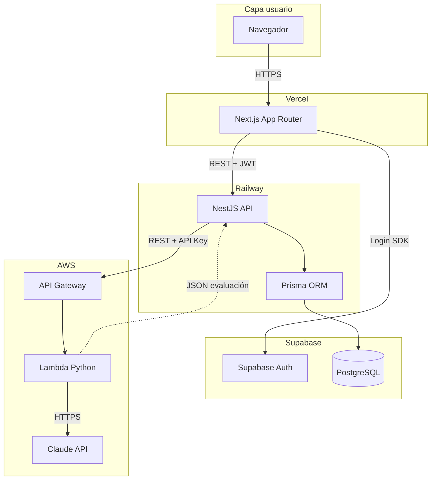

### Reglas de persistencia

| Regla | Detalle |
| --- | --- |
| Solo Nest escribe | `audits` y resultados vía Prisma |
| Lambda no escribe BD | Devuelve JSON; Nest valida y persiste |
| Next no habla SQL | Solo REST hacia Nest (en producción) |
| Secretos Claude | Solo en Lambda/AWS; nunca `NEXT_PUBLIC_*` |

---

## 2. REST: capas y endpoints

REST = HTTP + recursos nombrados + JSON.

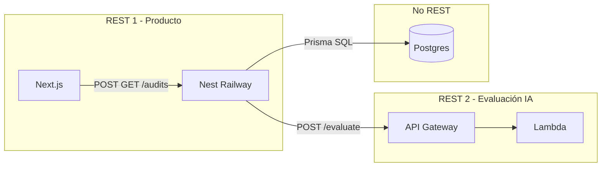

| Capa | Cliente | Servidor | Ejemplos |
| --- | --- | --- | --- |
| UI → dominio | Next | Nest | `POST /audits`, `GET /audits/:id`, `POST /audits/:id/evaluate` |
| Dominio → IA | Nest | API Gateway → Lambda | `POST /evaluate` |
| Dominio → datos | Nest (Prisma) | Postgres | No es REST; conexión SQL |

---

## 3. PostgreSQL (Supabase)

### Qué es

Motor de **base de datos relacional** (tablas, filas, SQL). **Supabase** lo hospeda y añade panel, Auth y RLS.

### Dónde se usa en el MVP

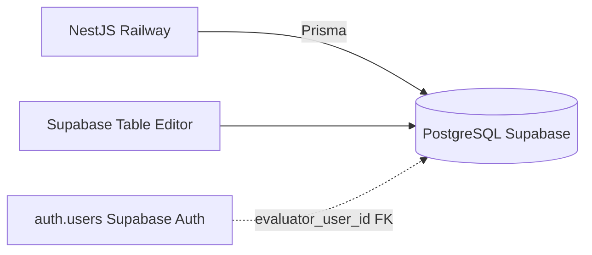

### Tablas principales (orientativo)

| Tabla | Contenido |
| --- | --- |
| `checklist_versions` | Catálogo checklist v1.1 |
| `audits` | Cabecera auditoría: URL, texto, resumen, versiones |
| `audit_criterion_results` | 39 filas por auditoría (detalle criterios) |
| `url_index` | Opcional: inventario Calidad Web |

### Qué NO conecta Postgres directamente

- Next.js (en diseño acordado)
- Lambda / Python
- Claude API

---

## 4. Prisma

### Qué es

**ORM** en TypeScript dentro de **Nest**: traduce objetos ↔ SQL Postgres.

### Flujo lógico

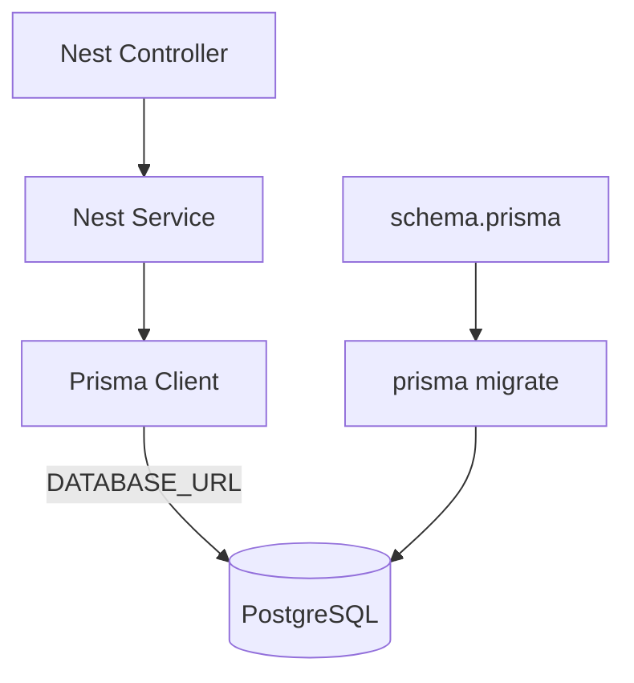

### Ejemplo mental de operación

```
Nest: "crear audit + 39 criterion_results"
  → Prisma genera INSERT/transaction SQL
  → Postgres guarda filas
  → Prisma devuelve objeto tipado a Nest
```

### Responsabilidades

| Prisma hace | Prisma no hace |
| --- | --- |
| Migraciones, CRUD tipado | Validar reglas LC (eso es Zod + Nest) |
| Relaciones 1:N | Llamar a Claude |
| Conexión pool a Supabase | Autenticar usuario (JWT lo hace Nest) |

---

## 5. API Gateway (AWS)

### Qué es

**Puerta HTTP** de AWS hacia Lambda. No evalúa LC ni guarda datos.

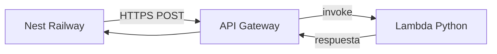

### Lógica por petición

1. Recibe `POST /evaluate` desde Nest.
2. Valida **auth servicio-a-servicio** (API Key u otro).
3. Invoca Lambda con el body JSON.
4. Devuelve status + JSON de Lambda a Nest.

### Límites relevantes MVP

| Límite | Nota |
| --- | --- |
| Timeout Gateway ~29 s | Alinear con expectativa PRD \< 30 s evaluación |
| Payload size | Textos muy largos → vigilar en Fase 3 captura |

---

## 6. AWS Lambda

### Qué es

**Función serverless**: código Python que AWS ejecuta **solo cuando hay una petición**, sin servidor 24/7.

### Ciclo de vida de una invocación

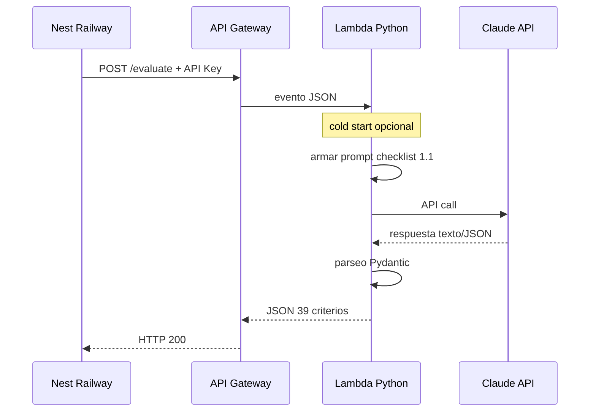

### Por qué es ideal para este MVP

- Una auditoría = un job corto (event-driven).
- Bajo tráfico demo UX → costo bajo.
- Separa IA (Camila/AWS) de dominio + datos (Nest/Railway).
- Clave Anthropic no sale de AWS.

### Lambda vs persistencia

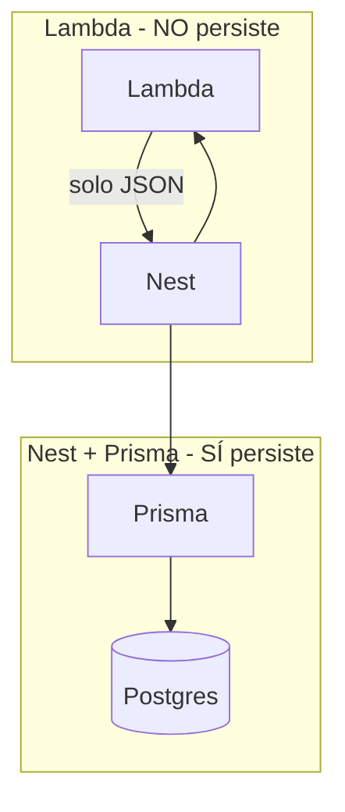

---

## 7. Autenticación (Supabase Auth)

Dos capas de auth distintas en el MVP.

### 7.1 Auth usuario (Supabase Auth)

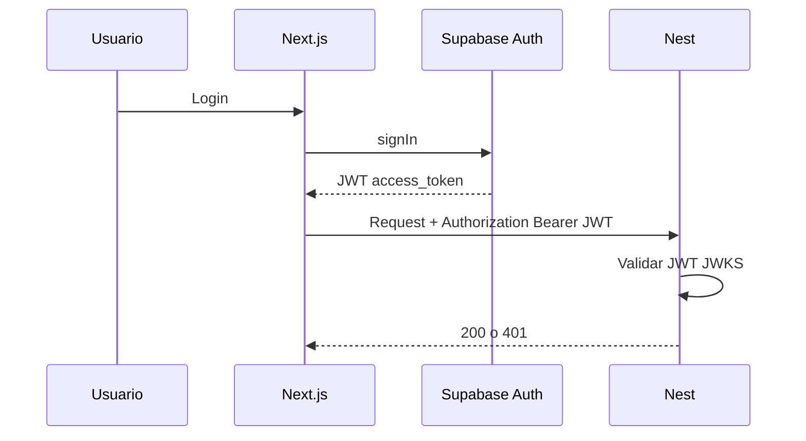

### 7.2 Auth servicio (Nest ↔ Lambda)

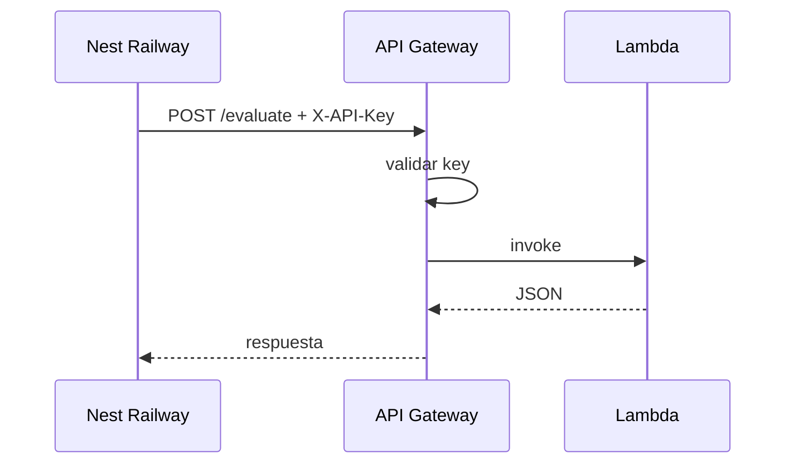

| Auth | Entre | Propósito |
| --- | --- | --- |
| JWT Supabase | Usuario → Next → Nest | ¿Quién audita? |
| API Key | Nest → Gateway | ¿Solo nuestro backend evalúa con Claude? |

---

## 8. Flujo completo de auditoría LC

De ingreso URL a resultado en pantalla.

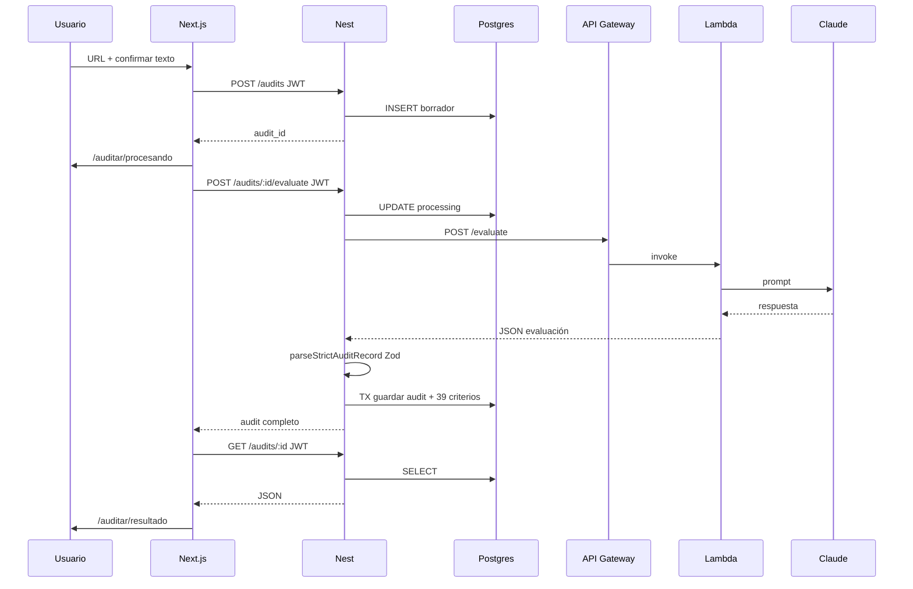

### Pantallas ↔ API (referencia estudio)

| Pantalla | Acción API |
| --- | --- |
| `/` → login | Supabase Auth |
| `/auditar` | — |
| `/auditar/captura` | texto para evaluar |
| `/auditar/procesando` | `POST /audits/:id/evaluate` |
| `/auditar/resultado` | `GET /audits/:id` |

---

## 9. Persistencia final (transacción Nest → Postgres)

Qué ocurre cuando Lambda devuelve JSON válido.

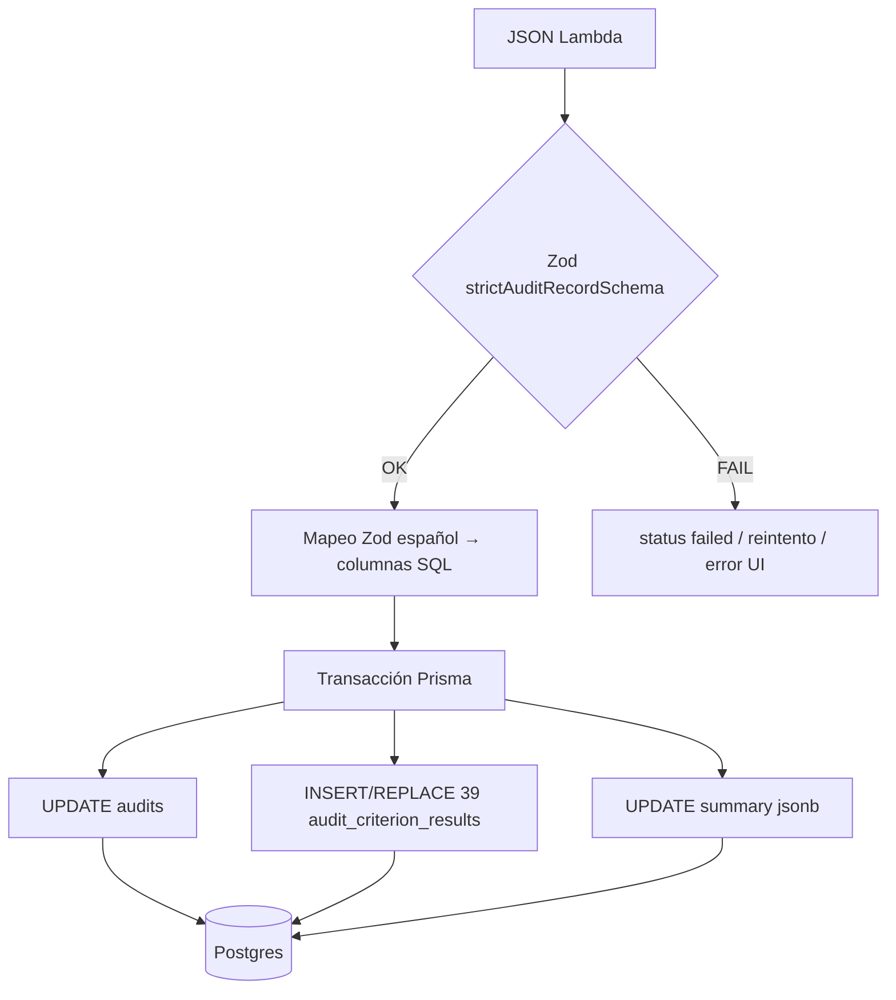

### Checklist persistencia correcta

- [ ] Exactamente **39** criterios.
- [ ] `summary` coherente con `summarizeEvaluations` (N/A fuera del denominador).
- [ ] `checklist_version` + `prompt_version` guardados.
- [ ] `evaluator_user_id` = JWT del request.
- [ ] `GET /audits/:id` devuelve lo mismo que se escribió.

### Origen de cada dato

| Campo | Origen |
| --- | --- |
| `captured_text`, `url` | Usuario / captura (Nest antes de evaluate) |
| `criterios_evaluados[39]` | Lambda / Claude |
| `texto_propuesto`, `observaciones_lc` | LLM |
| `porcentaje`, `estado_aceptacion` | Calculado Nest (`summarizeEvaluations`) |
| `evaluator_user_id` | JWT Supabase |
| `prompt_version` | Lambda / config |

---

## 10. Parseo: dónde ocurre y por qué importa

**Parsear** = interpretar datos crudos + validar forma y reglas de negocio.

### Mapa de contextos en el MVP

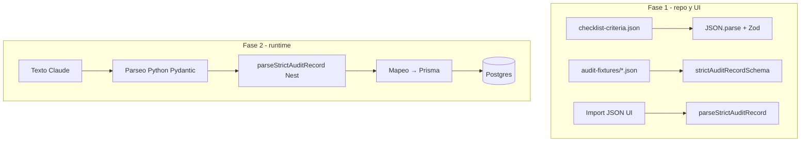

### Tabla de contextos

| # | Evento | Dónde | Herramienta |
| --- | --- | --- | --- |
| 1 | Validar catálogo checklist | Scripts CI | `parseChecklistCriteriaFile` |
| 2 | Validar fixtures JSON | CI / API fixtures | `strictAuditRecordSchema.parse` |
| 3 | Importar auditoría en UI | `/auditar/resultado` | `parseStrictAuditRecord` |
| 4 | Salida de Claude | Lambda Python | Pydantic / JSON estricto |
| 5 | Antes de persistir | Nest | `parseStrictAuditRecord` + `summarizeEvaluations` |
| 6 | Guardar en BD | Nest | Mapeo Zod → columnas Prisma |

### Flujo parseo en cadena (Fase 2)

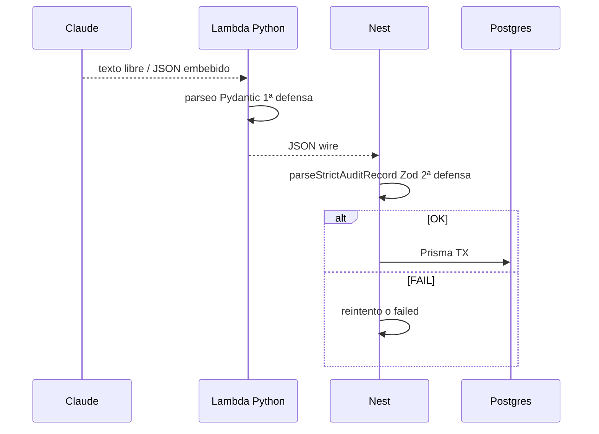

### Por qué importa (ADR 0007)

- LLM puede romper formato o números incoherentes.
- Mock UI, Lambda y Postgres deben compartir **el mismo contrato** (`src/schemas/checklist.ts`).
- Sin parseo acordado, no hay **persistencia segura**.

---

## 11. Export PDF (Fase 4; adelantado en Fase 1.5 para piloto)

En **Fase 1.5** el PDF por URL se genera desde el MVP (servidor Next, sin Nest). En **Fase 4** se consolida export institucional con historial persistido. Requiere **validación humana** antes de exportar (ADR 0004). Piloto: [`flujo-piloto-10-urls-claude-mvp.md`](flujo-piloto-10-urls-claude-mvp.md).

### Flujo producto

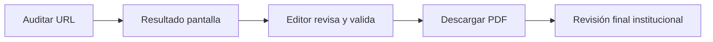

### Flujo técnico recomendado

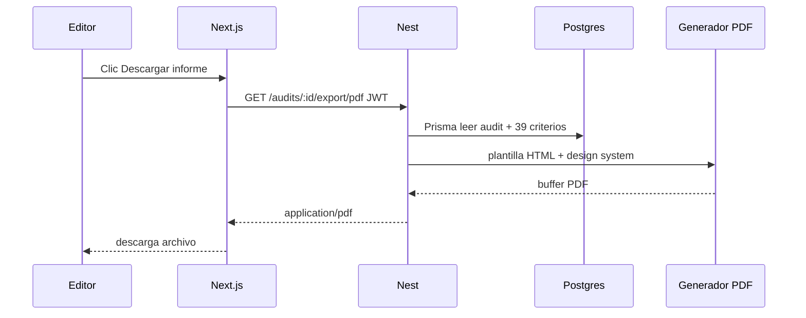

### Contenido del informe (referencia)

- Encabezado INAPI, URL, fecha, evaluador, versiones checklist/prompt.
- Resumen: % LC, `estado_aceptacion`.
- Tabla 39 criterios; hallazgos con cita, severidad, comentario.
- Texto propuesto, observaciones, pasos a seguir.

**Generación en Nest** (no Lambda): datos ya están en Postgres vía Prisma.

---

## 12. Docker local (servicio Python)

Paridad local ↔ Lambda (coordinación con Camila).

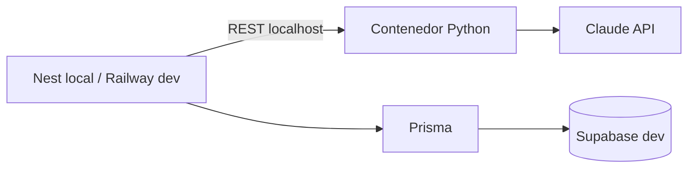

| Entorno | URL evaluación |
| --- | --- |
| Local | `http://localhost:PORT/evaluate` (Docker) |
| Staging/prod | API Gateway AWS |

---

## 13. Tabla rápida: quién conecta con quién

| Desde | Hacia | Protocolo | Auth | Persiste en BD |
| --- | --- | --- | --- | --- |
| Navegador | Next (Vercel) | HTTPS | — | No |
| Next | Supabase Auth | SDK | credenciales usuario | Solo `auth.users` |
| Next | Nest | REST | JWT usuario | No |
| Nest | Postgres | Prisma/SQL | `DATABASE_URL` | **Sí** |
| Nest | API Gateway | REST | API Key | No |
| Gateway | Lambda | invoke | AWS interno | No |
| Lambda | Claude | HTTPS | API Key Anthropic | No |
| Lambda | Postgres | — | **No conecta** | No |
| Nest | PDF generator | interno | — | Opcional log `exported_at` |

---

## Uso sugerido al estudiar Fase 2

| Sub-fase [`fase2-implementacion.md`](fase2-implementacion.md) | Diagramas de este doc |
| --- | --- |
| 2.0 Preparación | §1, §10, §13 |
| 2.1 BD + Prisma | §3, §4, §9 |
| 2.2 API Nest mínima | §2, §7.1, §8 (sin Lambda) |
| 2.3 Auth + FE | §7, §8 |
| 2.4 Lambda + Claude | §5, §6, §7.2, §8, §10, §12 |
| 2.5 Seguridad / cierre | §13 |
| Fase 4 PDF | §11 |

---

*Consolidado de guías de estudio Fase 2 (junio 2026). Actualizar al cerrar ADR 0007 y al añadir endpoints reales en Nest.*
