# Diagramas de procesos — LC INAPI MVP

**Última actualización:** 2026-08-21  

**Checklist:** 51 `LC-*` v3.0 · **11 URLs** META MEI.
**Vigente:** Claude Code + Playwright + Chroma/Xenova/LangChain + Zod + Vercel — [`ARCHITECTURE.md`](ARCHITECTURE.md) · [`despliegue/despliegue-hibrido.md`](despliegue/despliegue-hibrido.md) · [`flujo-piloto-10-urls-claude-mvp.md`](flujo-piloto-10-urls-claude-mvp.md).

---

## Índice

0. [Flujo vigente (Claude Code)](#0-flujo-vigente-claude-code)
1. [Archivo histórico — Arquitectura Nest/Supabase/AWS](#1-archivo-histórico--arquitectura-nestsupabaseaws)
2. [REST: capas y endpoints (histórico)](#2-rest-capas-y-endpoints-histórico)
3. [PostgreSQL / Supabase (histórico)](#3-postgresql-supabase-histórico)
4. [Prisma (histórico)](#4-prisma-histórico)
5. [API Gateway AWS (histórico)](#5-api-gateway-aws-histórico)
6. [AWS Lambda (histórico)](#6-aws-lambda-histórico)
7. [Autenticación Supabase (histórico)](#7-autenticación-supabase-auth-histórico)
8. [Flujo auditoría Nest→Postgres (histórico)](#8-flujo-completo-de-auditoría-lc-histórico)
9. [Persistencia Nest→Postgres (histórico)](#9-persistencia-final-transacción-nest--postgres-histórico)
10. [Parseo (notas; parcialmente vigente)](#10-parseo-dónde-ocurre-y-por-qué-importa)
11. [Export PDF (histórico + nota Fase 1.5)](#11-export-pdf-fase-4)
12. [Docker Python (histórico)](#12-docker-local-servicio-python-histórico)
13. [Tabla quién conecta con quién (histórico)](#13-tabla-rápida-quién-conecta-con-quién-histórico)

---

## 0. Flujo vigente (Claude Code)

Orquestación productiva actual (sin Nest, sin Postgres, sin Claude API de pago).

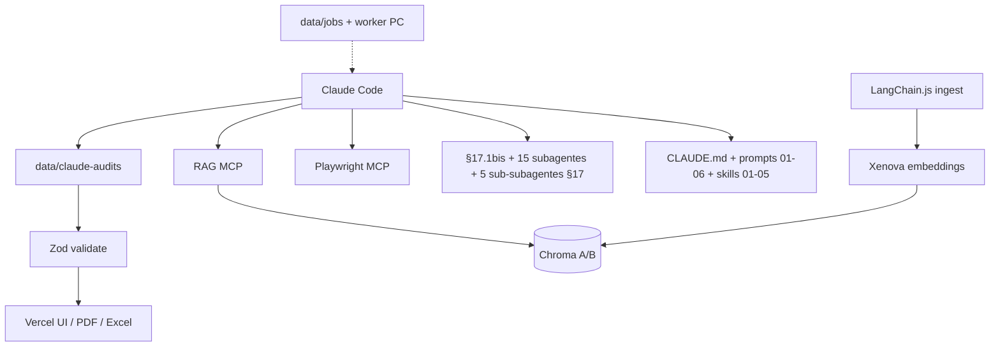
```mermaid
flowchart TD
  CC[Claude Code]
  CM[CLAUDE.md + prompts 01-06 + skills 01-05]
  SA[§17.1bis + 15 subagentes + 5 sub-subagentes §17]
  PW[Playwright MCP]
  RAG[RAG MCP]
  CH[(Chroma A/B)]
  XE[Xenova embeddings]
  LC[LangChain.js ingest]
  Z[Zod validate]
  JSON[data/claude-audits]
  V[Vercel UI / PDF / Excel]
  Jobs[data/jobs + worker PC]

  CC --> CM
  CC --> SA
  CC --> PW
  CC --> RAG
  RAG --> CH
  LC --> XE --> CH
  CC --> JSON --> Z --> V
  Jobs -.-> CC
```

| Pieza | Rol |
| --- | --- |
| Claude Code | Orquesta captura, RAG, 51 criterios, JSON |
| Prompt `05` | Contrato ejecutable 1 URL |
| Playwright MCP | DOM real |
| Chroma + Xenova + LangChain | RAG Colecciones A/B |
| Zod | `validate:claude-audits` |
| Vercel | UI, PDF, Excel, cola jobs |
| Worker PC | Claim job → mismo §17 (ADR 0011) |

Detalle: [`ARCHITECTURE.md`](ARCHITECTURE.md) · [`.claude/diagrams/workflow_diagram.md`](../.claude/diagrams/workflow_diagram.md).

---

## Archivo histórico (propuesta antigua)

> Las secciones siguientes documentan Nest / Railway / Supabase Auth / Lambda / 39 criterios. **No** son el plan del MVP. Se conservan como contexto de decisión (ver [ADR 0002](adr/0002-stack-next-bun-supabase.md), [ADR 0006](adr/0006-lc-evaluation-python-claude-aws.md)).

## 1. Archivo histórico — Arquitectura Nest/Supabase/AWS

Vista de la propuesta antigua (Nest + Railway + Supabase + Lambda).

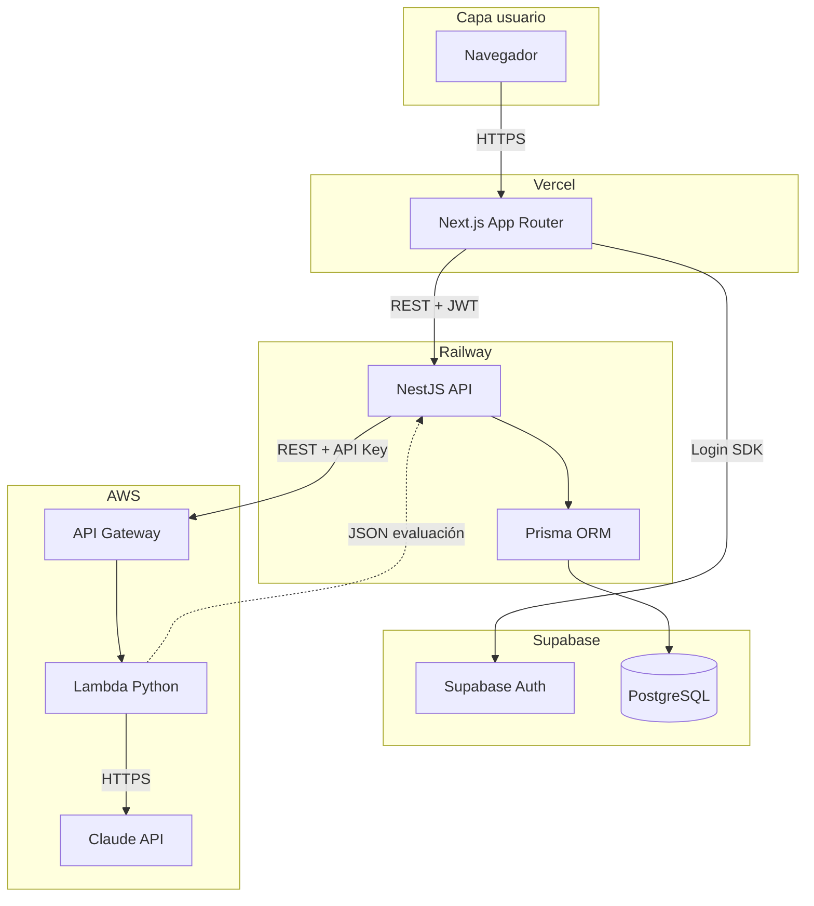
```mermaid
flowchart TB
  subgraph usuario [Capa usuario]
    Browser[Navegador]
  end

  subgraph vercel [Vercel]
    Next[Next.js App Router]
  end

  subgraph railway [Railway]
    Nest[NestJS API]
    Prisma[Prisma ORM]
  end

  subgraph supabase [Supabase]
    Auth[Supabase Auth]
    PG[(PostgreSQL)]
  end

  subgraph aws [AWS]
    GW[API Gateway]
    Lambda[Lambda Python]
    Claude[Claude API]
  end

  Browser -->|HTTPS| Next
  Next -->|Login SDK| Auth
  Next -->|REST + JWT| Nest
  Nest --> Prisma
  Prisma --> PG
  Nest -->|REST + API Key| GW
  GW --> Lambda
  Lambda -->|HTTPS| Claude
  Lambda -.->|JSON evaluación| Nest
```

### Reglas de persistencia

| Regla | Detalle |
| --- | --- |
| Solo Nest escribe | `audits` y resultados vía Prisma |
| Lambda no escribe BD | Devuelve JSON; Nest valida y persiste |
| Next no habla SQL | Solo REST hacia Nest (en producción) |
| Secretos Claude | Solo en Lambda/AWS; nunca `NEXT_PUBLIC_*` |

---

## 2. REST: capas y endpoints (histórico)

REST = HTTP + recursos nombrados + JSON.

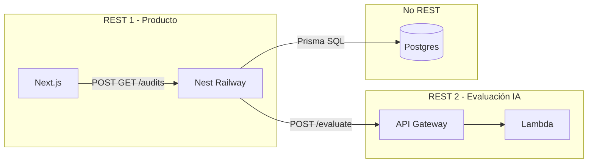
```mermaid
flowchart LR
  subgraph capa1 [REST 1 - Producto]
    Next[Next.js] -->|POST GET /audits| Nest[Nest Railway]
  end

  subgraph capa2 [REST 2 - Evaluación IA]
    Nest -->|POST /evaluate| GW[API Gateway]
    GW --> Lambda[Lambda]
  end

  subgraph capa3 [No REST]
    Nest -->|Prisma SQL| PG[(Postgres)]
  end
```

| Capa | Cliente | Servidor | Ejemplos |
| --- | --- | --- | --- |
| UI → dominio | Next | Nest | `POST /audits`, `GET /audits/:id`, `POST /audits/:id/evaluate` |
| Dominio → IA | Nest | API Gateway → Lambda | `POST /evaluate` |
| Dominio → datos | Nest (Prisma) | Postgres | No es REST; conexión SQL |

---

## 3. PostgreSQL (Supabase) (histórico)

### Qué es

Motor de **base de datos relacional** (tablas, filas, SQL). **Supabase** lo hospeda y añade panel, Auth y RLS.

### Dónde se usa en el MVP

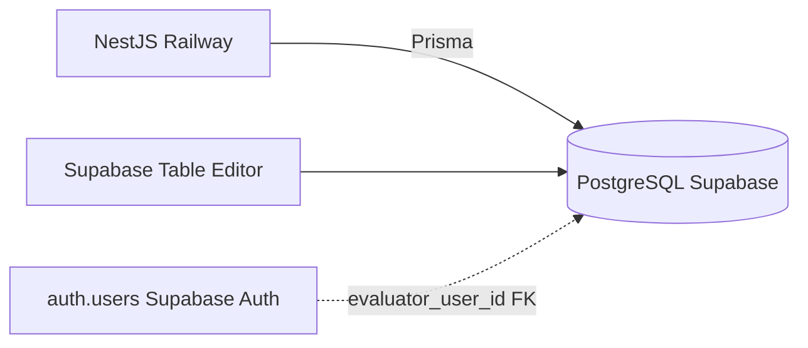
```mermaid
flowchart LR
  Nest[NestJS Railway] -->|Prisma| PG[(PostgreSQL Supabase)]
  Panel[Supabase Table Editor] --> PG
  AuthUsers[auth.users Supabase Auth] -.->|evaluator_user_id FK| PG
```

### Tablas principales (orientativo)

| Tabla | Contenido |
| --- | --- |
| `checklist_versions` | Catálogo checklist v1.1 |
| `audits` | Cabecera auditoría: URL, texto, resumen, versiones |
| `audit_criterion_results` | 39 filas por auditoría (detalle criterios) |
| `url_index` | Opcional: inventario Calidad Web |

### Qué NO conecta Postgres directamente

- Next.js (en diseño acordado)
- Lambda / Python
- Claude API

---

## 4. Prisma (histórico)

### Qué es

**ORM** en TypeScript dentro de **Nest**: traduce objetos ↔ SQL Postgres.

### Flujo lógico

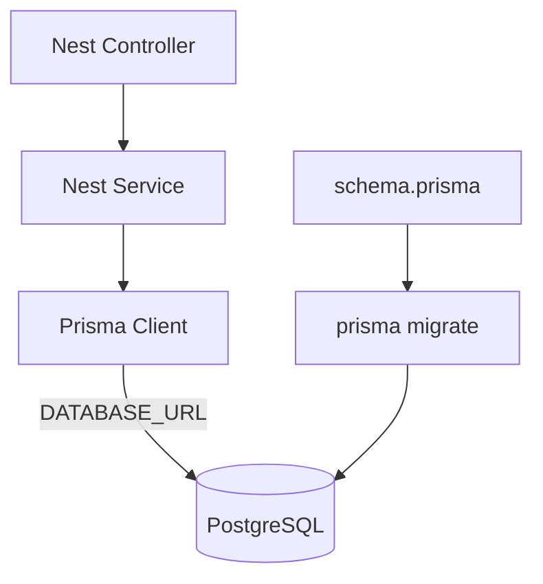
```mermaid
flowchart TB
  Controller[Nest Controller] --> Service[Nest Service]
  Service --> Client[Prisma Client]
  Client -->|DATABASE_URL| PG[(PostgreSQL)]

  Schema[schema.prisma] --> Migrate[prisma migrate]
  Migrate --> PG
```

### Ejemplo mental de operación

```
Nest: "crear audit + 39 criterion_results"
  → Prisma genera INSERT/transaction SQL
  → Postgres guarda filas
  → Prisma devuelve objeto tipado a Nest
```

### Responsabilidades

| Prisma hace | Prisma no hace |
| --- | --- |
| Migraciones, CRUD tipado | Validar reglas LC (eso es Zod + Nest) |
| Relaciones 1:N | Llamar a Claude |
| Conexión pool a Supabase | Autenticar usuario (JWT lo hace Nest) |

---

## 5. API Gateway (AWS) (histórico)

### Qué es

**Puerta HTTP** de AWS hacia Lambda. No evalúa LC ni guarda datos.

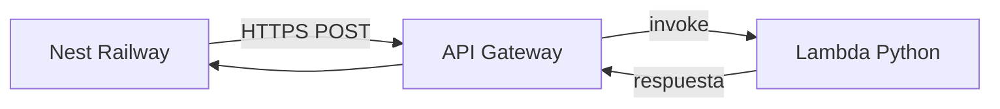
```mermaid
flowchart LR
  Nest[Nest Railway] -->|HTTPS POST| GW[API Gateway]
  GW -->|invoke| Lambda[Lambda Python]
  Lambda -->|respuesta| GW
  GW --> Nest
```

### Lógica por petición

1. Recibe `POST /evaluate` desde Nest.
2. Valida **auth servicio-a-servicio** (API Key u otro).
3. Invoca Lambda con el body JSON.
4. Devuelve status + JSON de Lambda a Nest.

### Límites relevantes MVP

| Límite | Nota |
| --- | --- |
| Timeout Gateway ~29 s | Alinear con expectativa PRD \< 30 s evaluación |
| Payload size | Textos muy largos → vigilar en Fase 3 captura |

---

## 6. AWS Lambda (histórico)

### Qué es

**Función serverless**: código Python que AWS ejecuta **solo cuando hay una petición**, sin servidor 24/7.

### Ciclo de vida de una invocación

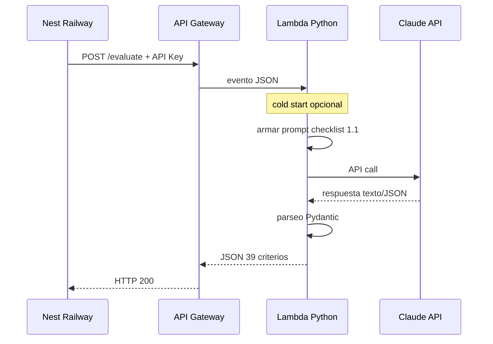
```mermaid
sequenceDiagram
  participant Nest as Nest Railway
  participant GW as API Gateway
  participant L as Lambda Python
  participant C as Claude API

  Nest->>GW: POST /evaluate + API Key
  GW->>L: evento JSON
  Note over L: cold start opcional
  L->>L: armar prompt checklist 1.1
  L->>C: API call
  C-->>L: respuesta texto/JSON
  L->>L: parseo Pydantic
  L-->>GW: JSON 39 criterios
  GW-->>Nest: HTTP 200
```

### Por qué es ideal para este MVP

- Una auditoría = un job corto (event-driven).
- Bajo tráfico demo UX → costo bajo.
- Separa IA (desarrollo backend/AWS) de dominio + datos (Nest/Railway).
- Clave Anthropic no sale de AWS.

### Lambda vs persistencia

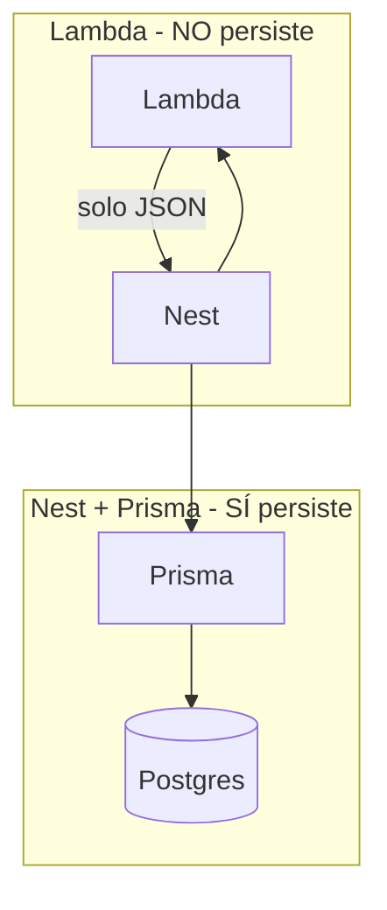
```mermaid
flowchart TB
  subgraph eval [Lambda - NO persiste]
    L[Lambda] -->|solo JSON| Nest
  end

  subgraph persist [Nest + Prisma - SÍ persiste]
    Nest --> Prisma --> PG[(Postgres)]
  end

  Nest --> L
```

---

## 7. Autenticación (Supabase Auth) (histórico)

Dos capas de auth distintas en el MVP.

### 7.1 Auth usuario (Supabase Auth)

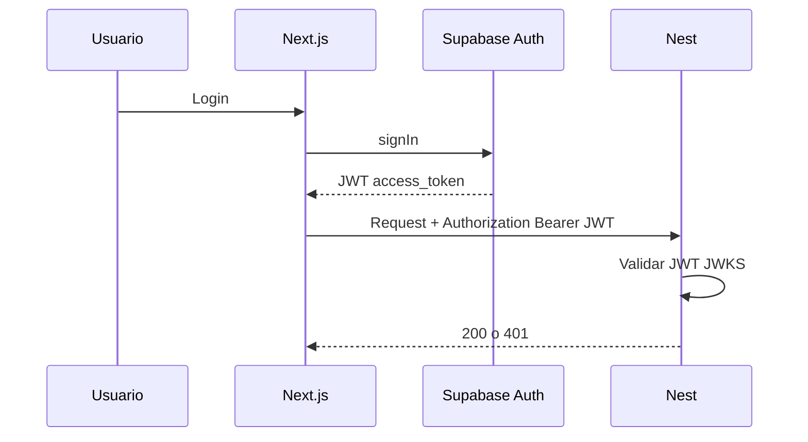
```mermaid
sequenceDiagram
  participant U as Usuario
  participant N as Next.js
  participant A as Supabase Auth
  participant API as Nest

  U->>N: Login
  N->>A: signIn
  A-->>N: JWT access_token
  N->>API: Request + Authorization Bearer JWT
  API->>API: Validar JWT JWKS
  API-->>N: 200 o 401
```

### 7.2 Auth servicio (Nest ↔ Lambda)

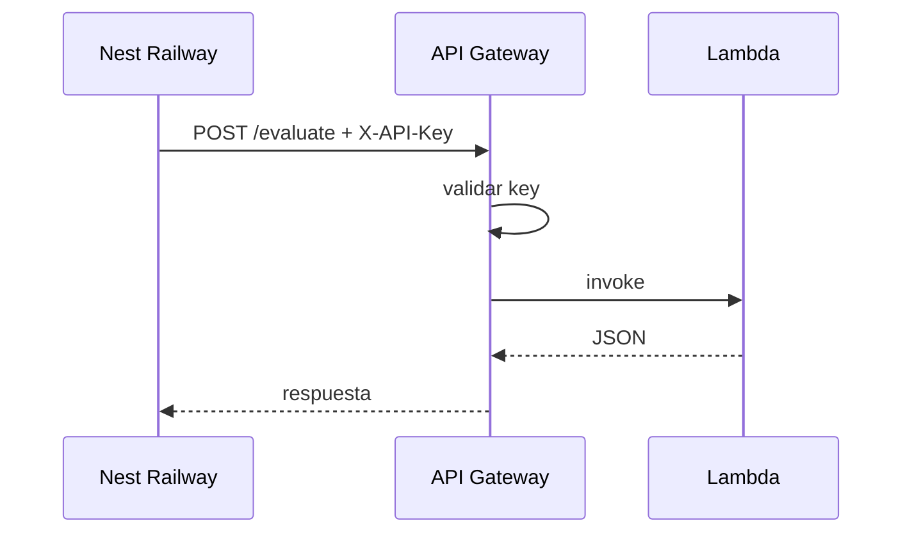
```mermaid
sequenceDiagram
  participant API as Nest Railway
  participant GW as API Gateway
  participant L as Lambda

  API->>GW: POST /evaluate + X-API-Key
  GW->>GW: validar key
  GW->>L: invoke
  L-->>GW: JSON
  GW-->>API: respuesta
```

| Auth | Entre | Propósito |
| --- | --- | --- |
| JWT Supabase | Usuario → Next → Nest | ¿Quién audita? |
| API Key | Nest → Gateway | ¿Solo nuestro backend evalúa con Claude? |

---

## 8. Flujo completo de auditoría LC (histórico)

De ingreso URL a resultado en pantalla.

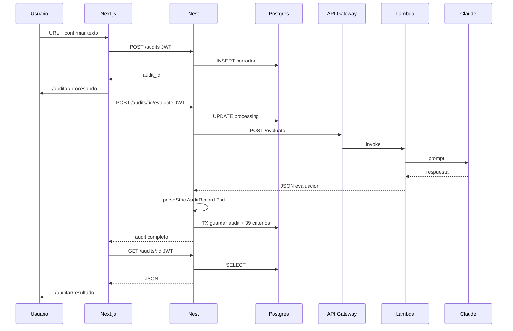
```mermaid
sequenceDiagram
  participant U as Usuario
  participant N as Next.js
  participant API as Nest
  participant DB as Postgres
  participant GW as API Gateway
  participant L as Lambda
  participant C as Claude

  U->>N: URL + confirmar texto
  N->>API: POST /audits JWT
  API->>DB: INSERT borrador
  API-->>N: audit_id
  N->>U: /auditar/procesando

  N->>API: POST /audits/:id/evaluate JWT
  API->>DB: UPDATE processing
  API->>GW: POST /evaluate
  GW->>L: invoke
  L->>C: prompt
  C-->>L: respuesta
  L-->>API: JSON evaluación
  API->>API: parseStrictAuditRecord Zod
  API->>DB: TX guardar audit + 39 criterios
  API-->>N: audit completo

  N->>API: GET /audits/:id JWT
  API->>DB: SELECT
  API-->>N: JSON
  N->>U: /auditar/resultado
```

### Pantallas ↔ API (referencia estudio)

| Pantalla | Acción API |
| --- | --- |
| `/` → login | Supabase Auth |
| `/auditar` | — |
| `/auditar/captura` | texto para evaluar |
| `/auditar/procesando` | `POST /audits/:id/evaluate` |
| `/auditar/resultado` | `GET /audits/:id` |

---

## 9. Persistencia final (transacción Nest → Postgres) (histórico)

Qué ocurre cuando Lambda devuelve JSON válido.

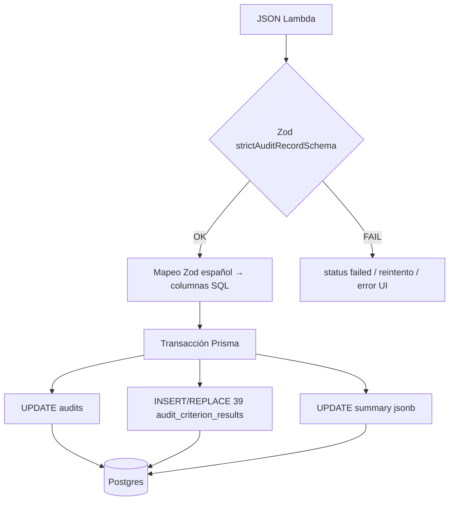
```mermaid
flowchart TB
  IN[JSON Lambda] --> V{Zod strictAuditRecordSchema}
  V -->|OK| MAP[Mapeo Zod español → columnas SQL]
  MAP --> TX[Transacción Prisma]
  TX --> A[UPDATE audits]
  TX --> B[INSERT/REPLACE 39 audit_criterion_results]
  TX --> C[UPDATE summary jsonb]
  A --> PG[(Postgres)]
  B --> PG
  C --> PG
  V -->|FAIL| F[status failed / reintento / error UI]
```

### Checklist persistencia correcta

- [ ] Exactamente **39** criterios.
- [ ] `summary` coherente con `summarizeEvaluations` (N/A fuera del denominador).
- [ ] `checklist_version` + `prompt_version` guardados.
- [ ] `evaluator_user_id` = JWT del request.
- [ ] `GET /audits/:id` devuelve lo mismo que se escribió.

### Origen de cada dato

| Campo | Origen |
| --- | --- |
| `captured_text`, `url` | Usuario / captura (Nest antes de evaluate) |
| `criterios_evaluados[39]` | Lambda / Claude |
| `texto_propuesto`, `observaciones_lc` | LLM |
| `porcentaje`, `estado_aceptacion` | Calculado Nest (`summarizeEvaluations`) |
| `evaluator_user_id` | JWT Supabase |
| `prompt_version` | Lambda / config |

---

## 10. Parseo: dónde ocurre y por qué importa

**Parsear** = interpretar datos crudos + validar forma y reglas de negocio.

### Mapa de contextos en el MVP

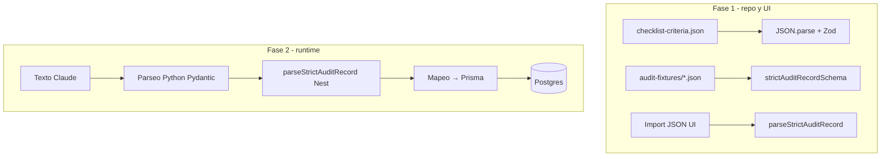
```mermaid
flowchart TB
  subgraph fase1 [Fase 1 - repo y UI]
    J1[checklist-criteria.json] --> P1[JSON.parse + Zod]
    J2[audit-fixtures/*.json] --> P2[strictAuditRecordSchema]
    UI[Import JSON UI] --> P3[parseStrictAuditRecord]
  end

  subgraph fase2 [Fase 2 - runtime]
    Claude[Texto Claude] --> P4[Parseo Python Pydantic]
    P4 --> P5[parseStrictAuditRecord Nest]
    P5 --> P6[Mapeo → Prisma]
    P6 --> PG[(Postgres)]
  end
```

### Tabla de contextos

| # | Evento | Dónde | Herramienta |
| --- | --- | --- | --- |
| 1 | Validar catálogo checklist | Scripts CI | `parseChecklistCriteriaFile` |
| 2 | Validar fixtures JSON | CI / API fixtures | `strictAuditRecordSchema.parse` |
| 3 | Importar auditoría en UI | `/auditar/resultado` | `parseStrictAuditRecord` |
| 4 | Salida de Claude | Lambda Python | Pydantic / JSON estricto |
| 5 | Antes de persistir | Nest | `parseStrictAuditRecord` + `summarizeEvaluations` |
| 6 | Guardar en BD | Nest | Mapeo Zod → columnas Prisma |

### Flujo parseo en cadena (Fase 2)

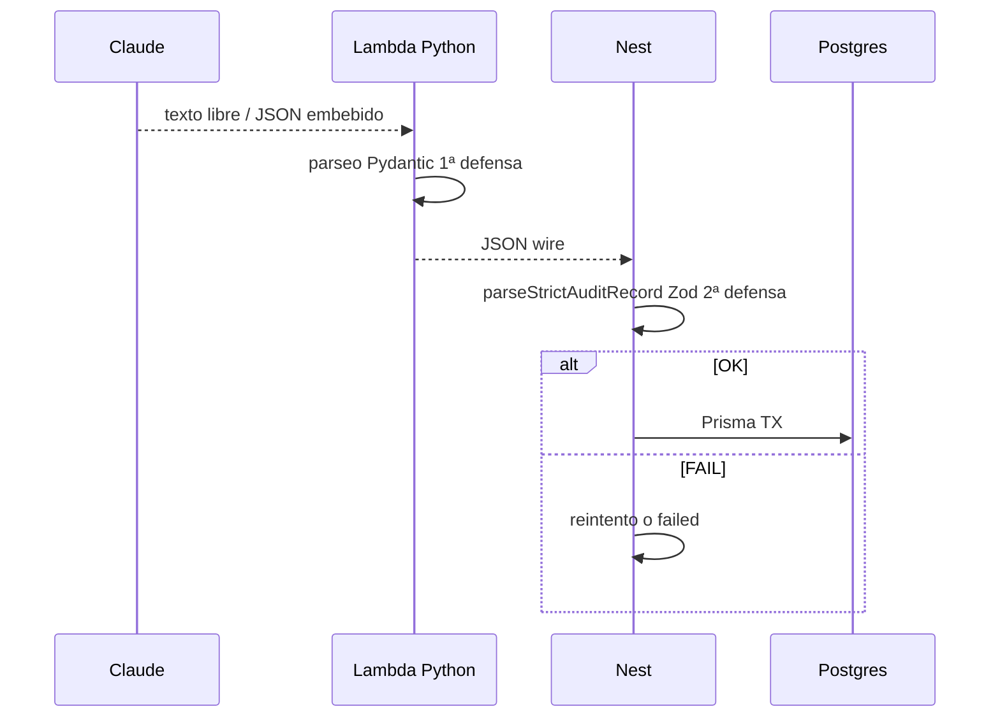
```mermaid
sequenceDiagram
  participant C as Claude
  participant L as Lambda Python
  participant API as Nest
  participant DB as Postgres

  C-->>L: texto libre / JSON embebido
  L->>L: parseo Pydantic 1ª defensa
  L-->>API: JSON wire
  API->>API: parseStrictAuditRecord Zod 2ª defensa
  alt OK
    API->>DB: Prisma TX
  else FAIL
    API->>API: reintento o failed
  end
```

### Por qué importa (ADR 0007)

- LLM puede romper formato o números incoherentes.
- Mock UI, Lambda y Postgres deben compartir **el mismo contrato** (`src/schemas/checklist.ts`).
- Sin parseo acordado, no hay **persistencia segura**.

---

## 11. Export PDF (Fase 4; adelantado en Fase 1.5 para piloto)

En **Fase 1.5** el PDF por URL se genera desde el MVP (servidor Next, sin Nest). En **Fase 4** se consolida export institucional con historial persistido. Requiere **validación humana** antes de exportar (ADR 0004). Piloto: [`flujo-piloto-10-urls-claude-mvp.md`](flujo-piloto-10-urls-claude-mvp.md).

### Flujo producto

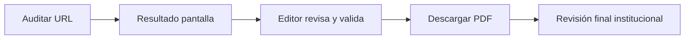
```mermaid
flowchart LR
  A[Auditar URL] --> B[Resultado pantalla]
  B --> C[Editor revisa y valida]
  C --> D[Descargar PDF]
  D --> E[Revisión final institucional]
```

### Flujo técnico recomendado

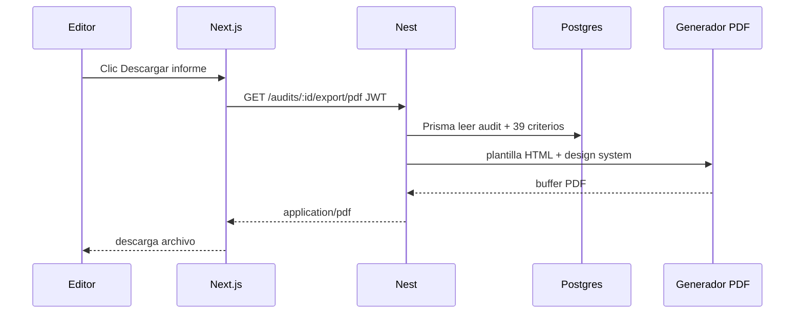
```mermaid
sequenceDiagram
  participant U as Editor
  participant N as Next.js
  participant API as Nest
  participant DB as Postgres
  participant PDF as Generador PDF

  U->>N: Clic Descargar informe
  N->>API: GET /audits/:id/export/pdf JWT
  API->>DB: Prisma leer audit + 39 criterios
  API->>PDF: plantilla HTML + design system
  PDF-->>API: buffer PDF
  API-->>N: application/pdf
  N-->>U: descarga archivo
```

### Contenido del informe (referencia)

- Encabezado INAPI, URL, fecha, evaluador, versiones checklist/prompt.
- Resumen: % LC, `estado_aceptacion`.
- Tabla 39 criterios; hallazgos con cita, severidad, comentario.
- Texto propuesto, observaciones, pasos a seguir.

**Generación en Nest** (no Lambda): datos ya están en Postgres vía Prisma.

---

## 12. Docker local (servicio Python) (histórico)

Paridad local ↔ Lambda (coordinación con desarrollo backend).

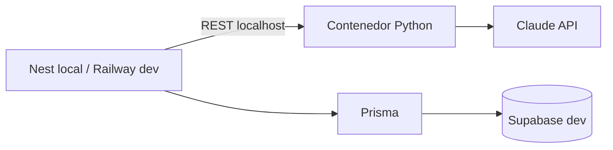
```mermaid
flowchart LR
  NestDev[Nest local / Railway dev] -->|REST localhost| Docker[Contenedor Python]
  Docker --> Claude[Claude API]
  NestDev --> Prisma[Prisma]
  Prisma --> SB[(Supabase dev)]
```

| Entorno | URL evaluación |
| --- | --- |
| Local | `http://localhost:PORT/evaluate` (Docker) |
| Staging/prod | API Gateway AWS |

---

## 13. Tabla rápida: quién conecta con quién (histórico)

| Desde | Hacia | Protocolo | Auth | Persiste en BD |
| --- | --- | --- | --- | --- |
| Navegador | Next (Vercel) | HTTPS | — | No |
| Next | Supabase Auth | SDK | credenciales usuario | Solo `auth.users` |
| Next | Nest | REST | JWT usuario | No |
| Nest | Postgres | Prisma/SQL | `DATABASE_URL` | **Sí** |
| Nest | API Gateway | REST | API Key | No |
| Gateway | Lambda | invoke | AWS interno | No |
| Lambda | Claude | HTTPS | API Key Anthropic | No |
| Lambda | Postgres | — | **No conecta** | No |
| Nest | PDF generator | interno | — | Opcional log `exported_at` |

---

## Uso sugerido (solo lectura histórica)

> El documento `fase2-implementacion.md` fue **retirado**. Nest/Supabase/Lambda **no** son el plan del MVP. Para el flujo vigente: [`ARCHITECTURE.md`](ARCHITECTURE.md) y [`despliegue/despliegue-hibrido.md`](despliegue/despliegue-hibrido.md).

| Tema (histórico) | Diagramas de este doc |
| --- | --- |
| Preparación / cuentas | §1, §10, §13 |
| BD + Prisma (antigua) | §3, §4, §9 |
| API Nest (antigua) | §2, §7.1, §8 |
| Auth + FE (antigua) | §7, §8 |
| Lambda + Claude API (antigua) | §5, §6, §7.2, §8, §10, §12 |
| Seguridad | §13 |
| Fase 4 PDF | §11 |

---

*Consolidado de guías de estudio Fase 2 (junio 2026). Actualizar al cerrar ADR 0007 y al añadir endpoints reales en Nest.*
