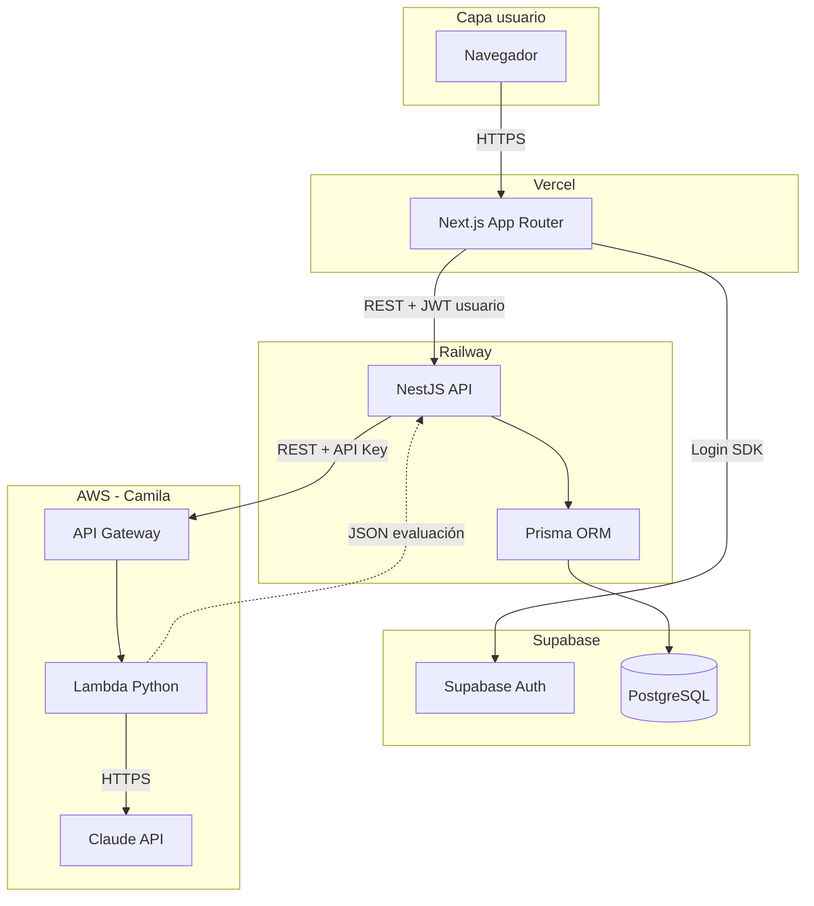
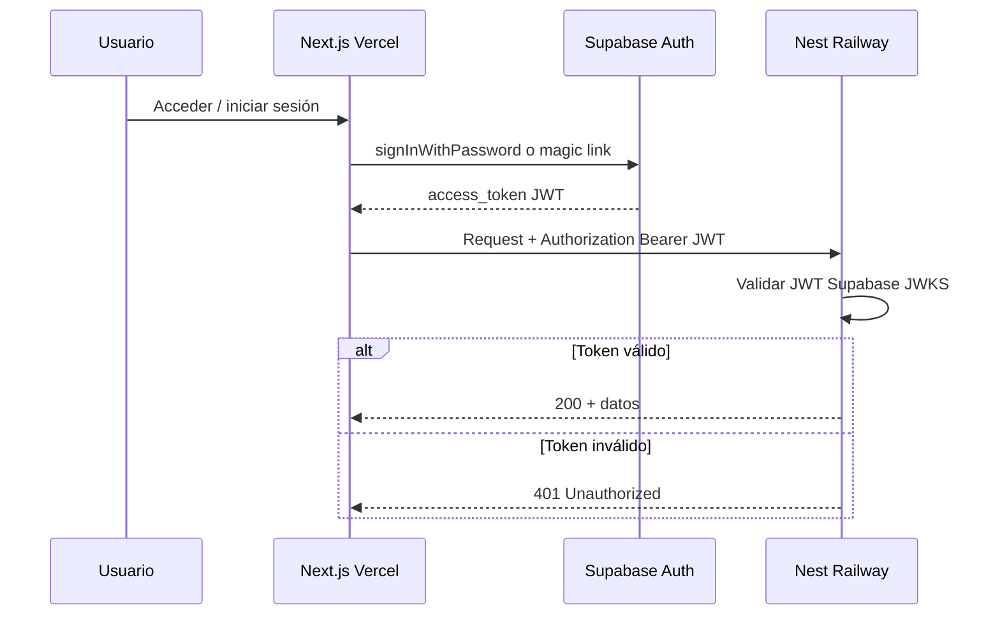
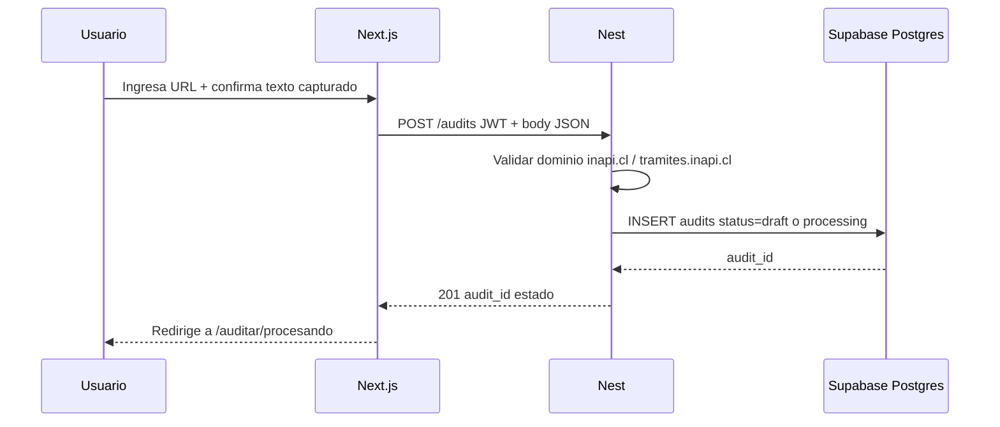
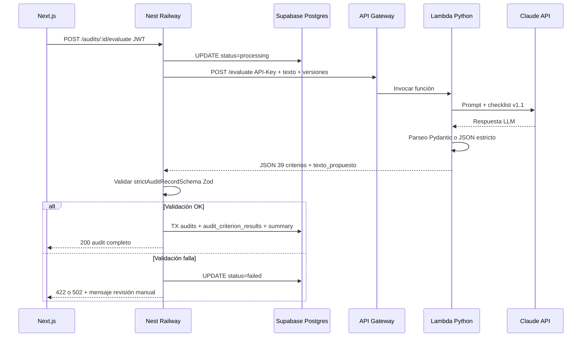
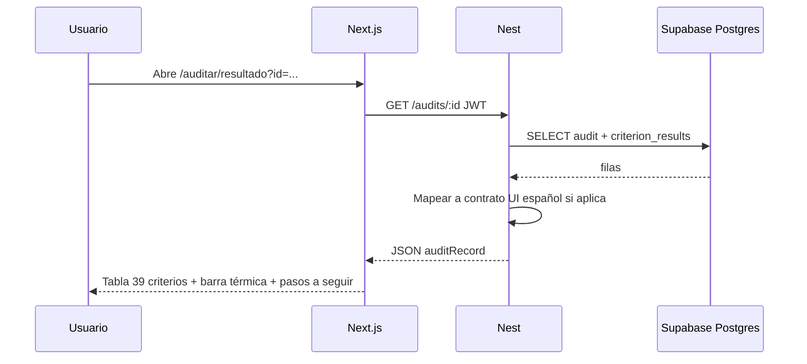
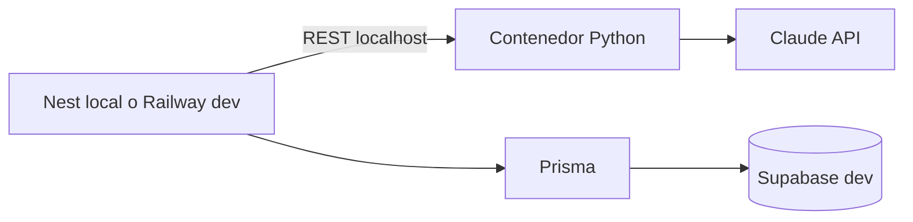
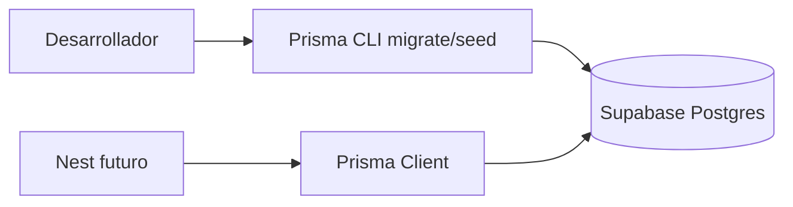

# Fase 2 — Implementación: persistencia, API y evaluación asistida

**Proyecto:** MVP — Aplicativo de Auditoría de Lenguaje Claro INAPI  
**Última actualización:** 2026-06-02  
**Audiencia:** implementación y estudio paralelo de BE + BD (perfil UX / producto con foco técnico)  
**Condición de entrada:** cierre de **Fase 1.5** (piloto **10 URLs**: JSON en repo, informe en MVP, PDF por URL). Ver [`flujo-piloto-10-urls-claude-mvp.md`](flujo-piloto-10-urls-claude-mvp.md) y [`ROADMAP.md`](ROADMAP.md).

---

## 1. Propósito de este documento

Este plan complementa [`ROADMAP.md`](ROADMAP.md) con un **desglose ejecutable** de la Fase 2, pensado para:

- **Estudiar** backend, base de datos e integraciones mientras se implementan.
- **Implementar** de forma incremental, con entregables verificables en cada sub-fase.
- Documentar **decisiones cerradas** para el MVP del equipo UX (2026), sin depender de TI INAPI.
- Dejar trazabilidad para una eventual industrialización por TI en 2027.

**Referencias obligatorias:**

| Documento | Uso |
| --- | --- |
| [`PRD.md`](PRD.md) | Requisitos funcionales y no funcionales |
| [`ARCHITECTURE.md`](ARCHITECTURE.md) | Capas y flujo runtime |
| [`DATABASE.md`](DATABASE.md) | Modelo de datos Supabase/Postgres |
| [`SECURITY.md`](SECURITY.md) | Checklist de seguridad post-backend |
| [`despliegue/despliegue-hibrido.md`](despliegue/despliegue-hibrido.md) | Etapas de despliegue |
| [`adr/0005-api-backend-nestjs-prisma.md`](adr/0005-api-backend-nestjs-prisma.md) | Nest + Prisma |
| [`adr/0006-lc-evaluation-python-claude-aws.md`](adr/0006-lc-evaluation-python-claude-aws.md) | Python + Claude + AWS |
| [`adr/0007-modelo-datos-parseo-pre-conexiones.md`](adr/0007-modelo-datos-parseo-pre-conexiones.md) | Mapeo Zod ↔ SQL y parseo |
| [`PROPUESTA_TECNICA_INTEGRAL.md`](PROPUESTA_TECNICA_INTEGRAL.md) | Roles y colaboración con Camila |

---

## 2. Decisiones cerradas para el MVP (2026)

Decisiones adoptadas para este plan, alineadas al contexto del equipo UX (sin TI, entrega Figma 2026, industrialización probable en 2027).

| Tema | Decisión MVP | Notas |
| --- | --- | --- |
| **Hosting frontend** | **Vercel** (Next.js) | Ya operativo en Fase 1 |
| **Hosting API Nest** | **Railway** | Simplicidad; sin plantillas TI; migrable a AWS en 2027 |
| **Base de datos** | **Supabase** (Postgres + Auth + RLS) | Mismo motor que Prisma |
| **ORM / migraciones** | **Prisma** en Nest | Solo Nest escribe en Postgres |
| **Auth de usuarios** | **Supabase Auth** | Login real del MVP; cuentas de prueba del equipo UX |
| **Servicio evaluación LC** | **Python en AWS Lambda** + **API Gateway** | Preferencia ADR 0006; ECS solo si Lambda no alcanza |
| **Proveedor LLM** | **Claude API** (Anthropic) | Claves solo en Lambda; nunca en cliente |
| **Auth Nest ↔ Lambda** | **API Key** en header (servicio-a-servicio) | Secreto en Railway + AWS; rotación manual en MVP |
| **Contratos de datos** | **Zod** (`src/schemas/checklist.ts`) | Fuente compartida FE/BE; validación en Nest |
| **Desarrollo local Python** | **Docker** | Paridad con Lambda; coordinación con Camila |
| **Monorepo** | Evolución gradual hacia `apps/backend-api` | No bloquea primeros endpoints |

### Fuera de alcance inmediato de Fase 2

- Captura real de URLs (Cheerio/Playwright) → Fase 3.
- Export PDF/Word e histórico completo en UI → Fase 4.
- Login institucional Google Workspace INAPI → dependencia TI 2027; MVP usa Supabase Auth con cuentas de prueba.

---

## 3. Arquitectura objetivo (vista general)



### Reglas de persistencia (no negociables)

1. **Solo Nest + Prisma** insertan/actualizan `audits` y resultados de criterios.
2. **Lambda/Python** devuelve JSON; **no** escribe en Supabase.
3. **Next** no accede a Postgres directamente en producción; habla con Nest.
4. **Claves Anthropic** solo en Lambda (o secretos AWS); nunca en `NEXT_PUBLIC_*`.

---

## 4. Cómo funciona REST en este MVP

REST = comunicación HTTP con recursos nombrados y JSON.

| Capa | Cliente | Servidor | Ejemplo |
| --- | --- | --- | --- |
| **UI → API dominio** | Next (servidor o cliente con JWT) | Nest (Railway) | `POST /audits`, `GET /audits/:id` |
| **API → evaluación LC** | Nest | API Gateway → Lambda | `POST /evaluate` |
| **Nest → datos** | Nest (Prisma) | Supabase Postgres | SQL vía `DATABASE_URL` (no REST) |

---

## 5. Flujos principales con diagramas

### 5.1 Autenticación (Supabase Auth)



**Lógica:**

- Supabase Auth emite el **JWT** del usuario.
- Nest verifica firma y extrae `sub` → `evaluator_user_id` en `audits`.
- RLS en Postgres refuerza aislamiento si hubiera acceso directo; con Nest + service role, la autorización vive en middleware Nest.

---

### 5.2 Crear auditoría y persistir borrador



**Campos persistidos en borrador (orientativo):**

- `url`, `domain`, `captured_text`, `checklist_version`
- `evaluator_user_id` (desde JWT)
- `evaluated_at` (al cerrar evaluación) o timestamp de creación

---

### 5.3 Evaluación LC (Nest → Lambda → Claude → persistencia)



**Persistencia correcta (checklist de verificación):**

- [ ] Exactamente **39** filas en `audit_criterion_results` (o array `results` jsonb validado).
- [ ] `summary` coherente con `summarizeEvaluations` (N/A excluidos del denominador).
- [ ] `prompt_version` y `checklist_version` guardados en `audits`.
- [ ] `evaluator_user_id` coincide con JWT del request.
- [ ] Re-leer `GET /audits/:id` devuelve lo mismo que se escribió.

---

### 5.4 Consulta de resultado en UI



---

### 5.5 Desarrollo local con Docker (servicio Python)



**Objetivo Docker:** mismo código/imagen base que Lambda; Camila mantiene Dockerfile; tú pruebas integración sin instalar Python global.

---

## 6. Modelo de datos (resumen implementación)

Basado en [`DATABASE.md`](DATABASE.md) y [`adr/0007-modelo-datos-parseo-pre-conexiones.md`](adr/0007-modelo-datos-parseo-pre-conexiones.md).

### Decisión MVP para almacenamiento de criterios

| Opción | Elección recomendada MVP | Motivo |
| --- | --- | --- |
| Tabla hija `audit_criterion_results` | **Recomendada** | Consultas claras; alineada a UI tabla por fila |
| Columna `results jsonb` en `audits` | Alternativa válida | Menos SQL; más simple si el equipo prioriza velocidad |

**Acción:** cerrar en implementación 2.1 y documentar en ADR 0007 como **Aceptado**.

### Entidades mínimas

- `checklist_versions` — seed desde `data/checklist-criteria.json`
- `audits` — cabecera + `summary` jsonb + `proposed_text`, `observaciones_lc`
- `audit_criterion_results` — 39 filas por auditoría
- `url_index` — opcional Fase 2; puede seguir en JSON hasta conectar inventario real

### Mapeo Zod ↔ SQL (extracto)

| Zod (`strictAuditRecordSchema`) | Postgres |
| --- | --- |
| `fecha_evaluacion` | `audits.evaluated_at` |
| `evaluador_uid` | `audits.evaluator_user_id` |
| `version_checklist` | `audits.checklist_version` |
| `texto_capturado` | `audits.captured_text` |
| `texto_propuesto` | `audits.proposed_text` |
| `criterios_evaluados[]` | `audit_criterion_results` |
| contadores + `estado_aceptacion` | `audits.summary` jsonb |

---

## 7. Roadmap Fase 2 — sub-fases (estudiar + implementar)

Cada sub-fase incluye **bloque de estudio** y **entregables**. Marcar `[ ]` / `[x]` al avanzar.

---

### Fase 2.0 — Preparación y cierre de decisiones lógicas

**Estudiar (≈ 3–5 días):**

- [ ] Leer ADR 0005, 0006, 0007 completos.
- [ ] Recorrer un fixture (`data/audit-fixtures/*.json`) campo a campo vs `src/schemas/checklist.ts`.
- [ ] Conceptos: HTTP, REST, JWT, ORM, migraciones SQL, variables de entorno.

**Implementar / acordar:**

- [ ] Cierre demo UX Fase 1 (go explícito a Fase 2).
- [ ] Reunión con Camila: contrato REST `POST /evaluate`, API Key Nest↔Gateway, timeline Lambda.
- [ ] Crear proyecto **Supabase** (dev).
- [ ] Crear proyecto **Railway** (servicio vacío, preparado para Nest).
- [ ] Definir convención wire JSON: campos en **español** en API pública (alineado a Zod) vs columnas SQL en inglés (mapeo en Nest).
- [ ] Decidir: `audit_criterion_results` normalizado vs `jsonb` (§6).

**Entregable:** documento de contrato REST (markdown) con ejemplos request/response completos.

---

### Fase 2.1 — Base de datos y Prisma

**Estudiar:**

- [ ] Postgres básico: tablas, FK, PK compuesta, jsonb.
- [ ] Prisma: `schema.prisma`, `migrate dev`, `seed`, relaciones 1:N.
- [ ] Supabase: connection string, RLS, Auth users.

**Implementar:**

- [ ] Inicializar `apps/backend-api` (Nest) + Prisma en monorepo.
- [ ] Schema Prisma: `checklist_versions`, `audits`, `audit_criterion_results`.
- [ ] Migración inicial contra Supabase dev.
- [ ] Seed `checklist_versions` desde `data/checklist-criteria.json`.
- [ ] Políticas RLS orientativas ([`DATABASE.md`](DATABASE.md) §4).
- [ ] Script o test: insertar fixture vía Prisma y leer de vuelta.

**Entregable:** auditoría de prueba persistida en Supabase visible en Table Editor.

**Diagrama:**



---

### Fase 2.2 — API Nest mínima (sin LLM)

**Estudiar:**

- [ ] NestJS: modules, controllers, services, DTOs, pipes.
- [ ] Validación con Zod en Nest (o class-validator alineado a Zod).
- [ ] Middleware JWT Supabase.

**Implementar:**

- [ ] `GET /health`
- [ ] `POST /audits` — crear borrador (URL + texto capturado mock/pegado).
- [ ] `GET /audits/:id`
- [ ] `GET /audits?url=` — base histórico futuro.
- [ ] Middleware: validar JWT Supabase en rutas protegidas.
- [ ] CORS: orígenes Vercel preview + production.
- [ ] Deploy a **Railway** con `DATABASE_URL` y secretos Supabase.

**Entregable:** Postman/Insomnia ejecuta CRUD contra Railway con JWT de usuario de prueba.

---

### Fase 2.3 — Supabase Auth + integración frontend

**Estudiar:**

- [ ] `@supabase/ssr` en Next App Router.
- [ ] Flujo sesión: login, refresh, logout.
- [ ] Server Components vs Route Handlers para llamar Nest con JWT.

**Implementar:**

- [ ] Pantalla login mínima (design system § portal institucional).
- [ ] Cuentas de prueba equipo UX en Supabase Auth.
- [ ] Conectar `/auditar/procesando` → `POST /audits/:id/evaluate` (stub sin LLM: devolver fixture persistido).
- [ ] Conectar `/auditar/resultado` → `GET /audits/:id` (datos reales; fallback fixture durante transición).
- [ ] Variables Vercel: `NEXT_PUBLIC_SUPABASE_*`, `NEST_API_URL` (server-only para proxy si aplica).

**Entregable:** flujo demo con usuario real identificado en `evaluator_user_id`.

**Diagrama:**

```mermaid
flowchart TB
  subgraph fe [Frontend Vercel]
    Login[Login Supabase]
    Auditar[/auditar]
    Proc[/auditar/procesando]
    Res[/auditar/resultado]
  end

  subgraph be [Backend Railway]
    API[Nest REST]
  end

  Login --> Auditar
  Auditar --> Proc
  Proc -->|POST evaluate stub| API
  API --> Res
  Res -->|GET audit| API
```

---

### Fase 2.4 — Servicio Python, Docker y Claude (con Camila)

**Estudiar:**

- [ ] API Gateway + Lambda (conceptos, timeouts, cold start).
- [ ] Docker: Dockerfile, `docker compose`, variables de entorno.
- [ ] Claude API: tokens, latencia, costos.

**Implementar (división de roles):**

| Responsable | Tareas |
| --- | --- |
| **Camila** | Lambda Python, prompt v1, parseo salida, API Gateway, secreto Anthropic en AWS |
| **Tú** | Cliente `EvaluationService` en Nest, timeout, reintentos acotados (ADR 0004), persistencia post-validación Zod |
| **Ambos** | Contrato JSON común; Docker local; prueba E2E dev |

**Checklist integración:**

- [ ] `POST /evaluate` documentado con ejemplo de **39** criterios.
- [ ] API Key Nest→Gateway configurada en Railway + AWS.
- [ ] Docker local del servicio Python (`docker compose up`).
- [ ] Nest en dev apunta a Docker; Nest en Railway apunta a API Gateway staging.
- [ ] Política de error: `failed` en BD + mensaje UI “revisión manual requerida”.
- [ ] `prompt_version` persistido en cada auditoría completada.

**Entregable:** una URL real evaluada end-to-end: UI → Nest → Lambda → Claude → Supabase → UI resultado.

---

### Fase 2.5 — Seguridad, observabilidad y cierre Fase 2

**Estudiar:**

- [ ] Checklist [`SECURITY.md`](SECURITY.md) §3.
- [ ] Rate limiting básico, tamaño máximo body, logs sin PII.

**Implementar:**

- [ ] Cabeceras HTTP en Next (CSP progresivo).
- [ ] Rate limit en Nest (evaluación costosa).
- [ ] Logs estructurados con `audit_id` en Nest.
- [ ] CI ampliado: typecheck backend, tests API, validación contratos.
- [ ] Documentar URLs y variables en README / devlog.
- [ ] Demo interna Fase 2 con Equipo UX (persistencia + evaluación real en muestra pequeña).

**Entregable:** MVP funcional documentado listo como referencia para TI 2027.

---

## 8. Variables de entorno (referencia)

### Vercel (Next)

| Variable | Uso |
| --- | --- |
| `NEXT_PUBLIC_SUPABASE_URL` | Cliente Supabase |
| `NEXT_PUBLIC_SUPABASE_ANON_KEY` | Cliente Supabase |
| `NEST_API_URL` | URL Railway (preferir uso desde servidor) |

### Railway (Nest)

| Variable | Uso |
| --- | --- |
| `DATABASE_URL` | Postgres Supabase (pooler si aplica) |
| `SUPABASE_JWT_SECRET` o JWKS URL | Validar tokens |
| `EVALUATION_SERVICE_URL` | API Gateway |
| `EVALUATION_API_KEY` | Auth servicio-a-servicio |
| `CORS_ORIGINS` | Dominios Vercel |

### AWS Lambda (Camila)

| Variable | Uso |
| --- | --- |
| `ANTHROPIC_API_KEY` | Claude API |
| `PROMPT_VERSION` | Trazabilidad |
| `INTERNAL_API_KEY` | Validar llamadas desde Nest |

**Nunca** en `NEXT_PUBLIC_*`: claves Anthropic, service role Supabase, API Key evaluación.

---

## 9. Plan de estudio sugerido (paralelo al código)

| Semana | Foco estudio | Foco implementación |
| --- | --- | --- |
| 1 | ADR 0007, DATABASE, fixtures JSON | Fase 2.0 + Supabase proyecto |
| 2 | Prisma + SQL | Fase 2.1 migraciones y seed |
| 3 | NestJS fundamentals | Fase 2.2 endpoints CRUD + Railway |
| 4 | Supabase Auth + JWT | Fase 2.3 login + FE conectado |
| 5 | REST servicio-a-servicio, Docker | Fase 2.4 stub evaluate |
| 6 | Lambda, Claude, observabilidad | Fase 2.4 E2E con Camila |
| 7 | SECURITY.md | Fase 2.5 endurecimiento + demo |

> Ajustar ritmo según disponibilidad. Es válido repetir semanas; lo crítico es **no saltar persistencia** antes de conectar LLM.

---

## 10. Criterios de éxito Fase 2

- [ ] Usuario autenticado (Supabase Auth) crea auditoría desde la UI.
- [ ] Texto capturado (mock/pegado) persiste en `audits.captured_text`.
- [ ] Evaluación real vía Lambda + Claude completa **39** criterios validados por Zod.
- [ ] Resultado visible en `/auditar/resultado` con paridad visual al mock Fase 1.
- [ ] `evaluator_user_id`, `checklist_version`, `prompt_version` trazables en BD.
- [ ] Secretos no expuestos al cliente.
- [ ] Deploy estable: Vercel + Railway + Supabase + AWS staging.

---

## 11. Riesgos y mitigaciones

| Riesgo | Mitigación |
| --- | --- |
| Curva de aprendizaje BE/BD | Sub-fases pequeñas; persistir fixture manual antes de LLM |
| PC corporativo sin terminal | Supabase/Railway cloud; desarrollo en entorno personal cuando sea posible |
| Timeout Lambda / Claude | Reintentos acotados; UI honesta en `/procesando`; estado `failed` |
| Desalineación contrato Python/Zod | ADR 0007 + ejemplos JSON completos en repo |
| Costo Claude | URLs piloto; límite de evaluaciones en staging |
| Migración TI 2027 | Contratos Zod, DATABASE.md y este doc como handoff |

---

## 12. Próximo paso inmediato

1. Ejecutar **Fase 1.5** según [`flujo-piloto-10-urls-claude-mvp.md`](flujo-piloto-10-urls-claude-mvp.md): 10 URLs, Claude → `data/claude-audits/`, UI piloto, PDF en MVP.
2. Tras cierre del piloto: **Fase 2.0** — proyecto Supabase + borrador contrato REST con Camila.
3. **Fase 2.1**: Prisma schema + primera migración + seed checklist.

**Nota:** el export PDF descrito en §11 de [`diagramas_procesos.md`](diagramas_procesos.md) se **adelanta** en Fase 1.5 para el piloto; la persistencia del informe en BD sigue en Fase 2.

---

*Documento derivado del análisis de Fase 2 (junio 2026). Actualizar al cerrar ADR 0007 y al formalizar ADR 0008 (hosting Railway MVP).*
