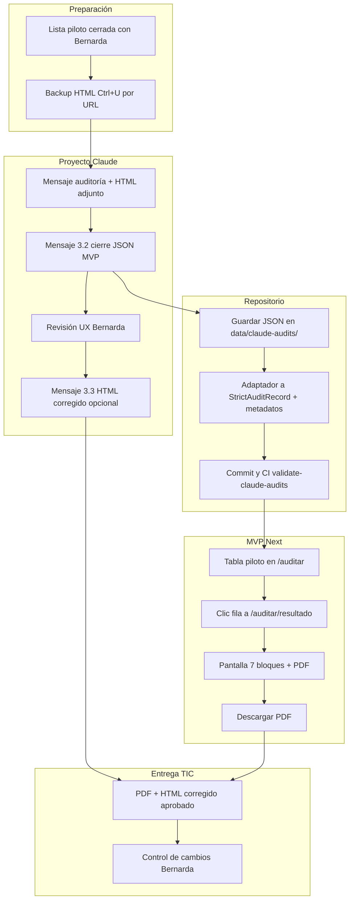

# Flujo operativo — Piloto 10 URLs (Claude) → MVP → PDF

| Metadatos | Detalle |
| --- | --- |
| **Fecha** | 2026-06-02 (actualizado 2026-06-08) |
| **Proveedor IA** | Claude (Proyecto «Auditor Lenguaje Claro URLs INAPI») |
| **Objetivo** | Auditar páginas prioritarias para TIC antes de fin de año: informe en MVP + PDF descargable + sustituciones de texto |
| **Alcance operativo en repo** | **9 URLs** con JSON, informe y PDF en MVP (merge a `main` 2026-06-08). Objetivo original de reunión: **10 URLs** — ver nota §2. |
| **Plan técnico asociado** | Adaptador JSON (`src/schemas/claude-audit-pilot.ts`), `data/claude-audits/`, API + PDF server |
| **Referencias** | [`ROADMAP.md`](ROADMAP.md) (Fase 1.5) · [`Comparación Auditoría URL Home INAPI Gemini-Claude.md`](Comparación%20Auditoría%20URL%20Home%20INAPI%20Gemini-Claude.md) · [`Propuesta Análisis LC URLs.md`](Propuesta%20Análisis%20LC%20URLs.md) §11 · [`development/DEVLOG.md`](development/DEVLOG.md#devlog-2026-06-08-docs-fase-1-5) · [`ux/inventario-urls-clarity.md`](ux/inventario-urls-clarity.md) |

---

## 1. Alcances de producto acordados (antes de implementar)

### 1.1 Nueva barra desplegable en `/auditar` (prioridad visual)

| Requisito | Detalle |
| --- | --- |
| **Ubicación** | **Justo debajo** de la tarjeta «Ingreso de URL» (barra de búsqueda), **antes** de «Prioridades demostrativas», «Importar auditoría» e inventario de 22 URLs. |
| **Patrón UI** | Misma estructura que el inventario actual: **Card** + **Accordion** colapsable (design system §15). |
| **Contenido** | Tabla con las URLs del piloto TIC/UX (no las 22 de Clarity), con columnas alineadas al historial existente donde aplique: `#`, ruta/etiqueta, tipo (`tramites` \| `sitioweb`), % LC, estado, última evaluación, encargado, columna MVP («Disponible» / «Pendiente»). |
| **Comportamiento** | Clic en fila disponible → **`/auditar/resultado`** con auditoría Claude cargada (`?claudeAudit={id}&url={url}`). |
| **Datos** | JSON en [`data/claude-audits/`](../data/claude-audits/) + tabla maestra en [`frontend/src/lib/claude-audits-launch.ts`](../frontend/src/lib/claude-audits-launch.ts) (§2). |

**Título en UI (implementado):** «Piloto auditoría LC — 9 URLs (entrega TIC)».

**Título del acordeón:** «URLs auditadas — piloto junio 2026».

### 1.2 Pantalla de resultado ampliada (clic desde la nueva tabla)

Al abrir una URL del piloto, `/auditar/resultado` debe mostrar **solo lectura** (sin bloque de importación JSON prominente en producción piloto) las secciones en el orden de la §4.

### 1.3 Límite conocido: Proyecto Claude ↔ MVP

No hay sincronización automática entre el chat del Proyecto y la app. Flujo: **exportar JSON** → **commit en repo** → **MVP lee y muestra** → **PDF server**. La API Anthropic es camino futuro, no sustituye el Proyecto.

---

## 2. URLs del piloto (lista operativa en repo)

**Nota:** la reunión 2026-06-02 propuso **10 URLs** (tabla histórica al final de esta §2). En junio 2026 el equipo cerró **9 URLs** con auditoría Claude, JSON en repo y MVP «Disponible». La **10.ª URL** queda como decisión pendiente con Bernarda/TIC.

| # piloto | Página (etiqueta UI) | URL canónica | `tipo_pagina` | % LC | Estado | Id repo (`claudeAudit`) | MVP |
| --- | --- | --- | --- | --- | --- | --- | --- |
| 1 | Home INAPI | `https://www.inapi.cl/` | `sitioweb` | 45,5 % | rechazado | `www-inapi-cl_2026-06-02` | Disponible |
| 2 | Buscador Marcas INAPI | `https://buscadormarcas.inapi.cl/Marca/BuscarMarca.aspx` | `sitioweb` | 39,4 % | rechazado | `buscadormarcas-inapi-cl-marca-buscar-marca_2026-06-05` | Disponible |
| 3 | Marcas | `https://www.inapi.cl/marcas` | `sitioweb` | 48,5 % | rechazado | `www-inapi-cl-marcas_2026-06-05` | Disponible |
| 4 | Acerca de INAPI | `https://www.inapi.cl/acerca-de/inapi` | `sitioweb` | 34,3 % | rechazado | `www-inapi-cl-acerca-de-inapi_2026-06-07` | Disponible |
| 5 | Buscador de noticias | `https://www.inapi.cl/buscador?indexCatalogue=inapi&searchQuery=noticias&wordsMode=0` | `sitioweb` | 34,5 % | rechazado | `www-inapi-cl-buscador-noticias_2026-06-07` | Disponible |
| 6 | Solicitud Nueva | `https://www.inapi.cl/marcas/tramites/solicitud-nueva` | `sitioweb` | 44,8 % | rechazado | `www-inapi-cl-marcas-tramites-solicitud-nueva_2026-06-07` | Disponible |
| 7 | Sala de Prensa | `https://www.inapi.cl/sala-de-prensa/noticias` | `sitioweb` | 45,5 % | rechazado | `www-inapi-cl-sala-de-prensa-noticias_2026-06-07` | Disponible |
| 8 | Formulario Contacto SIAC | `https://tramites.inapi.cl/siac` | `tramites` | 51,5 % | rechazado | `tramites-inapi-cl-siac_2026-06-07` | Disponible |
| 9 | Trámites y Servicios | `https://tramites.inapi.cl/` | `tramites` | 57,6 % | rechazado | `tramites-inapi-cl_2026-06-07` | Disponible |
| 10 | *Por definir con Bernarda* | — | — | — | — | — | Pendiente |

**Encargado (piloto):** Fernando Arriagada Castillo (columna fija en tabla hasta existir login real).

**Convención `id`:** `slug-desde-url_YYYY-MM-DD` (archivo, campo `"id"` en JSON y `claudeAuditId` en launch deben coincidir).

<details>
<summary>Propuesta inicial reunión 2026-06-02 (10 URLs — referencia histórica)</summary>

| # | URL propuesta | `type_url` | Rank inventario 22 |
| --- | --- | --- | --- |
| 1 | `https://www.inapi.cl/` | `sitioweb` | 21 |
| 2 | `https://www.inapi.cl/tramites/tramites-digitales` | `sitioweb` | 22 |
| 3 | `https://tramites.inapi.cl/` | `tramites` | 1 |
| 4 | `https://tramites.inapi.cl/Notificaciones` | `tramites` | 4 |
| 5 | `https://tramites.inapi.cl/Account/Login` | `tramites` | 2 |
| 6–10 | Por definir con Bernarda | — | — |

La lista operativa §2 (9 URLs) **no coincide línea a línea** con esta propuesta: se priorizaron páginas con mayor valor editorial para la demo TIC (buscador marcas, marcas, SIAC, etc.).

</details>

---

## 3. Qué pedir en el Proyecto Claude (mensajes listos para copiar)

### 3.0 Archivos JSON en el repositorio (home)

| Archivo | Uso |
| --- | --- |
| [`data/claude-audits/www-inapi-cl_2026-06-02.export.json`](../data/claude-audits/www-inapi-cl_2026-06-02.export.json) | Export **crudo** tal como lo entregó Claude (con `evaluador`, `seccion`, `severidad: null`, etc.). Solo archivo histórico / referencia. |
| [`data/claude-audits/www-inapi-cl_2026-06-02.json`](../data/claude-audits/www-inapi-cl_2026-06-02.json) | JSON **canónico** (pasa `strictAuditRecordSchema` + extensiones piloto). **Plantilla** para adjuntar al Proyecto Claude y para importar en `/auditar/resultado`. |

Regenerar canónico desde export (si Claude entrega otro `.export.json`):

```bash
bun data/claude-audits/normalize-export.mjs data/claude-audits/<archivo>.export.json
```

### 3.1 Primera corrida (auditoría completa) — ya realizada para la home

Mensaje tipo (HTML adjunto):

```text
Audita con checklist v1.1 (39 criterios A1–H1).

URL: https://www.inapi.cl/
tipo_pagina: sitioweb

Adjunto: [nombre].html (vista código fuente Ctrl+U).

Ejecuta Fase 0 (texto T001…), tabla de 39 criterios, resumen, sustituciones y JSON según tus instrucciones del proyecto.

Al cerrar con el mensaje §3.2, verifica cobertura 1:1: cada criterio "incumple" debe tener al menos una fila en sustituciones[] (reglas del contrato).
```

### 3.2 Entrega JSON canónico para el MVP (mensaje único — usar en cada URL)

**Plantilla de referencia en el repo:** adjunta o pega en el chat el archivo  
[`data/claude-audits/www-inapi-cl_2026-06-02.json`](../data/claude-audits/www-inapi-cl_2026-06-02.json)  
y pide que las **próximas auditorías** sigan **exactamente** esa forma (mismas claves, mismas reglas).

Usar **en el mismo hilo** tras la auditoría (o en mensaje nuevo con HTML + plantilla). Copiar y pegar:

```text
Necesito UN solo bloque JSON válido para integrar en nuestro MVP (Next.js) y entrega a TIC.
NO repitas la tabla de 39 criterios en prosa.
NO uses el campo "evaluador" — usa "evaluador_uid".
NO uses null en ningún campo: omite la clave si no aplica.

Adjunto como REFERENCIA OBLIGATORIA el JSON canónico de la home INAPI ya validado en nuestro repo (misma estructura, mismas reglas).

Para esta auditoría, sustituye solo los valores según la URL y el HTML adjunto:

- id: "<slug>_<AAAA-MM-DD>" (ej. tramites-inapi-cl_2026-06-10; home = www-inapi-cl_2026-06-02)
- url: [URL canónica]
- version_checklist: "1.1"
- tipo_pagina: "sitioweb" | "tramites"
- fecha_evaluacion: ISO 8601 en UTC terminado en Z (ej. 2026-06-03T04:00:00.000Z). Convierte desde hora Chile si hace falta.
- evaluador_uid: "Fernando Arriagada Castillo"

CONTRATO OBLIGATORIO (strictAuditRecordSchema — núcleo importable en la app):

1) criterios_evaluados: exactamente 39 objetos, orden A1…H1. Cada objeto SOLO puede incluir:
   - id (A1…H1)
   - estado: "cumple" | "incumple" | "no_aplica"
   - severidad: "baja" | "media" | "alta" — SOLO si estado es "incumple" (si no, omite la clave)
   - comentario: string — opcional pero recomendado
   - cita_textual: string — opcional; omite la clave si no hay cita (nunca null)
   PROHIBIDO en cada fila: seccion, criterio_enunciado, severidad null, cita_textual null.

   Ejemplo cumple:
   { "id": "B7", "estado": "cumple", "comentario": "..." }

   Ejemplo incumple:
   { "id": "B1", "estado": "incumple", "severidad": "alta", "comentario": "...", "cita_textual": "T372: ..." }

   Ejemplo no_aplica:
   { "id": "C6", "estado": "no_aplica", "comentario": "..." }

2) Resumen numérico coherente con las 39 filas:
   - criterios_no_aplica, criterios_aplicables, criterios_aprobados (solo "cumple")
   - porcentaje_cumplimiento (un decimal, ej. 45.5)
   - estado_aceptacion: "rechazado" | "aceptado_con_observaciones" | "aprobado"
     Umbrales INAPI: ≤80 rechazado; 81–90,9 aceptado_con_observaciones; ≥91 aprobado

3) texto_capturado: string (extracto T001… resumido si hace falta)

4) texto_propuesto: string (párrafo resumen opcional para TIC). La fuente de verdad accionable es sustituciones[] (ítem 8), no este párrafo. El MVP muestra la tabla de sustituciones en «Texto propuesto».

5) observaciones_lc: string (párrafo consolidado de hallazgos)

EXTENSIONES PILOTO (mantener en el mismo JSON, después del núcleo):

6) resumen_ejecutivo: párrafo único

7) observaciones_lc_por_severidad: {
     "hallazgos_prioridad_alta": ["(B1) ...", ...],
     "hallazgos_prioridad_media": [...],
     "hallazgos_prioridad_baja": [...]
   }
   (arrays de strings; puede ser [] si no hay hallazgos en esa severidad)
   Cada hallazgo listado aquí DEBE tener al menos una fila equivalente en sustituciones[] (ítem 8). No dejes hallazgos solo en esta lista.

8) sustituciones: [ { "linea", "original", "propuesto", "criterio_id", "motivo", "html_linea_aprox" } ]
   — Entregable principal para TIC (tabla «Texto propuesto» en el MVP).
   — NO inventes pesos en MB; para documentos usa solo "(PDF)" si no conoces el peso en el CMS.

   COBERTURA 1:1 (OBLIGATORIA):
   - Por CADA criterio con estado "incumple" en criterios_evaluados[], incluye AL MENOS UNA fila en sustituciones[] con el mismo criterio_id.
   - Puede haber varias filas para un mismo criterio_id (ej. D7: ACCESOS, BUSCADOR, MARCAS… cada uno en su fila).
   - PROHIBIDO: dejar un incumplimiento solo en observaciones_lc_por_severidad sin propuesta en sustituciones[].
   - Antes de entregar el JSON, verifica: cantidad de criterio_id distintos en sustituciones (solo incumplimientos) ≥ cantidad de filas "incumple" en criterios_evaluados. Si falta alguno, complétalo.

   CAMPOS POR FILA:
   - linea: identificador Tnnn del fragmento (o del punto de anclaje si es inserción).
   - criterio_id: A1…H1 del incumplimiento que corrige esta fila.
   - original: texto literal del HTML (con entidades &#243;, &aacute;, etc. si el fuente las usa) O "(ausencia)" / "(no existe en HTML)" si el problema es falta de contenido.
   - propuesto: texto que TIC debe dejar en la página (sustitución, inserción o "(eliminar nodo)" si corresponde quitar un fragmento).
   - motivo: por qué corrige el criterio (una frase clara).
   - html_linea_aprox: referencia aproximada en el HTML (ej. "HTML-L780"). OBLIGATORIO en inserciones, eliminaciones y cambios en <head>/<meta>; recomendado en todas las filas.

   CONTENIDO AUSENTE O INEXISTENTE (ej. E3 — fecha de publicación/última modificación de la PÁGINA):
   - Si el incumplimiento es que NO EXISTE un elemento (fecha de actualización de la página, párrafo introductorio bajo un banner, glosa de sigla), igual debes crear una fila en sustituciones[]:
     * original: "(ausencia)" o "(no existe en HTML)" (alineado con cita_textual del criterio).
     * propuesto: el texto literal que TIC debe INSERTAR (ej. "Última actualización: 3 de junio de 2026").
     * linea: Tnnn del punto de anclaje más cercano (ej. tras el H1 o en el footer).
     * html_linea_aprox: línea o bloque donde insertar (<footer>, tras T384, etc.).
   - E3 en home: exige fecha visible de la página principal, no basta con fechas de noticias individuales.

   CALIBRACIÓN G1 (RUT, teléfonos, direcciones):
   - El criterio G1 del checklist apunta a personas NATURALES (no exponer RUT/teléfono/dirección de ciudadanos).
   - RUT, teléfono y dirección del INAPI como persona jurídica pública en pie de página NO son violación de privacidad de usuarios.
   - Si G1 (o A5) queda "incumple" porque el RUT/dato institucional NO aporta valor a la tarea del usuario en esa URL, SÍ incluye fila en sustituciones[]:
     * propuesto: quitar la línea del RUT del footer, o moverla a «Quiénes somos» / transparencia.
     * motivo: aclarar que no es dato de persona natural, pero no aporta a la tarea en esta página.
   - En comentario del criterio G1 puedes anotar: «RUT institucional; revisión editorial A5».

   TIPOS DE PROPUESTA (usa el que corresponda):
   | Tipo | Cuándo | original / propuesto |
   | Sustitución | El texto existe y debe cambiar | original = literal HTML; propuesto = nuevo texto |
   | Inserción | Falta fecha, intro bajo banner, glosa de sigla | original = "(ausencia)"; propuesto = bloque a insertar |
   | Eliminación | Texto de desarrollo, RUT redundante (LINK EXTERNO) | original = fragmento; propuesto = "(eliminar nodo)" + motivo operativo |
   | Reorden / estructura | A2 pirámide invertida | propuesto = párrafo de propósito ANTES del titular técnico; html_linea_aprox del bloque |
   | Enlace / slug | F1, F3 | propuesto = texto visible que describe el destino; si el slug no puede cambiarse, motivo = «slug /ruta-actual; coordinar con TIC si se renombra» |

   ESTILO DE LAS PROPUESTAS:
   - Lenguaje claro, voz activa, sin mayúsculas en toda la palabra salvo siglas (PCT, INAPI).
   - Una fila por cambio localizable; no agrupar criterios distintos en una sola fila salvo párrafo continuo (ej. T432–T435).

   Orden sugerido del array: por sección A→H o por linea (Tnnn) ascendente.

9) nota_final_tic: párrafo breve (backup HTML, entidades &#243;, búsqueda literal)

Entrega SOLO el JSON, sin texto antes ni después:

```json
{
  "id": "...",
  ...
}
```

Si un campo opcional no aplica, omite la clave o usa [] en arrays. Nunca uses null.
```

### 3.3 Tercera corrida — HTML corregido (entrega TIC, **después** de revisión UX)

Solo tras **aprobar** sustituciones con Bernarda:

```text
Aplica ÚNICAMENTE las sustituciones aprobadas de la lista [pegar números o JSON de sustituciones].

Sobre el MISMO HTML original adjunto:
- Mismo marcado, mismas etiquetas, scripts y clases intactos.
- Solo reemplazo de subcadenas de texto.
- Al inicio: changelog línea por línea (original → propuesto).
- Entrega el HTML completo en un bloque descargable.

Sustituciones aprobadas:
1. …
2. …
```

### 3.4 Estado home INAPI (junio 2026)

| Entregable | Estado |
| --- | --- |
| Export crudo Claude | Guardado: [`www-inapi-cl_2026-06-02.export.json`](../data/claude-audits/www-inapi-cl_2026-06-02.export.json) |
| JSON canónico (import + plantilla Claude) | [`www-inapi-cl_2026-06-02.json`](../data/claude-audits/www-inapi-cl_2026-06-02.json) — validado con `strictAuditRecordSchema` |
| Prompt alineado al contrato (1:1 sustituciones, E3, G1) | §3.2 (este documento) |

Para **URLs adicionales** (p. ej. 10.ª URL), usar §3.1 + §3.2 adjuntando la plantilla canónica de la home. Las **9 URLs operativas** ya están en repo (junio 2026).

---

## 4. Estructura de `/auditar/resultado` (piloto Claude)

**Acuerdo UX (junio 2026):** orquestación en **siete bloques** con títulos de barra fijos. Solo **Datos de Auditoría** y **39 Criterios Evaluados** permanecen **siempre visibles** (sin acordeón). El resto usa el patrón de **barra colapsable** del design system (§15 en [`DESIGN_SYSTEM.md`](DESIGN_SYSTEM.md); implementación sugerida: Accordion/Collapsible shadcn + cabecera institucional `#0F69C4`).

**Modo piloto** (`?claudeAudit=` o import con metadatos `pilot`): aplicar orden y reglas de esta §4. **Modo mock/fixture** sin `pilot`: puede conservar bloques legacy (import JSON, narrativa `observaciones_lc` suelta) hasta unificar en fase posterior.

### Orden en pantalla (y referencia para PDF — §8)

| # | Título de barra / bloque | Desplegable | Contenido (fuente JSON / código) |
| --- | --- | --- | --- |
| 1 | **Datos de Auditoría** | No (siempre visible) | Fusión del resumen operativo + metadatos piloto: `url`, `version_checklist`, barra y etiqueta de `estado_aceptacion` + `porcentaje_cumplimiento`, conteos de criterios; `fecha_evaluacion`, `evaluador_uid`, `tipo_pagina` (`pilot`), `id` de auditoría. |
| 2 | **Resumen Auditoría** | Sí (colapsable) | Párrafo `resumen_ejecutivo` (`pilot`) — sin reescribir. |
| 3 | **Pasos a seguir** | Sí (colapsable) | Lista `PASOS_SEGUN_ESTADO[estado_aceptacion]` (copy mock por estado del informe). |
| 4 | **39 Criterios Evaluados** | No (siempre visible) | Tabla `criterios_evaluados` con Sección, Criterio, Estado, Severidad, Comentario; filtros en [`criterios-evaluados-filters.ts`](../frontend/src/lib/criterios-evaluados-filters.ts). |
| 5 | **Observaciones finales por severidad** | Sí (colapsable) | `observaciones_lc_por_severidad` (`pilot`): listas alta / media / baja. **No** duplicar en UI el párrafo `observaciones_lc` del núcleo si ya existen estas listas. |
| 6 | **Texto propuesto** | Sí (colapsable) | Tabla `sustituciones[]` (`pilot`): `linea`, `criterio_id`, `original`, `propuesto`, `motivo`, `html_linea_aprox` opcional. Es el entregable accionable para TIC; el campo `texto_propuesto` del JSON puede omitirse en pantalla piloto si hay sustituciones. |
| 7 | **Nota para el equipo TI** | Sí (colapsable) | `nota_final_tic` (`pilot`) — instrucciones operativas (p. ej. entidades HTML en búsqueda literal). |
| 8 | **Descargar informe PDF** | — (acción, Fase C) | Botón «Descargar informe PDF»; documento server-side con bloques 1–7. Ver §8 abajo. |

**Estado por defecto de acordeones (recomendación UX):** cerrados en bloques 2, 3, 5, 6 y 7 al abrir la URL; el usuario expande según necesidad. Bloques 1 y 4 siempre expandidos.

**Bloques que no forman barra propia en piloto (evitar redundancia):**

| Antes (mock / implementación intermedia B4) | Decisión piloto |
| --- | --- |
| Tarjeta aparte «Datos del informe piloto» | Fusionar en **Datos de Auditoría** (fila 1). |
| Sección «Observaciones» con `observaciones_lc` narrativo | Omitir si existe **Observaciones finales por severidad** (fila 5). |
| Sección «Texto propuesto» con párrafo `texto_propuesto` | Sustituida por **Texto propuesto** = tabla de **sustituciones** (fila 6). |
| Bloque JSON completo en pantalla | Opcional para desarrolladores; no obligatorio en demo UX. Incluir en PDF si se requiere trazabilidad. |

### Detalle — bloque 1 (Datos de Auditoría)

| Campo en UI | Fuente |
| --- | --- |
| URL canónica | `audit.url` |
| Checklist | `audit.version_checklist` |
| Cumplimiento + barra | `audit.porcentaje_cumplimiento`, `audit.estado_aceptacion` |
| Aprobados / aplicables / N/A | `audit.criterios_aprobados`, `criterios_aplicables`, `criterios_no_aplica` |
| Fecha de evaluación | `audit.fecha_evaluacion` (formato legible Chile) |
| Encargado | `audit.evaluador_uid` |
| Tipo de página | `pilot.tipo_pagina` → etiqueta «Trámites» \| «Sitio web» |
| Id auditoría | `audit.id` (p. ej. `www-inapi-cl_2026-06-02`) |

### Detalle — bloque 4 (39 Criterios Evaluados)

| Columna | Contenido |
| --- | --- |
| Sección | `formatSeccionTitulo(id)` |
| Criterio | `formatCriterioEnunciado(id)` |
| Estado | Iconografía LC (`cumple` / incumple / `no_aplica`) |
| Severidad | Pastilla baja \| media \| alta |
| Comentario | `comentario` por fila |

### §8 — Descargar PDF (Fase C — implementado)

Botón primario: **«Descargar informe PDF»** (visible cuando `?claudeAudit=` en la URL).

- Ruta implementada: **`GET /api/claude-audits/[claudeAuditId]/export/pdf`** (`@react-pdf/renderer`, `runtime = nodejs`).
- Misma allowlist que `GET /api/claude-audits/[id]`; bloques 1–7 en el mismo orden de esta §4.
- Nombre de archivo: `informe-lc-[slug-url]-[fecha].pdf` (ver `frontend/src/lib/informe-piloto-filename.ts`).

---

## 5. Flujo paso a paso (Claude → PDF en MVP)



### Paso 0 — Alineación (una vez)

1. Validar alcance final del piloto (**9 URLs en repo** vs **10.ª URL** pendiente) con Bernarda y TIC.
2. Usar reglas de calibración en **§3.2** (cobertura 1:1 sustituciones, E3 ausencias, G1 institucional) y [`Comparación…`](Comparación%20Auditoría%20URL%20Home%20INAPI%20Gemini-Claude.md) §9.
3. Confirmar proveedor: **Claude** (hecho).

### Paso 1 — Por cada URL del piloto

| Paso | Acción | Responsable |
| --- | --- | --- |
| 1.1 | Guardar HTML: `{slug}-original.html` en carpeta segura (backup). | Fernando |
| 1.2 | Proyecto Claude: mensaje **§3.1** + adjunto HTML. | Fernando |
| 1.3 | Proyecto Claude: mensaje **§3.2** (cierre JSON MVP). | Fernando |
| 1.4 | Copiar bloque JSON del chat. | Fernando |
| 1.5 | Guardar en repo: `data/claude-audits/{claudeAudit-id}.json`. | Fernando |
| 1.6 | Ejecutar local: `bun run validate:claude-audits` (cuando exista script). | Fernando / CI |
| 1.7 | Revisión UX: filtrar falsos positivos (ej. G1 RUT); marcar sustituciones **aprobadas**. | Bernarda + Fernando |
| 1.8 | (Opcional) Mensaje **§3.3** → HTML corregido para TIC. | Fernando |

### Paso 2 — Implementación en MVP (desarrollo) — **completado 2026-06-08**

| Paso | Entregable código | Estado |
| --- | --- | --- |
| 2.1 | Esquema `claude-audit-pilot.ts` + `parseClaudeAuditFile` → `StrictAuditRecord` | Hecho |
| 2.2 | Carpeta `data/claude-audits/` + 9 JSON canónicos | Hecho |
| 2.3 | Componente tabla piloto debajo ingreso URL | Hecho |
| 2.4 | API `GET /api/claude-audits/[id]` + query en resultado | Hecho |
| 2.5 | Pantalla resultado **7 bloques** §4 (+ acordeones) | Hecho |
| 2.6 | `GET …/export/pdf` + botón descarga | Hecho |
| 2.7 | `validate:claude-audits` en CI | Hecho (`typecheck:all`) |

### Paso 3 — Uso en demo / entrega TIC

1. Abrir **`/auditar`** → expandir **«URLs auditadas — piloto junio 2026»**.
2. Clic en fila **Home INAPI** (u otra con JSON en repo).
3. Revisar bloques 1–7 en `/auditar/resultado` (§4).
4. Clic **«Descargar informe PDF»**.
5. Enviar PDF (+ HTML corregido si aplica) a TIC con ticket de control de cambios (Bernarda).

### Paso 4 — URLs 2–9 (completado) y 10.ª URL (opcional)

URLs **1–9:** flujo §5 Paso 1–3 ejecutado; todas «Disponible» en MVP (verificado local y Vercel, junio 2026).

**10.ª URL:** repetir Paso 1 si Bernarda/TIC confirman alcance; la tabla mostrará «Pendiente» hasta existir JSON en `data/claude-audits/`.

---

## 6. Mapeo JSON Claude → pantalla y PDF

| Clave JSON (objetivo) | Bloque UI/PDF (§4) |
| --- | --- |
| `url`, `fecha_evaluacion`, `evaluador_uid`, `version_checklist`, conteos, `porcentaje_cumplimiento`, `estado_aceptacion` | 1 — Datos de Auditoría |
| `tipo_pagina` | 1 — Datos de Auditoría (`pilot`) |
| `resumen_ejecutivo` | 2 — Resumen Auditoría |
| (copy por `estado_aceptacion`) | 3 — Pasos a seguir |
| `criterios_evaluados[]` + catálogo checklist | 4 — 39 Criterios Evaluados |
| `observaciones_lc_por_severidad` | 5 — Observaciones finales por severidad |
| `sustituciones[]` | 6 — Texto propuesto |
| `nota_final_tic` | 7 — Nota para el equipo TI |
| `observaciones_lc` (narrativa) | No mostrar en piloto si hay bloque 5 |
| `texto_propuesto` (párrafo resumen) | No mostrar en piloto si hay `sustituciones` |
| (generado server-side) | 8 — PDF |

El adaptador en código completará `id` de auditoría, `evaluador_uid`, y recalculará resumen con `summarizeEvaluations()` si hace falta para pasar `strictAuditRecordSchema`.

---

## 7. Checklist de cierre Fase 1.5

### Implementación (repo + despliegue)

- [x] Lista operativa §2: **9 URLs** con JSON, informe y PDF en MVP.
- [x] JSON home export crudo: `data/claude-audits/www-inapi-cl_2026-06-02.export.json`.
- [x] JSON canónicos URLs 1–9 en `data/claude-audits/`.
- [x] Plantilla §3.2 usada en Proyecto Claude para URLs 1–9.
- [x] Alcance §1.1 implementado (`auditar-claude-pilot-section.tsx`).
- [x] Orquestación §4 en código (`/auditar/resultado` modo piloto).
- [x] Fases A–C del plan técnico (adaptador, API, PDF).
- [x] Merge a `main`, CI y Vercel verificados (tabla → resultado → PDF).
- [x] Script `validate:claude-audits` en `package.json` y `typecheck:all` / CI.

### Entrega editorial (pendiente)

- [ ] Decisión documentada: cierre en **9 URLs** o incorporación de **10.ª URL**.
- [ ] Revisión UX (Bernarda): sustituciones aprobadas por URL.
- [ ] Entrega TIC: PDF (+ HTML §3.3 donde aplique) y control de cambios.
- [ ] Acta breve UX/TIC (proveedor Claude, reglas G1/E3/cobertura 1:1).

---

## 8. Enlaces útiles en el repo

| Recurso | Ruta |
| --- | --- |
| Checklist 39 criterios | [`data/checklist-criteria.json`](../data/checklist-criteria.json) |
| Contrato auditoría estricta | [`src/schemas/checklist.ts`](../src/schemas/checklist.ts) |
| Inventario 22 URLs (referencia) | [`data/ux/clarity-fichas-mock.json`](../data/ux/clarity-fichas-mock.json) |
| Comparación Gemini vs Claude | [`docs/Comparación Auditoría URL Home INAPI Gemini-Claude.md`](Comparación%20Auditoría%20URL%20Home%20INAPI%20Gemini-Claude.md) |
| Página auditar actual | [`frontend/src/app/auditar/page.tsx`](../frontend/src/app/auditar/page.tsx) |
| Página resultado actual | [`frontend/src/app/auditar/resultado/page.tsx`](../frontend/src/app/auditar/resultado/page.tsx) |

---

*Documento operativo para el piloto junio 2026. Última actualización: 2026-06-08 — 9 URLs operativas en MVP; pendiente cierre editorial con UX/TIC.*
