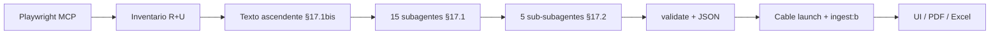

# Flujo operativo — META MEI / Clarity / MVP

| Metadatos | Detalle |
| --- | --- |
| **Fecha** | 2026-08-21 (origen piloto 2026-06-02; fusión stack + fixture 2026-08-21) |
| **Proveedor IA** | **Claude Code** + Playwright MCP + RAG Chroma/Xenova/LangChain |
| **Checklist** | PTD-LC **v3.0** — **51** criterios `LC-*` |
| **Objetivo** | Muestra **META MEI 10 URLs** con JSON + PDF + Excel |
| **Histórico** | 27 URLs Clarity/extras · piloto junio **9 URLs** · fixture mock Notificaciones |
| **Orquestación** | Prompt `05-audit-maestro-url.md` · skills `01`…`05` · `.claude/CLAUDE.md` §17 |
| **Referencias** | [`ARCHITECTURE.md`](ARCHITECTURE.md) · [`ROADMAP.md`](ROADMAP.md) · [`plantilla-excel-mei-bcd.md`](plantilla-excel-mei-bcd.md) · [`checklist-ptd-v2-mapa.md`](checklist-ptd-v2-mapa.md) · [`ux/inventario-urls-clarity.md`](ux/inventario-urls-clarity.md) · [ADR 0009](adr/0009-claude-code-pro-como-orquestador.md) · [`mei-meta-mei-urls.ts`](../src/lib/mei-export/mei-meta-mei-urls.ts) |

> Nest / AWS / Claude API / login = **propuestas antiguas** (no implementar). Persistencia = JSON en repo.  
> Este documento **absorbe** el antiguo `stack-orquestación.md` (simplificado) y el ejemplo fixture Notificaciones Marcas.

---

## 1. Alcances de producto acordados (antes de implementar)

### 1.1 Barra META MEI en `/auditar` (prioridad visual)

| Requisito | Detalle |
| --- | --- |
| **Ubicación** | Barra superior en `/auditar`: tabla **10 URLs META MEI**; debajo, inventarios Clarity / historial. |
| **Patrón UI** | Card + Accordion (design system §15). |
| **Contenido prioritario** | Las **10 URLs META MEI** (§2.1). El piloto de 9 y Clarity 17 no son el compromiso MEI. |
| **Comportamiento** | Clic en fila disponible → `/auditar/resultado?claudeAudit={id}&url={url}`. |
| **Datos** | [`mei-meta-mei-urls.ts`](../src/lib/mei-export/mei-meta-mei-urls.ts) + [`mei-meta-mei-launch.ts`](../frontend/src/lib/mei-meta-mei-launch.ts). |

**Título en UI (vigente):** «Auditoría 10 URLs INAPI - META MEI» / «10 URLs - META MEI».

**Registro antiguo:** acordeón piloto junio 2026 (§2.3) — solo histórico.

### 1.2 Pantalla de resultado ampliada

Al abrir una URL META MEI (u otra con `claudeAudit`), `/auditar/resultado` muestra **solo lectura** las secciones del informe (§5).

### 1.3 Límite conocido: export JSON → repo → MVP

No hay sincronización automática chat ↔ app. Flujo: **Claude Code / JSON** → **commit** → **MVP lee y muestra** → **PDF**. Sin Claude API operativa.

---

## 2. URLs — orden de lectura (META MEI → histórico 27 → piloto 9)

### 2.1 Muestra vigente — **10 URLs META MEI** (compromiso jefatura)

Fuente máquina: [`src/lib/mei-export/mei-meta-mei-urls.ts`](../src/lib/mei-export/mei-meta-mei-urls.ts).  
Orquestación: Claude Code §17 · checklist **v3.0** (51 `LC-*`) en auditorías nuevas; varias filas vigentes aún en **v2.1** hasta reauditoría.

| # | Rol META MEI | Página (UI) | URL canónica | Tipo | % LC (vigente) | Estado | Id JSON vigente | Checklist |
| --- | --- | --- | --- | --- | --- | --- | --- | --- |
| 1 | Portada o página de inicio | Portada / inicio INAPI | `https://www.inapi.cl/` | `sitioweb` | 78,9 % | rechazado | `www-inapi-cl_2026-08-22` | **3.0** |
| 2 | Menú principal (1/2) | Marcas | `https://www.inapi.cl/marcas` | `sitioweb` | 65,1 % | rechazado | `www-inapi-cl-marcas_2026-08-20` | 2.1 |
| 3 | Menú principal (2/2) | Patentes | `https://www.inapi.cl/patentes` | `sitioweb` | 65,1 % | rechazado | `www-inapi-cl-patentes_2026-08-20` | 2.1 |
| 4 | Página de información interior (1/2) | Acerca de INAPI | `https://www.inapi.cl/acerca-de/inapi` | `sitioweb` | 55,8 % | rechazado | `www-inapi-cl-acerca-de-inapi_2026-08-20` | 2.1 |
| 5 | Página de información interior (2/2) | Buscador de noticias | `https://www.inapi.cl/buscador?indexCatalogue=inapi&searchQuery=noticias&wordsMode=0` | `sitioweb` | 69,0 % | rechazado | `www-inapi-cl-buscador-noticias_2026-08-20` | 2.1 |
| 6 | Información del servicio digital / trámite | Solicitud Nueva (Marcas) | `https://www.inapi.cl/marcas/tramites/solicitud-nueva` | `sitioweb` | 62,5 % | rechazado | `www-inapi-cl-marcas-tramites-solicitud-nueva_2026-08-20` | 2.1 |
| 7 | Listado últimas noticias | Sala de Prensa — Noticias | `https://www.inapi.cl/sala-de-prensa/noticias` | `sitioweb` | 64,1 % | rechazado | `www-inapi-cl-sala-de-prensa-noticias_2026-08-20` | 2.1 |
| 8 | Últimas noticias (detalle 1/2) | Noticia — Cuenta Pública Participativa 2026 | `https://www.inapi.cl/sala-de-prensa/detalle-noticia/inapi-realizo-su-cuenta-publica-participativa-2026-en-valparaiso-y-reforzo-compromiso-con-la-descentralizacion-de-la-propiedad-industrial` | `sitioweb` | 44,2 % | rechazado | `www-inapi-cl-noticia-cuenta-publica-2026_2026-08-20` | 2.1 |
| 9 | Últimas noticias (detalle 2/2) | Noticia — Cifra histórica de patentes nacionales | `https://www.inapi.cl/sala-de-prensa/detalle-noticia/chile-alcanza-su-mayor-cifra-de-solicitudes-de-patentes-nacionales-en-mas-de-una-decada` | `sitioweb` | 58,1 % | rechazado | `www-inapi-cl-noticia-cifra-patentes-nacionales_2026-08-20` | 2.1 |
| 10 | Formulario (trámites) | Formulario Contacto SIAC | `https://tramites.inapi.cl/siac` | `tramites` | 51,4 % | rechazado | `tramites-inapi-cl-siac_2026-08-20` | 2.1 |

**Convención `id`:** `slug-desde-url_YYYY-MM-DD` (debe coincidir archivo, campo `"id"` y launch).

---

### 2.2 Histórico consolidado — **27 URLs** (Clarity INAPI + extras)

| Origen | Cantidad | Detalle |
| --- | --- | --- |
| Inventario Microsoft Clarity (INAPI) | **17** | Ranks 1–17 en [`clarity-fichas-mock.json`](../data/ux/clarity-fichas-mock.json) |
| Solo muestra META MEI (no están en Clarity 17) | **9** | Marcas, Patentes, Acerca de, Buscador noticias, Solicitud Nueva, Sala de Prensa, 2 noticias detalle, SIAC |
| Solo piloto junio | **1** | Buscador Marcas (`buscadormarcas.inapi.cl`) |
| **Total** | **27** | 17 + 9 + 1 |

La **home** (`www.inapi.cl/`) cuenta una sola vez (Clarity rank 16 **y** META MEI #1).

| # | Origen | Página | URL canónica | Tipo | JSON vigente / nota |
| --- | --- | --- | --- | --- | --- |
| C1 | Clarity | Landing Sitio de Trámites | `https://tramites.inapi.cl/` | `tramites` | `tramites-inapi-cl_2026-07-22` |
| C2 | Clarity | Inicio de sesión | `https://tramites.inapi.cl/Account/Login` | `tramites` | `tramites-inapi-cl-account-login_2026-07-22` |
| C3 | Clarity | Expediente de marca | `https://tramites.inapi.cl/Trademark/TrademarkFile` | `tramites` | `…trademarkfile_2026-07-27` |
| C4 | Clarity | Notificaciones Marcas | `https://tramites.inapi.cl/Notificaciones` | `tramites` | `…notificaciones_2026-07-27` |
| C5 | Clarity | Solicitudes guardadas | `https://tramites.inapi.cl/Trademark/TrademarkSavedApplications` | `tramites` | `…savedapplications_2026-07-27` |
| C6 | Clarity | Solicitar Marca | `https://tramites.inapi.cl/Trademark/TrademarkApplication/IndexTrademark` | `tramites` | `…indextrademark_2026-07-27` |
| C7 | Clarity | Solicitud de Marca | `https://tramites.inapi.cl/Trademark/TrademarkApplication/LoadTrademarkApplication` | `tramites` | `…loadtrademarkapplication_2026-07-27` |
| C8 | Clarity | Login ClaveÚnica | `https://tramites.inapi.cl/Login/claveunica` | `tramites` | **Pendiente TI** |
| C9 | Clarity | Estados diarios de marcas | `https://tramites.inapi.cl/EstadosDiariosMarcas` | `tramites` | `…estadosdiariosmarcas_2026-07-22` |
| C10 | Clarity | Clasificador de Niza | `https://tramites.inapi.cl/Trademark/TrademarkNizaClassifier` | `tramites` | `…nizaclassifier_2026-07-27` |
| C11 | Clarity | Confirmación presentación escritos | `https://tramites.inapi.cl/Trademark/TrademarkUserDocument/SuccessConfirmation` | `tramites` | **Pendiente TI** |
| C12 | Clarity | Presentación de escritos | `https://tramites.inapi.cl/Trademark/TrademarkUserDocument` | `tramites` | `…userdocument_2026-07-27` |
| C13 | Clarity | Confirmación solicitud de marca | `https://tramites.inapi.cl/Trademark/TrademarkApplication/Confirmation` | `tramites` | **Pendiente TI** |
| C14 | Clarity | Anotaciones de marca | `https://tramites.inapi.cl/Trademark/TrademarkAnnotation` | `tramites` | `…annotation_2026-07-27` |
| C15 | Clarity | Renovación de marca | `https://tramites.inapi.cl/Trademark/TrademarkRenewalApplication` | `tramites` | **Pendiente TI** |
| C16 | Clarity + META MEI #1 | Home INAPI | `https://www.inapi.cl/` | `sitioweb` | `www-inapi-cl_2026-08-22` (v3.0) |
| C17 | Clarity | Trámites digitales | `https://www.inapi.cl/tramites/tramites-digitales` | `sitioweb` | `…tramites-digitales_2026-07-22` |
| M2–M10 | META MEI | (ver §2.1 #2–#10) | — | — | Ids §2.1 |
| P2 | Piloto junio | Buscador Marcas INAPI | `https://buscadormarcas.inapi.cl/Marca/BuscarMarca.aspx` | `sitioweb` | `buscadormarcas-…_2026-06-05` |

Detalle Clarity: [`ux/inventario-urls-clarity.md`](ux/inventario-urls-clarity.md). Ranks **8, 11, 13, 15** = Pendiente TI.

---

### 2.3 Registro antiguo — piloto junio 2026 (**9 URLs**)

> **Solo histórico.** No es la muestra META MEI.

| # piloto | Página | URL canónica | Tipo | Id JSON piloto (junio) | Nota 2026-08 |
| --- | --- | --- | --- | --- | --- |
| 1 | Home INAPI | `https://www.inapi.cl/` | `sitioweb` | `www-inapi-cl_2026-06-02` | Vigente: `…_2026-08-22` |
| 2 | Buscador Marcas | `https://buscadormarcas.inapi.cl/Marca/BuscarMarca.aspx` | `sitioweb` | `buscadormarcas-…_2026-06-05` | Solo histórico §2.2 |
| 3 | Marcas | `https://www.inapi.cl/marcas` | `sitioweb` | `…marcas_2026-06-05` | Vigente: `…_2026-08-20` |
| 4 | Acerca de INAPI | `https://www.inapi.cl/acerca-de/inapi` | `sitioweb` | `…_2026-06-07` | Vigente: `…_2026-08-20` |
| 5 | Buscador de noticias | `https://www.inapi.cl/buscador?…noticias…` | `sitioweb` | `…_2026-06-07` | Vigente: `…_2026-08-20` |
| 6 | Solicitud Nueva | `https://www.inapi.cl/marcas/tramites/solicitud-nueva` | `sitioweb` | `…_2026-06-07` | Vigente: `…_2026-08-20` |
| 7 | Sala de Prensa | `https://www.inapi.cl/sala-de-prensa/noticias` | `sitioweb` | `…_2026-06-07` | Vigente: `…_2026-08-20` |
| 8 | SIAC | `https://tramites.inapi.cl/siac` | `tramites` | `…siac_2026-06-07` | Vigente: `…_2026-08-20` |
| 9 | Trámites y Servicios | `https://tramites.inapi.cl/` | `tramites` | `tramites-inapi-cl_2026-06-07` | Clarity C1; no es fila META MEI |

---

## 3. Orquestación vigente (Claude Code)

**Una URL = una sesión.** Pegar [`.claude/prompts/05-audit-maestro-url.md`](../.claude/prompts/05-audit-maestro-url.md). Leer Prompt `06` + skill `05` y Prompt `07` + skill `06` (texto ascendente) en cada corrida.

```mermaid
flowchart LR
  A[Playwright MCP] --> B[Inventario R+U]
  B --> C0[Texto ascendente §17.1bis]
  C0 --> C[15 subagentes §17.1]
  C --> D[5 sub-subagentes §17.2]
  D --> E[validate + JSON]
  E --> F[Cable launch + ingest:b]
  F --> G[UI / PDF / Excel]
```

| Paso | Qué |
| --- | --- |
| Captura | DOM real (Playwright); sesión ClaveÚnica si aplica — [`fase-3-3-captura-auth-claveunica.md`](fase-3-3-captura-auth-claveunica.md) |
| Texto ascendente | Paso D0 — palabra→párrafo (`07` + skill `06`) |
| Evaluación | 51 `LC-*` · `version_checklist: "3.0"` |
| Entrega CMS | §22 — propuesto / motivo / ubicación legible |
| Cableado | `clarity-audits-launch.ts` / `claude-audits-launch.ts` / META MEI (JSON solo **no** actualiza UI) |
| Multi-URL | Repetir Prompt 5 (orden `mei-meta-mei-urls.ts`) |

Cola META MEI y muestra oro = **mismo Prompt 5** (no hay prompts `audit-lote` / `audit-oro`).

---

## 4. Contexto de captura (del antiguo stack — resumido)

### 4.1 Tres capas de «HTML»

| Capa | Qué es | Uso |
| --- | --- | --- |
| **Ctrl+U** | HTML inicial del servidor | Referencia aproximada; **no** ancla primaria para TI |
| **DOM renderizado** | Lo que ve el ciudadano tras JS | **Fuente de verdad editorial** |
| **Código TI** | `.cshtml`, i18n, bundles | Donde se implementa el cambio |

En Trámites el JS puede venir del backend: la línea de Ctrl+U **no** coincide con el IDE. Ancla para TI = **fragmento único buscable** (`fragmento_busqueda` / texto en `ubicacion_pantalla`), no solo `html_linea_aprox`.

### 4.2 Capas de hallazgo (Excel / JSON)

| Etiqueta | Descripción |
| --- | --- |
| `VISIBLE` | Texto/enlace/botón ciudadano |
| `METADATA` | `<title>`, meta |
| `SISTEMA` | Overlays Ajax, nodos ocultos recurrentes |
| `DUPLICADO` | Misma cadena desktop + mobile → filas distintas si hace falta |

### 4.3 Histórico (no usar como runbook)

Antes del stack Claude Code: **Claude Proyecto** (Ctrl+U + 39 A–H), **DevTools IA** (DOM puntual) y plantillas MEI B/C/D. Esos prompts y el plan «hasta 30-jun-2026» quedaron **supersedidos**. Excel MEI vigente: [`plantilla-excel-mei-bcd.md`](plantilla-excel-mei-bcd.md).

---

## 5. Pantalla `/auditar/resultado` y PDF

Modo `?claudeAudit=`: bloques de informe (Datos, Resumen, Pasos, **Criterios**, Observaciones, Texto propuesto / sustituciones, Nota TI) + PDF (`GET /api/claude-audits/[id]/export/pdf`).

Auditorías **v3.0:** tabla de **51** `LC-*` (Instrumento → Estado → Texto → Corrección → Ubicación → Justificación → Criterio; Excel añade Hito/Tarea PTD). JSON **legado** A–H (39/47) siguen legibles según `version_checklist`.

Design system: [`DESIGN_SYSTEM.md`](DESIGN_SYSTEM.md) §15–§16.

---

## 6. Flujo repo → UI (resumen)

```mermaid
flowchart TB
  PW[Playwright + Prompt 5] --> JSON[data/claude-audits/...]
  JSON --> V[validate:claude-audits]
  V --> L[Cable launch]
  L --> UI[/auditar/resultado PDF Excel]
  JSON --> RAG[ingest:b]
```

1. Guardar JSON canónico (`id` = `slug_YYYY-MM-DD`).  
2. `bun run validate:claude-audits` (o hook).  
3. Actualizar launch (Clarity / piloto / META MEI).  
4. Commit atómico por URL + entrada DEVLOG si aplica.  
5. `bun run ingest:b` en PC con Chroma.

---

## 7. Fixture histórico — Notificaciones Marcas (mock)

> Referencia humana del primer fixture Fase 1. JSON máquina: `data/audit-fixtures/` ([README](../data/audit-fixtures/README.md)). Checklist del ejemplo: **v1.1 / 39 A–H** (legado).

| Campo | Valor |
| --- | --- |
| Página | Notificaciones Marcas — `https://tramites.inapi.cl/Notificaciones` |
| Fecha informe | 2026-05-11 |
| Evaluador (ficticio) | `fixture@inapi.cl` |
| Métricas | 16/29 aplicables · **55,2 %** · **rechazado** |
| Fixture id | `audit_fixture_notificaciones_marcas_rechazado` |
| Query UI | `?fixture=audit_fixture_notificaciones_marcas_rechazado` |

**Idea del texto capturado (resumen):** modal de advertencia (notificación electrónica ≠ notificación legal; Art. 13 Ley 19.039); vista con filtros de solicitud/fechas/titular; RUN/nombre de ejemplo ficticios; pie institucional. El volcado largo de criterios A–H del informe editorial original ya no se mantiene aquí — el contrato vigente de nuevas auditorías es **51 `LC-*`**.

Otros fixtures (81–90 % / ≥91 %): solo JSON validado en `data/audit-fixtures/`.

---

## 8. Checklist de cierre / enlaces

| Tema | Dónde |
| --- | --- |
| 10 URLs META MEI | §2.1 · `mei-meta-mei-urls.ts` |
| Clarity 17 | §2.2 · [`ux/inventario-urls-clarity.md`](ux/inventario-urls-clarity.md) |
| Auth ClaveÚnica | [`fase-3-3-captura-auth-claveunica.md`](fase-3-3-captura-auth-claveunica.md) |
| Excel MEI | [`plantilla-excel-mei-bcd.md`](plantilla-excel-mei-bcd.md) |
| Despliegue | [`despliegue/despliegue-hibrido.md`](despliegue/despliegue-hibrido.md) |
| Jobs worker | [`contratos-audit-jobs.md`](contratos-audit-jobs.md) |
| Bitácora | [`development/DEVLOG.md`](development/DEVLOG.md) |

