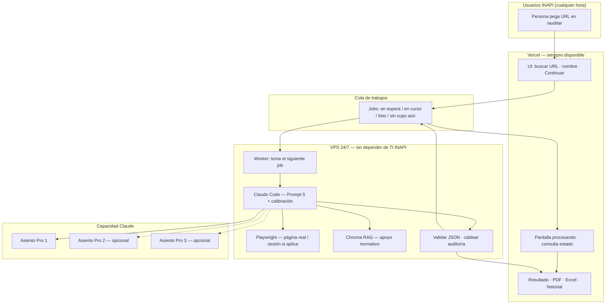

# Propuestas de implementación 24/7 — auditoría Lenguaje Claro INAPI

| Metadatos | Detalle |
| --- | --- |
| **Fecha** | 2026-08-24 |
| **Audiencia** | Jefatura de proyecto / Equipo UX / desarrollo |
| **Relacionado** | [ADR 0011](adr/0011-worker-local-on-demand-vercel.md) · [contratos audit-jobs](contratos-audit-jobs.md) · [despliegue híbrido](despliegue/despliegue-hibrido.md) · [SECURITY.md](SECURITY.md) · [PROPUESTA_TECNICA_INTEGRAL](PROPUESTA_TECNICA_INTEGRAL.md) |

> **Nombre del archivo:** `propuestas-implementacion-24-7.md` (en sistemas de archivos no se puede usar `/` dentro del nombre; “24/7” queda escrito como `24-7`).

---

## 1. Qué existe hoy en este proyecto

### 1.1 Para qué sirve el producto

El aplicativo **lc-inapi-app** audita páginas de `inapi.cl` y `tramites.inapi.cl` con el instrumento de **Lenguaje claro** del Checklist Editorial INAPI (catálogo máquina **PTD-LC v3.0**: **51 criterios** `LC-*`).

Entrega:

- un **JSON** validado por criterio;
- pantalla de **resultado** en la web;
- **PDF** e **Excel** (formato MEI / entrega a CMS y jefatura).

No es un “puntaje genérico de calidad”: cada criterio responde una **pregunta concreta** del checklist (Hito → Tarea → Indicador → Pregunta), con evidencia **visible en pantalla** y propuestas de corrección en lenguaje de editor CMS.

### 1.2 Dos mundos que ya conviven

| Mundo | Qué hace | Dónde corre hoy |
| --- | --- | --- |
| **Producto web** | Buscador/listas, resultado, PDF, Excel, historial, APIs delgadas de jobs | **Vercel** + código en **GitHub** |
| **Auditoría profunda** | Abrir la URL real, leer el DOM, aplicar 51 criterios con rigor, escribir el JSON | **PC / WSL** con **Claude Code** (cuenta institucional INAPI), Playwright y base vectorial local (Chroma) |

**GitHub** guarda el código, las auditorías en JSON y el control de calidad (CI).  
**Vercel** muestra el producto en internet para que Equipo UX y jefatura lo usen **sin instalar nada**.  
**Ninguno de los dos ejecuta hoy la auditoría larga (unos 10–40 minutos por URL).** Esa parte la hace Claude Code en el PC, siguiendo el flujo documentado en `.claude/` (Prompt maestro, calibraciones, subagentes).

### 1.3 Cómo se audita una URL hoy (método vigente)

1. Se elige **una URL** (muestra META MEI de 10 URLs, o una URL suelta en sesión Claude Code).  
2. **Playwright** abre la página real (HTML + lo que ve el usuario). Si hace falta sesión (trámites), se usa captura autenticada (p. ej. ClaveÚnica / cuenta de trabajo), según la documentación de Fase 3.3.  
3. Se arma un **inventario** del texto visible.  
4. **Paso D0:** análisis textual de menor a mayor (palabra → frase → oración → párrafo).  
5. **15 subagentes** (un indicador tras otro) + **5 sub-subagentes** de calidad de entrega (textos CMS, veracidad, Excel, etc.).  
6. Se lee siempre la **calibración persistente** (hallazgos acordados con UX: jerga, tasas, títulos, etc.).  
7. Se valida el JSON (`validate:claude-audits`), se cablea a la UI y se puede bajar PDF/Excel.

Ese método ya produjo la oleada META MEI reauditada a v3.0 (Portada, Marcas, Patentes, …, SIAC).

### 1.4 Lo que ya está listo para “pegar URL y esperar”

La idea del producto on-demand es simple:

1. Alguien escribe una URL en la web y pulsa Continuar.  
2. No se queda mirando una ventana de Claude Code.  
3. Espera unos minutos (o ve un mensaje de “en cola”) y luego abre el resultado, el PDF y el Excel.

Para que eso ocurra **sin** que Vercel ejecute la auditoría de 10–40 minutos, el proyecto ya separó tres piezas:

| Pieza | Rol en una frase |
| --- | --- |
| **La web (Vercel)** | Recibe la URL, crea un pedido y muestra “procesando” / resultado. |
| **El job (pedido)** | Es el ticket que dice “audita esta URL para esta persona”. |
| **El worker (trabajador automático)** | Es el programa que toma el ticket y hace (o debería hacer) la auditoría pesada. |

Hoy la web y los jobs ya existen; el worker existe pero en modo **ensayo** (simula el final sin llamar aún a Claude Code de verdad). El diseño oficial está en [ADR 0011](adr/0011-worker-local-on-demand-vercel.md).

**Falta para el producto real:** que el worker llame a Claude Code con el Prompt 5, y que esa máquina pueda estar **encendida 24/7** (VPS) en lugar de un PC de oficina solo de 8 a 18.

#### El worker: qué es, qué resuelve y cómo se implementa

**Analogía.** Imagina una oficina de atención:

- La **página web** es la ventanilla: la persona entrega el formulario (URL + nombre).  
- El **job** es el número de turno en la pantalla.  
- El **worker** es el funcionario del back-office: cuando hay turno pendiente, lo toma, hace el trabajo largo y avisa “listo, puede retirar su resultado”.

Sin worker, la ventanilla solo podría decir “deje su papel”… y nadie lo procesaría. Vercel es buena ventanilla; **no** es el funcionario que tarda media hora en auditar.

**Objetivo que cumple el worker**

- Ser el **puente automático** entre “alguien pidió una auditoría en la web” y “Claude Code (más Playwright) ya terminó y hay un resultado para mostrar”.  
- Correr **fuera** de Vercel (en un PC o en un VPS), donde sí se puede dejar abierto Claude Code, Playwright y la base de apoyo (Chroma) el tiempo que haga falta.  
- Hacer el ciclo siempre igual: **tomar un pedido → trabajar → marcar terminado o fallido**, para que la pantalla de “procesando” sepa qué decirle al usuario.

**Qué problema resuelve**

| Sin worker | Con worker |
| --- | --- |
| Cada auditoría exige que una persona abra Claude Code, pegue el Prompt 5 y espere | La persona solo usa la web; el worker se encarga del “pegar y esperar” en la máquina de auditoría |
| Vercel no puede (ni debe) correr 40 minutos de Claude + navegador | El trabajo pesado queda en la máquina correcta |
| No hay forma ordenada de hacer cola si llegan 5 URLs seguidas | Los pedidos se acumulan; el worker los toma de a uno (o de a varios si hay varios asientos) |
| No se sabe si el trabajo sigue vivo o se colgó | El pedido pasa por estados claros: en cola → en curso → listo / falló |

**Cómo se implementa hoy en el repo (en lenguaje simple)**

1. En el PC (o mañana en el VPS) se deja corriendo un comando del proyecto, por ejemplo `bun run worker:audit-jobs`, con un **secreto compartido** que solo conocen la API y el worker (como una contraseña entre ambos).  
2. El worker, en bucle:  
   - pregunta a la API: “¿hay algún pedido libre?” (**reclamar**);  
   - si no hay, espera un rato y vuelve a preguntar;  
   - si hay, se lo **reserva** (pasa a “en curso”, para que otro worker no tome el mismo);  
   - **hoy (modo ensayo):** no llama a Claude Code; inventa un identificador de prueba y marca el pedido como listo, solo para probar la tubería web ↔ cola ↔ worker;  
   - **mañana (modo real):** aquí debería lanzar Claude Code con el Prompt maestro de esa URL, validar el JSON y luego marcar el pedido como listo con el id de auditoría verdadero;  
   - si algo falla, marca el pedido como fallido con un mensaje seguro para la UI.  
3. Mientras tanto, la página de “procesando” va consultando el estado del pedido. Cuando ve “listo”, lleva al usuario al resultado.

**Cómo conecta esto con el 24/7**

- **24/7 de la web:** Vercel puede recibir URLs a cualquier hora y crear jobs.  
- **24/7 de la auditoría:** solo existe si el **worker está corriendo** en una máquina que no se apaga (el VPS de esta propuesta).  
- Si el worker está apagado (PC de oficina fuera de horario), los pedidos se acumulan o quedan “fuera de horario”, pero **nadie los ejecuta** hasta que alguien encienda de nuevo el trabajador automático.

En una frase: **el worker es el proceso que hace de “Claude Code automático” detrás de la cola; el 24/7 no es magia de Vercel, es “dejar ese proceso siempre vivo en un VPS”.**

Detalle de contratos: [contratos audit-jobs](contratos-audit-jobs.md). Script actual: `bun run worker:audit-jobs` (`src/scripts/audit-jobs-worker.ts`).

### 1.5 Mini sección: qué son los jobs (pedidos de auditoría)

Un **job** (en el día a día se puede llamar **pedido** o **trabajo en cola**) es el registro de “alguien pidió auditar esta URL”.

**Para qué sirve**

- Separar el momento en que el usuario **pide** del momento en que la máquina **termina** (pueden pasar 10–40 minutos, o más si hay cola o sin cupo Claude).  
- Permitir que varias personas pidan auditorías aunque solo haya capacidad para unas pocas a la vez.  
- Dar a la UI un estado honesto: en cola, en curso, listo, falló, o “fuera del horario en que atendemos” (regla actual 8–18 si solo hay PC de oficina).

**Qué guarda (idea, sin tecnicismos)**

- La URL a auditar.  
- Un nombre libre de quien pide (no es login).  
- El estado del pedido.  
- Fechas de creación / reserva / fin.  
- Cuando termina bien: el enlace lógico al resultado (el id de la auditoría ya generada).  
- Si falla: un mensaje entendible, no un volcado técnico.

**Estados que verá el producto (resumen)**

| Estado | Qué significa para la persona |
| --- | --- |
| En cola | Su pedido fue aceptado; espera su turno. |
| Fuera de horario | (Con PC 8–18) el pedido quedó registrado; se atenderá cuando abra la ventana laboral. Con VPS 24/7 esto se puede relajar. |
| En curso | El worker ya lo tomó; Claude Code está trabajando. |
| Listo | Puede ver resultado / PDF / Excel. |
| Falló | Algo impidió terminar; se muestra un mensaje claro y se puede reintentar según política del equipo. |

**Dónde viven hoy:** un archivo por pedido en `data/jobs/`, creado y actualizado por la API del propio aplicativo.

**Relación job ↔ worker ↔ 24/7**

```
Persona → crea JOB → JOB espera en la cola
                ↓
         WORKER toma el JOB → hace la auditoría → marca JOB listo
                ↓
         Persona ve el resultado
```

Sin jobs, no hay cola. Sin worker, los jobs no avanzan. Sin máquina 24/7 para el worker, la cola solo “atiende” cuando alguien enciende el PC.

### 1.6 Límites actuales

| Límite | Qué implica |
| --- | --- |
| **Claude Pro / Team institucional** | Capacidad orientativa del orden de **3 a 4 URLs cada ~5 horas** por asiento (el cupo lo fija la suscripción, no Vercel). |
| **Horario PC 8–18** (diseño ADR 0011) | Fuera de ese horario no hay quien ejecute auditorías nuevas si solo hay un PC de oficina (el worker no está corriendo). |
| **Vercel** | Sirve la UI siempre; **no** puede hospedar Playwright + Claude Code de 40 minutos de forma fiable. |
| **Sin servidor TI / sin API Claude operativa (acuerdo actual)** | No hay Nest, AWS ni Anthropic API cableada al MVP; la inteligencia corre con el **asiento Claude Code**. |
| **Worker en modo ensayo** | La tubería web ↔ cola ↔ worker se puede probar, pero **aún no** genera auditorías reales hasta conectar Claude Code. |

---

## 2. Alternativas para 24/7

Objetivo común: **cualquier persona de INAPI pega una URL → el sistema audita → ve resultado / PDF / Excel**, idealmente **a cualquier hora**, **sin depender de TI** para montar un servidor institucional.

| # | Alternativa | Cómo funciona (en corto) | ¿24/7? | ¿PC oficina? | ¿API Anthropic? | ¿Qué reutiliza del repo? | Esfuerzo | Capacidad típica | Costo orientativo a cotizar | Riesgo / nota |
| --- | --- | --- | --- | --- | --- | --- | --- | --- | --- | --- |
| **0** | **Hoy + cola en PC (ADR 0011)** | Vercel o túnel encola; PC 8–18 ejecuta Claude Code | Solo en horario laboral | **Sí** | No | Casi todo (jobs ya existen) | Bajo (conectar stub → Claude real) | ~3–4 URL / 5 h por asiento | Asiento Claude (ya) + electricidad/PC | No cumple “siempre on” |
| **1** | **VPS 24/7 + Claude Code** (recomendada) | Se arrienda una máquina en la nube (no es servidor TI); ahí viven Playwright, Chroma y Claude Code; Vercel sigue siendo la cara pública | **Sí** (si el VPS está encendido) | **No** | No | Todo el método §17, prompts, calibraciones, jobs | Medio | Sigue el cupo Pro (~3–4 / 5 h por asiento); se puede **multiplicar con más asientos** (ver §4) | VPS ~USD 10–40/mes + asiento(s) Claude | Misma calidad que hoy; cola cuando hay más demanda que cupo |
| **2** | **Worker en nube + Anthropic API** | La UI encola; un servicio en la nube llama a la **API de Claude** (pago por uso) y Playwright; ya no depende del asiento “Code” | **Sí** | No | **Sí** | UI, Zod, Excel/PDF, idea de cola; hay que **rehacer** el cerebro de auditoría (hoy vive en Claude Code + subagentes) | Alto | Escala con dinero (tokens), no con cupo Pro de Code | API (variable por auditoría) + worker ~USD 20–80/mes + cola (KV/Redis pocos USD) | Mejor para mucho volumen; más ingeniería y calibración de nuevo |
| **3** | **Agente en nube del proveedor** (p. ej. agentes cloud / SDK) | Vercel encola; un agente cloud corre el prompt maestro | Posible | No | Depende del producto | Parcial | Medio + incertidumbre | Límites del plan cloud | Cotizar licencia cloud | Hay que validar licencia institucional y cupos antes de prometer |
| **4** | **Solo Vercel + “un prompt con las 51 preguntas”** (estilo app simple de evaluación) | Subir URL o captura y un modelo responde en la misma request | Aparente 24/7 | No | Casi siempre sí (o cuota del hosting de IA) | Casi nada del rigor actual | Bajo en demos, alto en calidad | Rápido pero superficial | API o plan del hosting | **No equivale** a este MVP (ver §3.6 frente a IPeval) |
| **5** | **GitHub Actions como “worker”** | Cada URL dispara un workflow | Parcial (colas/límites de Actions) | No | No / dudoso | Poco práctico con Claude Code + Playwright largos | Medio–alto | Limitado por minutos y secretos | Minutos Actions + asiento | Frágil para 10–40 min y sesión ClaveÚnica |

**Lectura rápida:** si la prioridad es **misma calidad que META MEI** y **24/7 sin TI**, la fila **#1 (VPS)** es la que mejor encaja con lo construido. Si la prioridad es **muchas auditorías concurrentes sin tope Pro**, hay que abrir la fila **#2 (API)**.

---

## 3. Propuesta recomendada: VPS 24/7 + lo que ya existe

### 3.1 Por qué es la opción más realista y eficaz *hoy*

1. **No tira a la basura el trabajo de 2026:** Prompt maestro, calibraciones, D0, 15+5 subagentes, validación Zod, UI, PDF, Excel y cola de jobs.  
2. **Cumple el veto práctico a “pedir servidor a TI”:** el VPS lo arrienda el proyecto (cuenta cloud del equipo), no un ticket de infraestructura INAPI.  
3. **Cumple 24/7 de disponibilidad del sistema:** la máquina está siempre encendida; la UI en Vercel también. Lo que sigue acotado es el **cupo de Claude**, no el “¿está prendido el PC de la oficina?”.  
4. **Es el camino más corto** entre “demo con cola” y “producto siempre on” **sin** reescribir el orquestador en API.  
5. Encaja con la propuesta de Álvaro de **licencias institucionales** (GitHub, Vercel, Claude Code): el equipo sigue usando las mismas herramientas; solo cambia **dónde** corre Claude Code (VPS en lugar de laptop).

### 3.2 Qué problema resuelve

| Problema de hoy | Con VPS |
| --- | --- |
| Dependencia de un PC de oficina 8–18 | La auditoría corre en una máquina dedicada 24/7 |
| “¿Por qué no puedo pegar una URL en Vercel y listo?” | Vercel **encola**; el VPS **ejecuta**; el usuario **espera y ve resultado** (mismo contrato mental que un producto) |
| Pérdida de calidad si se simplifica a “un solo prompt” | Se mantiene el workflow calibrado (D0 + indicadores + entrega CMS) |
| TI no monta servidor | No se pide servidor INAPI; se arrienda VPS del proyecto |

### 3.3 Qué se necesita para implementarla

Orden práctico: primero la máquina (**VPS**), luego cómo entrar a ella (**SSH**, §3.4), después el software y la cola.

| Pieza | Detalle |
| --- | --- |
| **1. VPS** | Máquina Linux 24/7 (orientativo: 2–4 vCPU, 8 GB RAM, disco para Chroma y HTML). Proveedores habituales: **Hetzner, DigitalOcean**, etc. (un VPS clásico basta; no hace falta un producto tipo Railway para esta opción). |
| **2. Acceso remoto seguro (SSH)** | Ver **§3.4** (cómo se crea la llave, cómo se pone en el VPS y en qué se diferencia del secreto del worker). |
| **3. Software en el VPS** | Bun, Claude Code (cuenta institucional), Playwright, Chroma, clone del repo, variables de entorno del worker. |
| **4. Conectar el worker real** | Dejar de usar el stub: al reclamar un job, lanzar el **Prompt 5** (una URL) con el mismo rigor META MEI; luego `validate` y marcar el job como listo. |
| **5. Cola** | Reutilizar `audit-jobs` (jobs en disco del VPS, o UI en Vercel que habla con la API del VPS / túnel). |
| **6. Horario vs cupo** | El sistema puede recibir URLs a las 3 a.m.; si el cupo Pro está agotado, el job queda **en cola** con mensaje claro (“capacidad estimada: N auditorías cada 5 horas”). |
| **7. Licencias** | Claude Code institucional (ya); opcionalmente más asientos (ver §4); GitHub + Vercel como hoy. |
| **8. Cuenta genérica INAPI (recomendable)** | Para páginas con login: usuario de prueba institucional para Playwright (mejor que depender de la ClaveÚnica personal de una sola persona). |

En corto: el ciudadano solo usa **Vercel**; quien implementa entra al VPS por **SSH** para dejar el worker siempre corriendo.

### 3.4 Acceso SSH al VPS (punto intermedio)

**Qué es.** SSH es la forma segura de **entrar a distancia** al VPS: abrir una terminal en esa máquina desde el PC del equipo, para instalar Claude Code, dejar corriendo el worker y revisar que todo siga vivo. **No** es lo que ve Equipo UX ni el ciudadano. **No** es el tubo que une Vercel con la auditoría (eso va por la API de jobs + el secreto del worker; ver §1.4 y §7).

**Analogía.** El VPS es la sala de máquinas. SSH es la **llave de esa sala**. Solo 1–2 personas del proyecto deben tenerla.

#### Cómo se crea la llave (en el PC del administrador)

En Linux, WSL o Mac:

```bash
ssh-keygen -t ed25519 -C "tu-correo@inapi.cl"
```

- Ruta por defecto al pulsar Enter: `~/.ssh/id_ed25519`.  
- Conviene poner una **passphrase** (contraseña tuya sobre la llave; no es la del VPS).

Se crean dos archivos:

| Archivo | Qué es | ¿Se comparte? |
| --- | --- | --- |
| `~/.ssh/id_ed25519` | Llave **privada** | **Nunca** (ni GitHub, ni Vercel, ni chat) |
| `~/.ssh/id_ed25519.pub` | Llave **pública** | Sí: solo al VPS (y a quien administre contigo) |

Ver la pública:

```bash
cat ~/.ssh/id_ed25519.pub
```

Empieza algo como `ssh-ed25519 AAAA... tu-correo@inapi.cl`.

#### Cómo se pone en el VPS

Al crear el servidor en Hetzner/DigitalOcean, casi siempre se puede **pegar la llave pública** en el panel.

Si el VPS ya existe y hay un acceso temporal (consola web del proveedor):

```bash
ssh usuario@IP_DEL_VPS
mkdir -p ~/.ssh
chmod 700 ~/.ssh
echo "PEGA_AQUI_LA_LINEA_COMPLETA_.pub" >> ~/.ssh/authorized_keys
chmod 600 ~/.ssh/authorized_keys
```

(`usuario` suele ser `root` o el que indique el proveedor.)

#### Cómo se entra después

```bash
ssh usuario@IP_DEL_VPS
```

Si la llave no es la por defecto:

```bash
ssh -i ~/.ssh/id_ed25519 usuario@IP_DEL_VPS
```

#### Buenas prácticas

- La privada solo en el PC del administrador (y respaldo cifrado si hace falta).  
- **No** subir `id_ed25519` a GitHub ni a Vercel.  
- En el VPS: preferir login solo con llave, sin contraseña de root abierta a internet.  
- Si alguien deja el equipo: quitar su línea de `authorized_keys`.

#### No confundir SSH con el secreto del worker

| Cosa | Para qué |
| --- | --- |
| **SSH** | Que el equipo **administre** el VPS |
| **Secreto del worker** | Que solo el worker legítimo **reclame** jobs de auditoría (variable de entorno; no es un archivo `.pub`) |

### 3.5 Cuánto costaría (órdenes de magnitud para cotizar)

| Ítem | Orden de magnitud | Nota |
| --- | --- | --- |
| VPS | **~USD 10–40 / mes** | Según CPU/RAM/disco |
| Claude Code / Team | **Asiento(s) ya institucionales** | El costo extra es por **asiento adicional**, no por “servidor TI” |
| Vercel | Plan actual (Hobby suele bastar para UI) | La auditoría no corre en Vercel |
| Dominio / túnel (si aplica) | Bajo o incluido | Solo si la API de jobs no vive detrás de Vercel de forma directa |
| **Total “encender 24/7” (1 asiento)** | En la práctica: **decenas de USD/mes** de infra + el/los asientos Claude | Cotizar cifras exactas con el proveedor elegido |

No incluye el costo de **desarrollo** (conectar worker → Claude Code real, pruebas, mensajes de cola en la UI): es trabajo de ingeniería del equipo, no factura de TI.

### 3.6 Por qué este workflow de auditoría es mejor que “una app simple como IPeval”

Referencia que suele aparecer en la conversación: [IPeval](https://ipeval-eight.vercel.app/) (*IP Analytics · Quality Evaluator*). Esa app pide **tipo de reporte**, **subir una imagen** (captura/PDF) y devuelve un **puntaje y observaciones**. Es útil para evaluar **un artefacto visual ya preparado**.

Nuestro MVP resuelve **otro problema**:

| | IPeval (ejemplo) | lc-inapi-app (este repo) |
| --- | --- | --- |
| Entrada | Imagen / captura de un reporte | **URL viva** de INAPI |
| Qué se evalúa | Calidad visual / estructura de un informe de analytics | **51 preguntas** de Lenguaje claro (checklist institucional) |
| Evidencia | Lo que se ve en la imagen subida | Lo que el ciudadano ve en el **DOM real** (incl. modales, acordeones, menús) |
| Sesión / login | No aplica | **Sí aplica** en trámites: Playwright puede entrar con ClaveÚnica o cuenta genérica |
| Salida | Scorecard / observaciones | Cumple/incumple por criterio + **texto propuesto para CMS** + PDF + Excel MEI |
| Mejora en el tiempo | Depende del prompt fijo de esa app | **Calibración persistente** (Prompt 6): cada hallazgo de UX se fija y se reaplica en todas las URLs |

**¿Por qué Ipeval no es lo mismo con una URL?”:**

1. **No es el mismo input.** IPeval evalúa una **foto** del reporte. Nosotros debemos **abrir la URL**, a veces **iniciar sesión**, expandir bloques y no inventar lo que no está en pantalla.  
2. **Un solo prompt con “las 51 preguntas” puede existir**, y de hecho cualquiera puede intentarlo en una app con API. Pero en la práctica INAPI ya vio que sin método (inventario, D0, un indicador a la vez, calibraciones) **se pasan hallazgos por alto** (jerga, tasas, títulos, cobertura, etc.). El valor de este MVP no es “llamar a un modelo”: es **repetir con rigor institucional**.  
3. **La calibración a mano no es un fallo: es el producto.** Equipo UX revisa resultados → se escriben reglas en Prompt 6 → la próxima URL no comete el mismo error. Una app “prompt único” sin ese ciclo **no aprende** entre Portada, Marcas y SIAC.  
4. **Casi seguro hará falta cuenta de pago.** Tanto Claude Code como una API de Anthropic (u otro proveedor) son de pago si se quiere volumen y modelos capaces. IPeval en Vercel también implica un backend de IA (aunque el usuario final solo vea “Evaluate”). Lo barato es la **UI**; lo caro y difícil es la **auditoría seria**.  
5. **Playwright + cuenta genérica** es precisamente la ventaja frente a “sube un screenshot”: cubrimos trámites autenticados y el HTML dinámico de INAPI, no solo una imagen estática.

En una frase para la reunión:  
**IPeval demuestra que se puede publicar una UI de evaluación en Vercel; este MVP demuestra que se puede auditar el sitio real de INAPI con el checklist oficial y entrega para CMS. No son el mismo entregable.**

---

## 4. Varias cuentas Claude Pro institucionales (multiplicar capacidad)

### 4.1 ¿Se puede?

**Sí, en principio:** la capacidad del asiento Pro/Team es **por cuenta (asiento)**. Si la organización tiene **3 asientos** institucionales autorizados para Claude Code, y se configuran **3 workers** (o un gestor que reparte jobs entre tres sesiones/cuentas), la capacidad orientativa pasa de:

- **~3–4 URLs / 5 horas** (1 asiento)  
a  
- **~9–12 URLs / 5 horas** (3 asientos),  
asumiendo que cada asiento mantiene un ritmo similar y que no comparten el mismo límite de organización de forma más restrictiva.

### 4.2 Condiciones prácticas

| Condición | Por qué importa |
| --- | --- |
| **Licencias / asientos reales** | Hay que confirmar con administración Claude Team INAPI cuántos asientos se pueden asignar al “motor de auditoría” (no solo a personas humanas). |
| **Un job = un asiento a la vez** | Tres asientos permiten hasta **tres auditorías en paralelo** (o una cola más rápida). |
| **Misma calibración** | Todos los workers deben usar el **mismo repo** (Prompt 5, Prompt 6, skills). La calidad no se multiplica sola: se multiplica la **capacidad**. |
| **Cola única** | La UI sigue creando jobs en una sola cola; un despachador asigna el siguiente job libre al worker que tenga cupo. |
| **Costo** | 3× asiento Claude (cotizar con el contrato institucional). El VPS puede ser uno más grande o varios pequeños. |

### 4.3 Qué no resuelve multi-cuenta

- No elimina la necesidad de **máquina(s)** 24/7 (VPS).  
- No convierte a Vercel en el lugar donde “corre” Claude.  
- No reemplaza la **calibración UX**; solo permite más URLs por ventana de tiempo.

---

## 5. Diagrama del flujo propuesto (Vercel + VPS + lo existente)



**Lectura del diagrama:**

1. El usuario solo habla con **Vercel**.  
2. El trabajo queda en la **cola**.  
3. El **VPS** (siempre encendido) toma el job y corre el **mismo** método de auditoría que ya usamos en META MEI.  
4. Si hay **varios asientos**, varios jobs pueden avanzar en paralelo.  
5. Cuando termina, la UI muestra el resultado como hoy.

---

## 6. Mensaje ejecutivo

1. **Hoy** ya tenemos UI en Vercel/GitHub y un método de auditoría serio en Claude Code; lo que falta para “pegar URL 24/7” es una **máquina siempre on** (VPS) y conectar el worker real.  
2. **Licencias** GitHub + Vercel + Claude Code alinea al equipo; **no sustituyen** solas el motor 24/7.  
3. La vía **más fiel a lo construido** es **VPS + Claude Code + cola** (esta propuesta).  
4. Si el volumen supera ~3–4 URL / 5 h, se suman **asientos** (p. ej. 3 → ~9–12 / 5 h) o, más adelante, se evalúa **API Anthropic** (más caro en ingeniería).  
5. Comparar con [IPeval](https://ipeval-eight.vercel.app/) es útil para UI; **no** es el mismo problema que auditar URLs INAPI con checklist PTD, sesión, calibración y entrega CMS.

---

## 7. Seguridad si se implementa el VPS

¿Cómo evitar que terceros usen nuestras cuentas, lean secretos o manipulen el sistema?

No es un manual de ciberseguridad exhaustivo; es la **política práctica** alineada a lo que el repo ya cuida ([SECURITY.md](SECURITY.md)) y a lo que habría que reforzar en el VPS.

### 7.1 Principio general

| Qué | Regla simple |
| --- | --- |
| **Código** | Puede estar en GitHub (público o privado del org). |
| **Secretos** | **Nunca** en GitHub ni en el chat. Solo en el VPS / Vercel como variables de entorno, fuera del código. |
| **Quién administra el VPS** | Pocas personas del proyecto (ideal: 1–2), no “todo el equipo con la misma contraseña”. |
| **La web pública** | Puede recibir URLs de INAPI; **no** debe poder reclamar jobs ni leer contraseñas. |

### 7.2 Cuentas Claude Pro institucionales

| Riesgo | Cómo protegerlas |
| --- | --- |
| Que alguien use el asiento desde fuera | La sesión de Claude Code vive **solo en el VPS** (o en PCs de trabajo autorizados). No se comparte la contraseña del correo INAPI por WhatsApp ni se guarda en el repo. |
| Que un visitante de la web “dispare” Claude a costa del asiento | La web **solo crea jobs**. Solo el worker, con el **secreto del worker**, puede reclamar y completar. Sin ese secreto, un tercero no enciende Claude. |
| Abuso de cupo (muchas URLs basura) | Lista blanca de dominios (`inapi.cl` / `tramites.inapi.cl`); opcional: límite de pedidos por día; más adelante, acceso restringido a red INAPI o contraseña de demo. |
| Varios asientos (multi-cuenta) | Cada asiento con su propio acceso; el despacho de jobs no publica esas credenciales en la UI. Rotar contraseñas si alguien deja el equipo. |

### 7.3 Cuenta para abrir trámites en Playwright (ClaveÚnica / usuario de prueba)

| Riesgo | Cómo protegerla |
| --- | --- |
| Credenciales en el código o en un commit | Guardarlas solo en el VPS (archivo de entorno o bóveda local **ignorada por git**). El repo ya contempla no versionar carpetas de autenticación de Playwright. |
| Que el JSON o el HTML de auditoría filtren RUN/nombre reales | Reglas del proyecto: **anonimizar** en el resultado; no subir capturas con datos personales a GitHub. Preferir una **cuenta genérica de prueba INAPI**, no la ClaveÚnica personal de un funcionario. |
| Que un tercero use esa sesión | La sesión guardada del navegador (si existe) queda solo en disco del VPS, no en Vercel ni en el navegador del usuario final. Acceso al VPS con llave privada, no con contraseña débil compartida. |

### 7.4 Secreto del worker, APIs y scripts

| Elemento | Protección |
| --- | --- |
| **Secreto worker ↔ API** (`AUDIT_JOBS_WORKER_SECRET`) | Igual en la API y en el worker; largo y aleatorio; solo en variables de entorno del VPS (y de Vercel si la API vive ahí). Si se filtra, se **rota** (se cambia) de inmediato. |
| **Rutas de reclamar / completar job** | Exigen ese secreto. Un usuario normal de `/auditar` no las usa. |
| **Scripts del repo** (`worker:audit-jobs`, validaciones, ingestas) | El código puede ser público; lo peligroso es **ejecutarlos con secretos**. En el VPS, solo el usuario de servicio del worker tiene esos permisos. |
| **Tokens de Vercel / GitHub** | Solo en cuentas del equipo; autenticación en dos pasos cuando el proveedor lo permita; no pegar tokens en issues o PRs. |

### 7.5 El VPS en sí (la “caja” donde corre todo)

| Práctica | Por qué |
| --- | --- |
| Acceso por **llave** (no contraseña abierta a internet) | Reduce el riesgo de que alguien adivine la entrada. |
| Actualizaciones del sistema | Parches básicos del sistema operativo. |
| Cortafuegos: solo puertos necesarios | La auditoría no necesita “abrir el mundo”; si la UI está en Vercel, el VPS puede hablar por HTTPS de forma controlada. |
| Copias de seguridad acotadas | Respaldar configuración y jobs si hace falta; **no** respaldar a un lugar público las sesiones de login ni las claves. |
| Separar “demo pública” de “máquina con secretos” | La cara bonita (Vercel) puede ser más visible; el VPS con Claude y ClaveÚnica de prueba es el activo sensible. |

### 7.6 Qué sigue siendo un riesgo aceptable del MVP (y cómo mitigarlo)

El MVP **sin login de usuario final** significa que quien tenga la URL de la app puede **pedir** una auditoría (dentro de dominios permitidos). Eso no les da las cuentas Claude ni la ClaveÚnica, pero sí puede **consumir cupo** si no hay límites.

Mitigaciones razonables sin montar un gran sistema de identidad:

- solo dominios INAPI;  
- mensaje claro de cola / sin cupo;  
- opcional: clave compartida de “demo interna” o red institucional;  
- revisar logs de jobs (quién pidió qué URL) con el nombre libre que ya se pide.

### 7.7 Resumen en una frase

**La web puede ser pública; las llaves (Claude, usuario de trámites, secreto del worker) viven solo en el VPS y en variables privadas, nunca en el código ni en lo que ve el ciudadano.**

---

## 8. Referencias internas

- [ADR 0011 — Worker local / on-demand](adr/0011-worker-local-on-demand-vercel.md)  
- [Contratos audit-jobs](contratos-audit-jobs.md)  
- [Túnel Vercel ↔ worker](despliegue/tunel-vercel-worker-pc.md)  
- [Despliegue híbrido](despliegue/despliegue-hibrido.md)  
- [Captura autenticada ClaveÚnica](fase-3-3-captura-auth-claveunica.md)  
- [SECURITY.md](SECURITY.md)  
- Prompt maestro: `.claude/prompts/05-audit-maestro-url.md`  
- Calibración: `.claude/prompts/06-calibracion-hallazgos.md`
