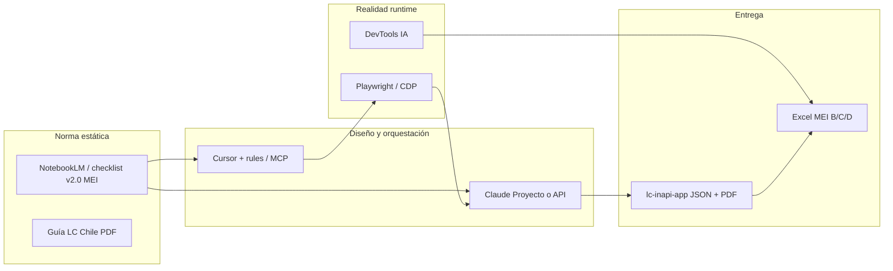

# Stack de orquestación — Auditoría editorial INAPI

| Metadatos | Detalle |
| --- | --- |
| **Fecha** | 2026-06-28 (actualizado 2026-06-27 — prompt home) |
| **Autores** | Fernando Arriagada Castillo (con Bernarda — entrega MEI) |
| **Objetivo** | Unificar captura DOM, checklist LC, localización para TI y entregables duales (Excel MEI + JSON MVP) |
| **Referencias** | [`flujo-piloto-10-urls-claude-mvp.md`](flujo-piloto-10-urls-claude-mvp.md) · [`plantilla-excel-mei-bcd.md`](plantilla-excel-mei-bcd.md) · [`ROADMAP.md`](ROADMAP.md) (Fase 1.5 MEI) · [`ARCHITECTURE.md`](ARCHITECTURE.md) · [ADR 0009](adr/0009-claude-code-pro-como-orquestador.md) · [Guía LC Chile (PDF)](https://www.lenguajeclarochile.cl/wp-content/uploads/2019/10/recomendaciones-lenguaje-claro-para-la-web-.pdf) |

> **Nota de alineación (jul 2026):** este documento describe el **flujo operativo manual** acordado para la entrega MEI (jun 2026): DevTools IA sobre DOM + Excel B/C/D. La **automatización objetivo** del repositorio está en el AI Stack v2 ([`ARCHITECTURE.md`](ARCHITECTURE.md), [`PROPUESTA_TECNICA_INTEGRAL.md`](PROPUESTA_TECNICA_INTEGRAL.md)): **Claude Code Pro** como orquestador ([ADR 0009](adr/0009-claude-code-pro-como-orquestador.md)), **Playwright MCP** para captura y **Chroma RAG** local ([ADR 0010](adr/0010-rag-local-chroma-xenova-transformers.md)) — ver Fases 0–3 en [`ROADMAP.md`](ROADMAP.md).

---

## 1. Problema que resuelve este stack

### 1.1 Tres capas distintas de «HTML»

| Capa | Qué es | Uso en auditoría |
| --- | --- | --- |
| **Ctrl+U** | HTML inicial del servidor (plantilla, placeholders) | Referencia aproximada (`html_linea_aprox`); **no** es el identificador primario para TI |
| **DOM renderizado** | Texto y nodos tras JS, partials y menús dinámicos | **Fuente de verdad editorial** (lo que ve el ciudadano) |
| **Código fuente TI** | `.cshtml`, bundles, recursos i18n, JS inyectado en BE | Donde TI implementa el cambio (`Buscar en todo el proyecto`) |

En URLs de **Trámites**, el JS puede inyectarse desde el backend: la línea 1000 en Ctrl+U **no coincide** con la línea en el IDE de TI. Por eso el piloto migra de `HTML-Lnnn` como ancla principal a **fragmento único buscable**.

### 1.2 Hallazgos complementarios entre herramientas

| Herramienta | Fortaleza | Debilidad conocida |
| --- | --- | --- |
| **Claude Proyecto** | 39 criterios, % LC, JSON canónico, informe/PDF MVP | Ctrl+U; puede omitir duplicados desktop/mobile |
| **DevTools IA** | DOM real, ortografía visible, menús duplicados, entidades `&#8230;` | Sesión efímera; sin persistencia en repo sin export manual |
| **Cursor** | Orquestación, reglas persistentes, validación schema, futuro Playwright/MCP | No sustituye «ojos» en runtime sin browser MCP |

**Conclusión operativa:** roles separados — **Auditor normativo** (Claude/Cursor), **Auditor de campo** (DevTools), **Revisor humano** (Fernando + Bernarda).

---

## 2. Arquitectura Agente–Analista–Validador



| Rol | Herramienta | Responsabilidad |
| --- | --- | --- |
| **Cerebro normativo (RAG)** | NotebookLM, `data/checklist-criteria.json` | Checklist v2.0 (MEI/DevTools); JSON piloto puede estar en v1.1 hasta migración |
| **Arquitecto** | Cursor + Claude | Prompt §3.2, JSON MVP, validación Zod |
| **Validador de campo** | DevTools IA (+ browser MCP en Cursor) | DOM, duplicados, integridad JS/layout |
| **Orquestador (objetivo repo)** | Claude Code Pro + Playwright MCP + RAG MCP | URL → captura → auditoría → JSON canónico (Fases 0–3 del ROADMAP) |

---

## 3. Flujo operativo en 6 pasos

Usar **por cada URL** (prioridad **Trámites** para entrega MEI 30-jun-2026).

### Paso 1 — Captura del estado real (DOM)

1. Abrir URL en Chrome; esperar carga completa.
2. DevTools → **Elements** (no Sources ni Ctrl+U).
3. Clasificar hallazgos:

| Etiqueta | Descripción |
| --- | --- |
| `VISIBLE` | Texto/enlace/botón que ve el ciudadano |
| `METADATA` | `<title>`, meta |
| `SISTEMA` | Overlays Ajax, nodos ocultos recurrentes |
| `DUPLICADO` | Misma cadena en menú desktop y mobile → **dos filas** en Excel |

Para Excel MEI: exportar principalmente `VISIBLE` + `METADATA`.

### Paso 2 — Checklist con prioridad MEI

Orden de ejecución (entrega 30-jun):

1. **D1** — Ortografía y gramática
2. **C1–C7** — Redacción y claridad
3. **B1–B7** — Lenguaje claro (voz activa, tuteo, tono)
4. **D7** — Mayúsculas sostenidas
5. **A, E, F, G, H** — Segunda pasada / JSON completo MVP

**DevTools:** usar [Prompt maestro v2](#4-prompt-maestro-v2-devtools-ia) (no pegar checklist completo).

**Claude/Cursor:** usar [`flujo-piloto-10-urls-claude-mvp.md`](flujo-piloto-10-urls-claude-mvp.md) §3.1 + §3.2.

### Paso 3 — Localización técnica por fragmento único

Campo principal para TI: **`fragmento_busqueda`** (etiqueta + atributos estables + texto).

| Campo | Obligatorio Excel | Obligatorio JSON MVP (hoy) | JSON MVP (evolución) |
| --- | --- | --- | --- |
| `ubicacion_contextual` | Sí | — | Opcional |
| `fragmento_busqueda` | Sí | — | Opcional |
| `texto_original` / `original` | Sí | Sí | Sí |
| `texto_propuesto` / `propuesto` | Sí | Sí | Sí |
| `criterio_id` | Sí | Sí | Sí |
| `motivo` | Sí | Sí | Sí |
| `capa` | Sí | — | Opcional |
| `html_linea_aprox` | Opcional | Recomendado | Opcional |
| `requiere_validacion_tic` | Si aplica | — | Opcional |

**Reglas del fragmento:**

- Incluir apertura de etiqueta + `class` / `id` / `href` / `onclick` si son estables.
- Entidades HTML en `original` (`&#211;`); nota en columna Notas TI si el recurso es i18n/BE.
- Si el string no aparece en Ctrl+U: `origen_probable: backend-i18n | vista-razor | bundle-js`.

### Paso 4 — Traducción a lenguaje claro

Checklist rápido por propuesta:

- ¿Entiende un ciudadano sin formación jurídica la acción?
- ¿Voz activa? (ej. «Presentar demanda de oposición» → «Oponerse al registro de una marca»)
- ¿Evita burocracia? («Escritos guardados» → «Borradores de documentos»)
- ¿Tuteo consistente? («Mi INAPI», «Tus solicitudes»)
- ¿Sin MAYÚSCULAS sostenidas salvo siglas?
- ¿Botones descriptivos? (`Ok` → `Aceptar selección`)

Marcar `requiere_validacion_tic = sí` si el término legal debe mantenerse por norma interna.

### Paso 5 — Entregables duales

| Entregable | Formato | Audiencia | Plantilla |
| --- | --- | --- | --- |
| **A — Humano** | Excel / CSV | Bernarda, MEI, TI | [`plantilla-excel-mei-bcd.md`](plantilla-excel-mei-bcd.md) |
| **B — Sistema** | JSON canónico | MVP, PDF, CI | `data/claude-audits/*.json` — §3.2 del flujo piloto |

Filtro MEI: solo criterios **B\*, C\*, D\*** en Excel.

### Paso 6 — Validación de integridad

Antes de enviar a TI:

| Verificación | Cómo |
| --- | --- |
| IDs/classes no cambian | Solo texto interior del nodo |
| Duplicados desktop/mobile | Dos filas o nota `duplicado_de` |
| Entidades HTML | `&#8230;` puede ser obligatorio en plantilla |
| Longitud UI | Probar botones en mobile |
| Texto desde JS/BE | Indicar búsqueda en recursos, no solo HTML estático |
| Accesibilidad | `aria-label` si el visible es solo icono |

**Pregunta de cierre a DevTools:**

```text
Para cada cambio propuesto, confirma:
1) ¿El fragmento/selector sigue siendo válido en el DOM?
2) ¿Cambiar solo el texto rompe algún evento JS o layout mobile?
3) ¿Hay segunda ocurrencia del mismo string en otro menú?
```

---

## 4. Prompt maestro v2 (DevTools IA)

Copiar **íntegro** en el chat de DevTools IA (Chrome → Inspeccionar → asistente IA).

**Ejemplo canónico en repo:** home INAPI — `https://www.inapi.cl/`, `tipo_pagina: sitioweb`, `fecha_auditoria: 27-06-2026`, checklist **v2.0**. Para otras URLs, cambiar solo esos tres campos en `<contexto>`. Copia idéntica en [`flujo-piloto-10-urls-claude-mvp.md`](flujo-piloto-10-urls-claude-mvp.md) §3.6.1.

**Nota de versión:** el flujo DevTools MEI referencia checklist **v2.0**; los JSON piloto Claude en `data/claude-audits/` pueden seguir con `version_checklist: "1.1"` hasta alinear datos en repo (`data/checklist-criteria.json`).

```text
<rol>
Eres el auditor de campo INAPI para entrega MEI (30-jun-2026).
Analizas el DOM RENDERIZADO (Elements), no el código fuente estático Ctrl+U.
</rol>

<contexto>
Institución: INAPI (Instituto Nacional de Propiedad Industrial), Chile.
Checklist: Lenguaje Claro v2.0 (39 criterios A1–H1) — en esta sesión PRIORIZA entrega MEI.
URL: https://www.inapi.cl/
tipo_pagina: sitioweb
fecha_auditoria: 27-06-2026
auditor: Fernando Arriagada Castillo
Guía de referencia: https://www.lenguajeclarochile.cl/wp-content/uploads/2019/10/recomendaciones-lenguaje-claro-para-la-web-.pdf
</contexto>

<prioridad_mei>
Orden de análisis (implementación inmediata primero):
1) D1 — ortografía y gramática
2) C1–C7 — redacción, claridad, estructura textual
3) B1–B7 — lenguaje claro (voz activa, tuteo, tono positivo)
4) D7 — mayúsculas sostenidas
No omitas hallazgos B/C/D visibles aunque no evalúes aún A/E/F/G/H en detalle.
</prioridad_mei>

<capas>
Clasifica cada hallazgo:
- VISIBLE: texto/enlace/botón que ve el ciudadano
- METADATA: <title>, meta
- SISTEMA: overlays Ajax, nodos técnicos no orientados al ciudadano
- DUPLICADO: misma cadena en menú desktop y mobile → DOS filas separadas
Para Excel MEI exporta principalmente VISIBLE + METADATA.
</capas>

<localizacion_tecnica>
PROHIBIDO usar número de línea HTML como identificador principal.
Por cada hallazgo incluye fragmento_busqueda: snippet HTML único con etiqueta de apertura, atributos estables (id, class, href, onclick si aplica) y texto original.
html_linea_aprox (Ctrl+U) es OPCIONAL y secundario.
Si el texto no aparece en Ctrl+U, indica origen_probable: backend-i18n | vista-razor | bundle-js.
</localizacion_tecnica>

<reglas_lc>
- Voz activa; evitar jerga jurídica/burocrática (ej. «Escritos» → «Borradores»).
- Tuteo y tono cercano (ej. «MI INAPI» → «Mi INAPI»).
- Botones descriptivos (ej. «Ok» → «Aceptar selección»).
- Un solo criterio_id por fila (B*, C*, D*).
- Si el término legal debe mantenerse, marca requiere_validacion_tic = si.
- Entidades HTML en original (&#8230;, &#243;); propuesto en texto legible + nota si aplica.
</reglas_lc>

<tarea>
PASO 1 — Recorre el DOM visible: título, menús (desktop Y mobile por separado), breadcrumbs, botones, modales, overlays de carga.
PASO 2 — Lista hallazgos B/C/D en tabla con columnas EXACTAS:
| num | ubicacion_contextual | capa | texto_original | texto_propuesto | criterio_id | motivo | fragmento_busqueda | html_linea_aprox | duplicado_de | origen_probable | requiere_validacion_tic |
PASO 3 — Traduce términos técnicos/jurídicos según B2, B5, B6.
PASO 4 — Al final, resumen: total hallazgos, desglose por criterio, URLs de menú revisadas.
PASO 5 — Pregunta de cierre: para cada cambio, ¿rompe JS, layout mobile o hay segunda ocurrencia?
</tarea>

<salida>
Entregable A: tabla lista para copiar a Excel (TSV si es posible).
Entregable B (opcional): bloque JSON reducido con url, fecha, auditor y array hallazgos[]
(sin repetir checklist completo).
NO entregues JSON canónico MVP de 39 criterios aquí — eso es Claude §3.2.
</salida>
```

**Resumen de instrucciones embebidas:**

- Prioridad MEI: D1, C, B, D7
- DOM renderizado, no Ctrl+U
- Fragmento único buscable (no línea como ID principal)
- Tabla dual: humana + bloque JSON reducido opcional
- Una fila por ocurrencia (desktop/mobile separados)

---

## 5. Conectividad y herramientas (roadmap técnico)

### 5.1 Corto plazo (antes 30-jun-2026)

| Acción | Herramienta |
| --- | --- |
| Excel MEI B/C/D | Plantilla § [`plantilla-excel-mei-bcd.md`](plantilla-excel-mei-bcd.md) |
| Re-auditar Trámites con DOM | DevTools + Prompt v2 |
| Evidencia de proceso | MVP 9 URLs + PDF existentes |
| 1-pager flujo publicación | Este doc §3 + hitos MEI |

### 5.2 Mediano plazo (jul–ago 2026)

| Herramienta | Uso |
| --- | --- |
| **MCP** | Servidor local: checklist + `data/claude-audits/` sin re-pegar contexto |
| **Playwright** | `scripts/audit-capture.mjs` → DOM + fragmentos |
| **CDP / browser MCP** | Validación runtime desde Cursor |
| **Cursor SDK** | CI: `validate:claude-audits`, agentes batch |
| **API Anthropic** | Mismo contrato §3.2 sin Proyecto manual |

### 5.3 Largo plazo (evaluar según necesidad)

| Herramienta | Cuándo tiene sentido |
| --- | --- |
| **n8n** | Orquestación visual si el equipo no vive en Cursor |
| **LangChain / CrewAI** | Pipelines multi-agente fuera del IDE |
| **Vortex AI (enterprise)** | Políticas corporativas INAPI |

### 5.4 Optimización de contexto (tokenización)

- **Etiquetas XML** en prompts: `<checklist>`, `<contexto_tecnico>`, `<url>`, `<prioridad_mei>`.
- **Selective context:** fragmento o UID de elemento, no HTML completo en cada turno.
- **`.cursor/rules`:** estándar LC INAPI persistente en Cursor.
- **Sesiones limpias DevTools:** una URL → prompt maestro → export → cerrar pestaña.
- **NotebookLM:** checklist y guía LC como RAG; exportar resumen B/C/D a `.md` en repo si hace falta.

---

## 6. Hitos MEI (informe meta, 30-jun-2026)

| Actividad / hito | Evidencia en este stack |
| --- | --- |
| Checklist editorial obligatorio en flujo de publicación | Checklist v2.0 (39 criterios) + flujo §3 + Prompt v2 + revisión humana |
| Contenidos en LC sin errores ortográficos/gramaticales | Excel B/C/D con correcciones priorizadas + muestra implementada en Trámites |

**Alcance:** URLs **Trámites** y **sitioweb**; entrega MEI enfatiza **B, C, D** (Excel con Bernarda). Informe completo 39 criterios permanece en MVP/PDF.

---

## 7. Relación con el repo actual

| Componente | Estado |
| --- | --- |
| 9 JSON piloto + PDF | Operativo — [`claude-audits-launch.ts`](../frontend/src/lib/claude-audits-launch.ts) |
| Schema `sustituciones[]` | `linea`, `html_linea_aprox`, `original`, `propuesto`, `criterio_id`, `motivo` — [`claude-audit-pilot.ts`](../src/schemas/claude-audit-pilot.ts) |
| Evolución schema | Campos opcionales `fragmento_busqueda`, `ubicacion_contextual`, `capa` (post-MEI) |
| Serie Clarity 17 URLs | Parcial — ver devlog 2026-06-11 |

---

## 8. Plan sugerido hasta 30-jun-2026

| Día | Acción |
| --- | --- |
| Inmediato | Cerrar plantilla Excel con Bernarda; listar URLs Trámites prioritarias |
| Semana previa | 2–3 URLs Trámites con Pasos 1–6 (DevTools Prompt v2) |
| 29-jun | Consolidar Excel; marcar `requiere_validacion_tic` |
| 30-jun | Entregar Excel MEI + 1-pager proceso + enlace MVP/PDF piloto |

---

## 9. Referencias cruzadas

- Flujo Claude §3.1–§3.2 y **§3.6 DevTools:** [`flujo-piloto-10-urls-claude-mvp.md`](flujo-piloto-10-urls-claude-mvp.md)
- Plantilla Excel: [`plantilla-excel-mei-bcd.md`](plantilla-excel-mei-bcd.md)
- Roadmap Fase 1.5: [`ROADMAP.md`](ROADMAP.md)
- Bitácora: [`development/DEVLOG.md`](development/DEVLOG.md#devlog-2026-06-28-stack-orquestacion-mei)
