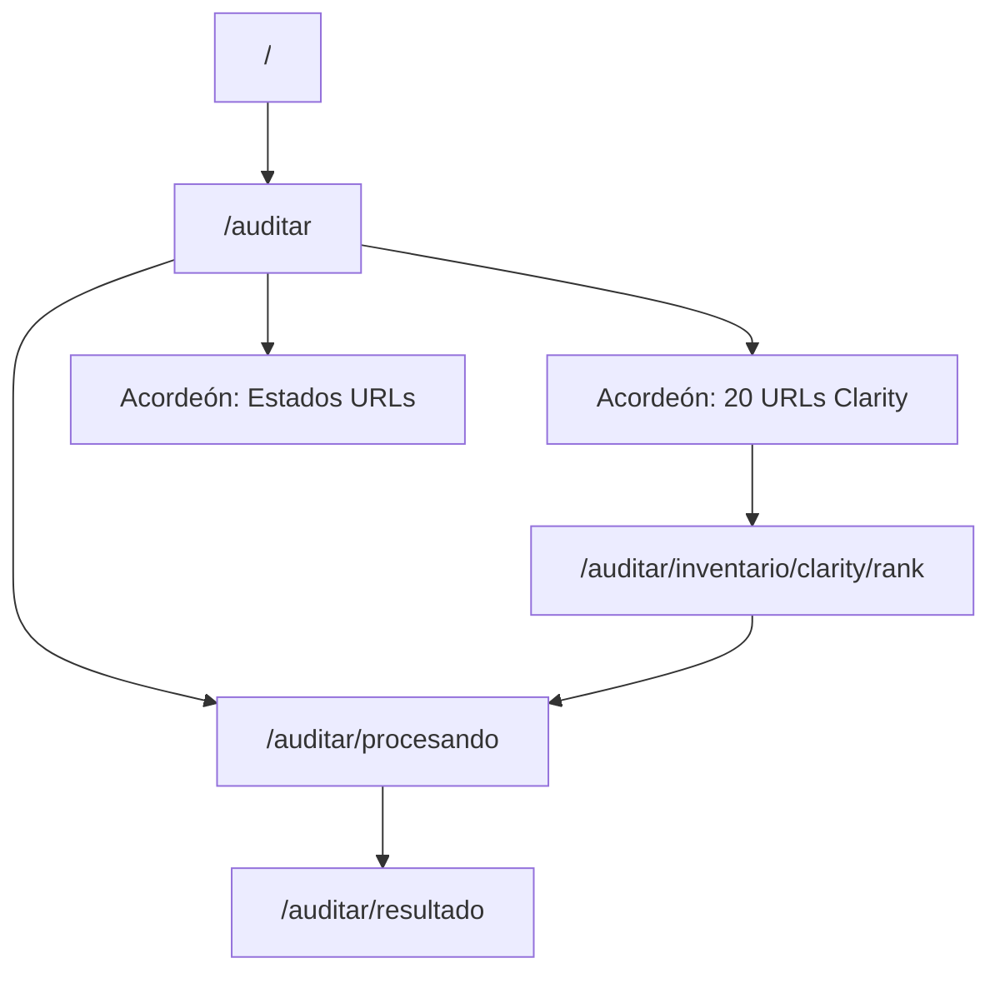

# Inventario de URLs — tráfico Clarity y priorización LC

**Propósito:** fuente de verdad **documental** para el equipo UX/editorial: qué páginas concentran visitas o interacción según **Microsoft Clarity**, cómo se relacionan con el **seguimiento de lenguaje claro** en el aplicativo mock (Fase 1) y cómo se presentan en **`/auditar`** y en las **fichas por URL**.

**Alcance:** Clarity informa **comportamiento y volumen** en el sitio; **no** sustituye una evaluación LC automática. Las columnas de **% cumplimiento LC** y **estado** reflejan **criterio editorial de referencia** al momento de registrar esta tabla, salvo donde exista fixture validado en repo.

**Fuente máquina (mock Fase 1):** [`data/ux/clarity-fichas-mock.json`](../../data/ux/clarity-fichas-mock.json) — **20 fichas** con URL absoluta, métricas, encargado, auditorías, última revisión e historial breve. La tabla resumida en UI **deriva** de ese JSON (vía `frontend/src/lib/clarity-fichas-mock.ts`); no mantener tres listas mock independientes con URLs o conteos distintos.

---

## 1. Tres URLs priorizadas (atajos editoriales — mock Fase 1)

Estas tres direcciones son las **prioridades demostrativas** acordadas: representan **peor**, **intermedia** y **mejor** desempeño respecto al checklist LC en la referencia actual del equipo. En implementación mock, los atajos en **`/auditar`** navegan vía **`/auditar/procesando?url=…`** al **resultado** con datos coherentes con ese perfil (fixtures o generador mock alineado).

| Perfil | Nombre (producto) | URL canónica |
| --- | --- | --- |
| **Peor** (rechazado; menor %) | Notificaciones Marcas | `https://tramites.inapi.cl/Notificaciones` |
| **Intermedia** (aceptado con observaciones en referencia numérica) | Presentación de Escritos — INAPI — Sitio de Trámites | `https://tramites.inapi.cl/Trademark/TrademarkUserDocument/SuccessConfirmation` |
| **Mejor** (aprobado en referencia) | Homepage institucional | `https://www.inapi.cl/` |

**Nota:** la **home institucional** (`www.inapi.cl`) es atajo editorial §1 y coincide con el **rank 1** del inventario Clarity §2 (`Home INAPI`, mayor volumen de visitas). Las demás URLs del inventario usan prefijo `tramites.inapi.cl`.

**Informe completo → fixture (ejemplo):** el caso **Notificaciones Marcas** (55,2 %; rechazado) está volcado como referencia humana en [`audit-fixture-ejemplo-notificaciones-marcas-rechazado.md`](audit-fixture-ejemplo-notificaciones-marcas-rechazado.md). Las franjas **81–90 %** y **≥91 %** se cubren con JSON generado y validado (ver [`data/audit-fixtures/README.md`](../../data/audit-fixtures/README.md)).

---

## 2. Inventario ampliado — 20 URLs Clarity (tabla unificada en `/auditar`)

### 2.1 Presentación en la pantalla `/auditar`

**Un solo acordeón** con la tabla de **20 URLs** priorizadas por Clarity. Ya **no** existe un acordeón aparte «URLs más auditadas»: las columnas **Auditorías (ref.)** y **Última revisión (ref.)** viven en esta misma tabla.

**Título sugerido del acordeón:** «Prioridades evidenciadas en **Microsoft Clarity** (volumen e interacción); estados LC según referencia editorial.»

Patrón visual: barra colapsable según [`docs/DESIGN_SYSTEM.md`](../DESIGN_SYSTEM.md) §15; iconografía y color de fila según §13.1.

**Columnas (orden objetivo):**

| Columna | Descripción |
| --- | --- |
| `#` | Rank 1–20; enlace a ficha `/auditar/inventario/clarity/[rank]` |
| Ruta o etiqueta (Clarity) | Etiqueta documental; enlace a la misma ficha |
| **Encargado** | Responsable mock de seguimiento (Fase 1: **Fernando Arriagada** en las 20 filas) |
| Visitas (ref.) | Volumen Clarity de referencia |
| **Auditorías (ref.)** | Conteo mock de revisiones LC internas |
| **Última revisión (ref.)** | Fecha ISO `YYYY-MM-DD` de la auditoría más reciente |
| % LC (ref.) | Porcentaje editorial de referencia |
| Estado (ref.) | Estado de **aceptación LC** derivado del % (ver §2.3) |

**Regla de coherencia datos ↔ ficha:** `auditoriasRef` en JSON = número de filas en `historialAuditorias` cuando el conteo es numérico; `ultimaRevisionRef` = fecha ISO de la entrada más reciente del historial.

**Conteo mock por importancia (volumen Clarity):** el número de auditorías refleja la prioridad relativa de la URL — a mayor tráfico, más revisiones LC ficticias en el historial:

| Ranks | Auditorías (ref.) | Ejemplo |
| --- | --- | --- |
| 1 | 5 | Home INAPI (432.572 visitas) |
| 2 | 4 | Account/Login |
| 3 | 3 | Trademark/TrademarkFile |
| 4 | 2 | Notificaciones Marcas |
| 5–20 | 1 | Resto del inventario |

Orden por volumen relativo en el extracto entregado al repositorio (sin pretender ser un dump crudo de Clarity).

| # | Ruta o etiqueta (Clarity) | Visitas (ref.) | Auditorías (ref.) | % LC (ref.) | Estado (ref.) |
| --- | --- | --- | --- | --- | --- |
| 1 | `Home INAPI` | 432.572 | 5 | 60,0 % | Rechazado |
| 2 | `Account/Login` | 209.811 | 4 | 65,2 % | Rechazado |
| 3 | `Trademark/TrademarkFile` (Expediente) | 198.337 | 3 | 61,5 % | Rechazado |
| 4 | Notificaciones Marcas | 79.775 | 2 | 55,2 % | Rechazado |
| 5 | `TrademarkSavedApplications` | 65.628 | 1 | 64,3 % | Rechazado |
| 6 | `TrademarkApplication/IndexTrademark` | 41.429 | 1 | 57,1 % | Rechazado |
| 7 | `Login/claveunica` (Registro CU) | 38.519 | 1 | 62,1 % | Rechazado |
| 8 | `LoadTrademarkApplication` (paso 1) | 37.468 | 1 | 61,3 % | Rechazado |
| 9 | `EstadosDiariosMarcas` | 31.929 | 1 | 70,4 % | Rechazado |
| 10 | `TrademarkNizaClassifier` | 30.947 | 1 | 67,7 % | Rechazado |
| 11 | `TrademarkUserDocument/SuccessConfirmation` | 23.779 | 1 | 72,0 % | Rechazado |
| 12 | `TrademarkUserDocument` (Escritos) | 23.141 | 1 | 63,0 % | Rechazado |
| 13 | Confirmación Solicitud Marca | 21.825 | 1 | 57,7 % | Rechazado |
| 14 | `LoadTrademarkApplication` (revisión) | 18.654 | 1 | 59,4 % | Rechazado |
| 15 | `Account/Register` | 17.603 | 1 | 55,9 % | Rechazado |
| 16 | `TrademarkSecondPayment/SuccessConfirmation` | 14.609 | 1 | 68,0 % | Rechazado |
| 17 | `TrademarkAnnotation` | 13.600 | 1 | 59,3 % | Rechazado |
| 18 | `EstadosDiariosPatentes` | 12.628 | 1 | 70,4 % | Rechazado |
| 19 | `TrademarkRenewalApplication` | 12.528 | 1 | 70,8 % | Rechazado |
| 20 | `NotificacionesPatentes` | 12.271 | 1 | 56,7 % | Rechazado |

**Encargado (mock):** en implementación, columna fija **Fernando Arriagada** para las 20 filas (`encargadoRef` en JSON).

**URLs absolutas:** prefijo `https://tramites.inapi.cl/` salvo **rank 1** (`https://www.inapi.cl/`); detalle por fila en [`data/ux/clarity-fichas-mock.json`](../../data/ux/clarity-fichas-mock.json).

### 2.2 Ficha de detalle por URL

Ruta: **`/auditar/inventario/clarity/[rank]`** (`rank` entero 1–20).

| Bloque | Contenido |
| --- | --- |
| Cabecera | Nombre legible, rank, CTA «Regresar al inventario» |
| Resumen | URL (mock), ruta Clarity, visitas, % LC, estado, **Encargado**, auditorías (ref.), última revisión (ref.) |
| Contexto editorial | Descripción y observaciones |
| Historial (mock) | Tabla: fecha, % LC, estado, nota — **N filas = N auditorías** |
| Acciones | «Auditar esta URL (mock)» → `/auditar/procesando?url=…` |

La ficha **no** es un `StrictAuditRecord`; el informe con 39 criterios sigue en **`/auditar/resultado`**.

### 2.3 Iconografía y color de fila (estado LC de aceptación)

Umbrales alineados al checklist y a `/auditar/resultado` (`acceptanceStatusFromPercentage` en [`src/schemas/checklist.ts`](../../src/schemas/checklist.ts)):

| Franja | Estado | Símbolo | Color de acento |
| --- | --- | --- | --- |
| ≤ 80 % | Rechazado | `!` | Rojo |
| 81–90 % | Aceptado con observaciones | `✓` | Azul |
| ≥ 91 % | Aprobado | `✓✓` | Verde |
| Sin % numérico | No aplica | `—` | Gris |

**Color de fondo / borde izquierdo de fila** en tabla Clarity: verde (aprobado), naranja (aceptado con observaciones), rojo (rechazado), gris (no aplica).

Esta misma presentación aplica a la sección **Estados URLs** (§4) y a las celdas de estado en el historial de la ficha.

---

## 3. Política de datos (`docs/ux/` vs `data/`)

| Ubicación | Rol |
| --- | --- |
| **`docs/ux/`** (este archivo) | Inventario **humano**, reglas de presentación, columnas y coherencia editorial |
| **`data/ux/clarity-fichas-mock.json`** | **Fuente máquina** de las 20 fichas y de la tabla Clarity en UI |
| **`data/audit-fixtures/`** | Informes LC completos (`strictAuditRecordSchema`) para resultado mock |

**Deprecado en UI (mock Fase 1):** acordeón y archivo espejo **«URLs más auditadas»** (`most-audited-url-rows.ts` / `most-audited-urls.json`) — sustituido por columnas en §2.1.

---

## 4. Estados URLs (antes «URLs con estados LC resueltos»)

Segundo acordeón en **`/auditar`**, título: **Estados URLs**.

Casos de ejemplo con **cierre de ciclo LC** en la narrativa mock (no persistencia real). **Columnas:** Página (ref.), Estado LC final (ref.), Fecha cierre (ref.), Observación.

**Iconografía:** misma que §2.3 (`!` / `✓` / `✓✓` / `—`). Datos de referencia en [`frontend/src/lib/resolved-lc-state-rows.ts`](../../frontend/src/lib/resolved-lc-state-rows.ts) (etiquetas normalizadas a los cuatro estados anteriores).

---

## 5. Estructura de pantallas mock (resumen)

| Pantalla | Tablas / bloques relevantes |
| --- | --- |
| `/auditar/resultado` | 39 criterios: Sección, Criterio, Estado, Severidad, Comentario |
| `/auditar` | Clarity 20 filas (§2.1) + Estados URLs (§4) |
| `/auditar/inventario/clarity/[rank]` | Resumen + historial mock (§2.2) |

---

*Última revisión documental: 2026-05-28 — alineado a feedback UX, [`docs/development/DEVLOG.md`](../development/DEVLOG.md) (entrada 2026-05-28), [`docs/DESIGN_SYSTEM.md`](../DESIGN_SYSTEM.md) §13.1 y §15, [`data/ux/clarity-fichas-mock.json`](../../data/ux/clarity-fichas-mock.json).*
