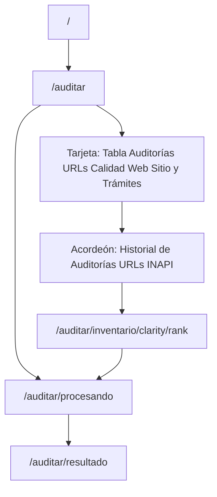

# Inventario de URLs — Calidad Web (Sitio Web y Trámites) y priorización LC

**Propósito:** fuente de verdad **documental** para el equipo UX/editorial: qué páginas concentran visitas según el marco **Calidad Web INAPI** (extracto **Microsoft Clarity**), cómo se relacionan con el **seguimiento de lenguaje claro** en el aplicativo mock (Fase 1) y cómo se presentan en **`/auditar`** y en las **fichas por URL**.

**Fase 1.5 (piloto junio 2026):** el entregable operativo a TIC son **10 URLs** auditadas con Claude (ver [`../flujo-piloto-10-urls-claude-mvp.md`](../flujo-piloto-10-urls-claude-mvp.md) y [`../ROADMAP.md`](../ROADMAP.md)); este inventario de **22** filas sigue siendo la **referencia Calidad Web** completa, no la cola única del piloto.

**Alcance analítico:** el inventario mock agrupa **22 URLs** en **una sola tabla** (§2.1): la mayoría son **Calidad Web — Trámites** (`tramites.inapi.cl`, aplicación de trámites) y **tres** son **Calidad Web — Sitio Web** (`www.inapi.cl`: home institucional y página informativa de trámites digitales). Cada fila lleva **`type_url`**: `tramites` | `sitioweb` (ver §2.0). **No** se mantiene un segundo acordeón por tipo; la distinción se resuelve con **filtro** en la misma tabla.

**Paradoja Clarity (mayo 2026):** el proyecto Microsoft Clarity está asociado al **Sitio Web** INAPI, pero el extracto de páginas populares (365 días) muestra **mayormente URLs de `tramites.inapi.cl`**. La página con **más visitas** en ese extracto es **`www.inapi.cl/tramites/tramites-digitales`** (~16.059 visitas) — contenido **informativo** con acordeones RNT, **no** el portal de login. La **home** `https://www.inapi.cl/` **no aparece** en el top Clarity revisado, aunque es la portada institucional; se incluye igual en inventario por criterio editorial. Detalle en §2.0.

**Alcance LC:** Clarity/Calidad Web informa **comportamiento y volumen**; **no** sustituye una evaluación LC automática. Las columnas de **% cumplimiento LC** y **estado** reflejan **criterio editorial de referencia**, salvo donde exista fixture validado en repo.

**Fuente máquina (mock Fase 1):** [`data/ux/clarity-fichas-mock.json`](../../data/ux/clarity-fichas-mock.json) — **22 fichas** con URL absoluta, **`type_url`**, métricas, encargado, auditorías, última revisión e historial breve. La tabla en UI **deriva** de ese JSON (vía `frontend/src/lib/clarity-fichas-mock.ts`). Los identificadores internos (`clarity-*`, ruta `/inventario/clarity/[rank]`) son **legado de implementación**; semánticamente la lista es el historial unificado Calidad Web Sitio + Trámites.

---

## 1. Tres URLs priorizadas (atajos editoriales — mock Fase 1)

Estas tres direcciones son las **prioridades demostrativas** acordadas: representan **peor**, **intermedia** y **mejor** desempeño respecto al checklist LC en la referencia actual del equipo. En implementación mock, los atajos en **`/auditar`** navegan vía **`/auditar/procesando?url=…`** al **resultado** con datos coherentes con ese perfil (fixtures o generador mock alineado).

| Perfil | Nombre (producto) | URL canónica |
| --- | --- | --- |
| **Peor** (rechazado; menor %) | Notificaciones Marcas | `https://tramites.inapi.cl/Notificaciones` |
| **Intermedia** (aceptado con observaciones en referencia numérica) | Presentación de Escritos — INAPI — Sitio de Trámites | `https://tramites.inapi.cl/Trademark/TrademarkUserDocument/SuccessConfirmation` |
| **Mejor** (aprobado en referencia) | Homepage institucional | `https://www.inapi.cl/` |

**Nota:** la **home institucional** (`https://www.inapi.cl/`) es atajo editorial §1 (perfil **mejor** LC) y **fila de inventario** con `type_url: sitioweb` (rank **21** objetivo, §2.1) — **no** coincide con el **rank 1** del inventario, que es la **landing del portal de trámites** `https://tramites.inapi.cl/` (`type_url: tramites`). Las filas `tramites` usan dominio `tramites.inapi.cl`; las `sitioweb`, `www.inapi.cl`.

**Informe completo → fixture (ejemplo):** el caso **Notificaciones Marcas** (55,2 %; rechazado) está volcado como referencia humana en [`audit-fixture-ejemplo-notificaciones-marcas-rechazado.md`](audit-fixture-ejemplo-notificaciones-marcas-rechazado.md). Las franjas **81–90 %** y **≥91 %** se cubren con JSON generado y validado (ver [`data/audit-fixtures/README.md`](../../data/audit-fixtures/README.md)).

---

## 2. Tabla de auditorías URL — Calidad Web (tabla única en `/auditar`)

### 2.0 Dos tipos de URL: Trámites vs Sitio Web (`type_url`)

INAPI expone **dos experiencias web** que comparten la palabra «trámites» en títulos o menús, pero **no** son la misma URL ni el mismo producto analítico:

| `type_url` | Dominio típico | Qué es | Ejemplo |
| --- | --- | --- | --- |
| **`tramites`** | `tramites.inapi.cl` | **Aplicación** de trámites y servicios: login (Clave INAPI / ClaveÚnica), formularios, expedientes, notificaciones. Título Clarity suele ser «- INAPI - Sitio de Trámites». | Rank **1:** `https://tramites.inapi.cl/` — landing previa al modal de login; al pulsar ClaveÚnica se abre **`/Account/Login`** (rank **2**). Ambas pantallas comparten cabecera «Trámites y Servicios • INAPI». |
| **`sitioweb`** | `www.inapi.cl` | **Sitio institucional** informativo: home, contenidos editoriales, listados RNT con acordeones «Trámites digitales» (FAQ / acceso a trámites, **sin** ser el portal de aplicación). | Rank **22** (objetivo): `https://www.inapi.cl/tramites/tramites-digitales` — «Trámites • Trámites digitales», acordeones por trámite. Rank **21** (objetivo): `https://www.inapi.cl/` — home «Te queremos ayudar…». |

**Campo mock `type_url` (JSON):** obligatorio en cada ficha; valores permitidos: **`tramites`** | **`sitioweb`**. Permite filtrar en UI sin duplicar secciones.

**Extracto Clarity «Sitio Web» (referencia mayo 2026):** aunque el proyecto Clarity es del sitio web, el ranking de visitas mezcla dominios:

| Posición Clarity (extracto) | Título en Clarity | URL | `type_url` | Notas |
| --- | --- | --- | --- | --- |
| 1 | Trámites Digitales | `https://www.inapi.cl/tramites/tramites-digitales` | `sitioweb` | **Mayor volumen** (~16.059 visitas). Misma pantalla que Clarity ranks 2, 5, 11, 12 con variantes de URL (`http`, sin `www`, `inapi.gob.cl`, etc.) — **una sola fila canónica** en inventario (rank 22). |
| 2–5, 11–12 | Trámites Digitales (variantes) | `inapi.cl/…`, `http://…`, `inapi.gob.cl/…` | — | **No** duplicar en inventario; alias del rank 22. |
| 3 | - INAPI - Sitio de Trámites | `https://tramites.inapi.cl/` | `tramites` | Landing portal (~113 visitas en extracto); **rank 1** inventario. |
| 4+ | Varios «… Sitio de Trámites» | `https://tramites.inapi.cl/…` | `tramites` | Ranks 2–20 inventario (Account/Login, TrademarkFile, Notificaciones, etc.). |
| — | *(ausente en top)* | `https://www.inapi.cl/` | `sitioweb` | Home institucional **no listada** en el top Clarity revisado; se agrega por criterio editorial (rank 21). |

### 2.1 Presentación en la pantalla `/auditar`

**Un solo acordeón** con la tabla de **22 URLs** (20 actuales + **2 filas Sitio Web** documentadas). Es el **registro canónico** mock: visitas, auditorías, última revisión, % LC, estado y **`type_url`**. Ya **no** existen acordeones aparte por tipo; observaciones de seguimiento en **ficha por URL** (§2.2).

**Títulos en UI (2026-05-28):**

| Elemento | Texto |
| --- | --- |
| **Tarjeta** (`CardTitle`, encima del acordeón) | **Tabla de Auditorías URLs - Calidad Web: Sitio Web y Trámites - INAPI** |
| **Acordeón** (trigger colapsable) | **Historial de Auditorías URLs - INAPI** |

Patrón visual: barra colapsable según [`docs/DESIGN_SYSTEM.md`](../DESIGN_SYSTEM.md) §15; iconografía y color de fila según §13.1.

**Etapa 4 (feedback UX) — cancelada como acordeón aparte:** no hay segundo bloque «Calidad web (Sitio Web)»; Sitio Web y Trámites conviven en **esta tabla** con filtro **`type_url`** (§2.0).

**Filtros y orden:** al expandir la tabla, el usuario puede:

| Dimensión | Comportamiento |
| --- | --- |
| **Tipo de URL** | **URLs Trámites** (`tramites`) / **URLs Sitio Web** (`sitioweb`) / **Todas** — implementado en UI (`clarity-inventory-historial-table.tsx`) y en JSON maestro |
| **Estado LC** | Filtrar por bucket: Rechazado / Aceptado con observaciones / Aprobado / No aplica / Todos |
| **Visitas (ref.)** | Orden ascendente o descendente |
| **Auditorías (ref.)** | Orden ascendente o descendente |
| **Última revisión (ref.)** | Orden de más reciente a más antigua (y viceversa) |
| **% LC (ref.)** | Orden ascendente o descendente |

**Sin filtro** por encargado ni por observación (el encargado permanece como columna informativa; las observaciones viven en la ficha).

**Orden por defecto:** rank 1–22 según priorización editorial (§2.1, tabla); ranks 1–20 alineados al extracto Trámites; ranks 21–22 = Sitio Web añadidas.

**Columnas (orden objetivo):**

| Columna | Descripción |
| --- | --- |
| `#` | Rank 1–22; enlace a ficha `/auditar/inventario/clarity/[rank]` |
| Ruta o etiqueta (Clarity) | Etiqueta documental; enlace a la misma ficha |
| **Tipo** | `type_url`: **Trámites** \| **Sitio Web** (badge o columna; derivado del JSON) |
| **Encargado** | Responsable mock de seguimiento (Fase 1: **Fernando Arriagada** en todas las filas) |
| Visitas (ref.) | Volumen Clarity de referencia |
| **Auditorías (ref.)** | Conteo mock de revisiones LC internas |
| **Última revisión (ref.)** | Fecha ISO `YYYY-MM-DD` de la auditoría más reciente |
| % LC (ref.) | Porcentaje editorial de referencia |
| Estado (ref.) | Estado de **aceptación LC** derivado del % (ver §2.3) |

**Esquema JSON (campo nuevo):**

```json
"type_url": "tramites"
```

Valores: `"tramites"` | `"sitioweb"`. Obligatorio en cada objeto de `fichas[]` en [`data/ux/clarity-fichas-mock.json`](../../data/ux/clarity-fichas-mock.json).

**Regla de coherencia datos ↔ ficha:** `auditoriasRef` en JSON = número de filas en `historialAuditorias` cuando el conteo es numérico; `ultimaRevisionRef` = fecha ISO de la entrada más reciente del historial.

**Conteo mock por importancia (volumen Clarity):** el número de auditorías refleja la prioridad relativa de la URL — a mayor tráfico, más revisiones LC ficticias en el historial:

| Ranks | Auditorías (ref.) | Ejemplo |
| --- | --- | --- |
| 1 | 5 | Landing `tramites.inapi.cl/` |
| 2 | 4 | `Account/Login` |
| 3 | 3 | `Trademark/TrademarkFile` |
| 4 | 2 | Notificaciones Marcas |
| 5–20 | 1 | Resto Trámites |
| 21–22 | 1 | Filas Sitio Web (home + Trámites digitales) |

Orden por volumen relativo en el extracto entregado al repositorio (sin pretender ser un dump crudo de Clarity). **Corrección documental (2026-05-28):** el rank **1** del inventario es **`https://tramites.inapi.cl/`**, no la home `www.inapi.cl` (error previo en doc y JSON).

| # | Ruta o etiqueta | URL canónica | `type_url` | Visitas (ref.) | Auditorías | % LC (ref.) | Estado (ref.) |
| --- | --- | --- | --- | --- | --- | --- | --- |
| 1 | Landing Sitio de Trámites | `https://tramites.inapi.cl/` | `tramites` | 432.572* | 5 | 60,0 % | Rechazado |
| 2 | `Account/Login` | `https://tramites.inapi.cl/Account/Login` | `tramites` | 42* | 4 | 65,2 % | Rechazado |
| 3 | `Trademark/TrademarkFile` | `https://tramites.inapi.cl/Trademark/TrademarkFile` | `tramites` | 67* | 3 | 61,5 % | Rechazado |
| 4 | Notificaciones Marcas | `https://tramites.inapi.cl/Notificaciones` | `tramites` | 9* | 2 | 55,2 % | Rechazado |
| 5 | `TrademarkSavedApplications` | `…/Trademark/TrademarkSavedApplications` | `tramites` | *(editorial)* | 1 | 64,3 % | Rechazado |
| 6 | `IndexTrademark` | `…/TrademarkApplication/IndexTrademark` | `tramites` | *(editorial)* | 1 | 57,1 % | Rechazado |
| 7 | `Login/claveunica` | `…/Login/claveunica` | `tramites` | 7* | 1 | 62,1 % | Rechazado |
| 8 | `LoadTrademarkApplication` | `…/LoadTrademarkApplication/` | `tramites` | 13* | 1 | 61,3 % | Rechazado |
| 9 | `EstadosDiariosMarcas` | `…/EstadosDiariosMarcas` | `tramites` | 36* | 1 | 70,4 % | Rechazado |
| 10 | `TrademarkNizaClassifier` | `…/TrademarkNizaClassifier` | `tramites` | 13* | 1 | 67,7 % | Rechazado |
| 11 | SuccessConfirmation (escritos) | `…/TrademarkUserDocument/SuccessConfirmation` | `tramites` | *(editorial)* | 1 | 72,0 % | Rechazado |
| 12 | `TrademarkUserDocument` | `…/TrademarkUserDocument` | `tramites` | *(editorial)* | 1 | 63,0 % | Rechazado |
| 13 | Confirmación Solicitud Marca | `…/SuccessConfirmation` (solicitud) | `tramites` | *(editorial)* | 1 | 57,7 % | Rechazado |
| 14 | `LoadTrademarkApplication` (revisión) | `…/LoadTrademarkApplication/` | `tramites` | *(editorial)* | 1 | 59,4 % | Rechazado |
| 15 | `Account/Register` | `…/Account/Register` | `tramites` | *(editorial)* | 1 | 55,9 % | Rechazado |
| 16 | SecondPayment Success | `…/TrademarkSecondPayment/SuccessConfirmation` | `tramites` | 6* | 1 | 68,0 % | Rechazado |
| 17 | `TrademarkAnnotation` | `…/TrademarkAnnotation/GetTrademarkAnnotation` | `tramites` | 9* | 1 | 59,3 % | Rechazado |
| 18 | `EstadosDiariosPatentes` | `…/EstadosDiariosPatentes` | `tramites` | 12.628* | 1 | 70,4 % | Rechazado |
| 19 | `TrademarkRenewalApplication` | `…/TrademarkRenewalApplication` | `tramites` | *(editorial)* | 1 | 70,8 % | Rechazado |
| 20 | `NotificacionesPatentes` | `…/NotificacionesPatentes` | `tramites` | *(editorial)* | 1 | 56,7 % | Rechazado |
| **21** | **Home INAPI** | `https://www.inapi.cl/` | **`sitioweb`** | — | 1 | 92,0 % | Aprobado |
| **22** | **Trámites • Trámites digitales** | `https://www.inapi.cl/tramites/tramites-digitales` | **`sitioweb`** | **16.059*** | 1 | 68,0 % | Rechazado |

\* Visitas con asterisco: orden de magnitud del **extracto Clarity** (365 días, mayo 2026); filas «*(editorial)*» conservan métricas mock previas hasta volcado completo en JSON. Rank 21: visitas «—» (no aparece en el top Clarity revisado; criterio editorial).

**Encargado (mock):** columna fija **Fernando Arriagada** (`encargadoRef` en JSON).

**URLs absolutas:** dominio `tramites.inapi.cl` en ranks 1–20; `www.inapi.cl` en ranks 21–22. Detalle por fila en [`data/ux/clarity-fichas-mock.json`](../../data/ux/clarity-fichas-mock.json) (campo `type_url` en las 22 fichas).

### 2.2 Ficha de detalle por URL

Ruta: **`/auditar/inventario/clarity/[rank]`** (`rank` entero **1–22**).

| Bloque | Contenido |
| --- | --- |
| Cabecera | Nombre legible, rank, CTA «Regresar al inventario» |
| Resumen | URL (mock), **`type_url`**, ruta Clarity, visitas, % LC, estado, auditorías (ref.), última revisión (ref.) |
| Contexto editorial | Descripción; **observaciones** breves (y detalle desarrollado cuando aplique) — sustituyen la columna «Observación» del antiguo acordeón de estados resueltos |
| Historial (mock) | Tabla: fecha, % LC, estado, nota — **N filas = N auditorías** |
| Acciones | «Auditar esta URL (mock)» → `/auditar/procesando?url=…` |

La ficha **no** es un `StrictAuditRecord`; el informe con 39 criterios sigue en **`/auditar/resultado`**.

### 2.3 Iconografía y color de fila (estado LC de aceptación)

Umbrales alineados al checklist y a `/auditar/resultado` (`acceptanceStatusFromPercentage` en [`src/schemas/checklist.ts`](../../src/schemas/checklist.ts)):

| Franja | Estado | Símbolo | Color de acento |
| --- | --- | --- | --- |
| ≤ 80 % | Rechazado | `!` | Rojo |
| 81–90 % | Aceptado con observaciones | `✓` | Azul |
| ≥ 91 % | Aprobado | `✓✓` | Verde |
| Sin % numérico | No aplica | `—` | Gris |

**Color de fondo / borde izquierdo de fila** en tabla Clarity: verde (aprobado), naranja (aceptado con observaciones), rojo (rechazado), gris (no aplica).

Esta misma presentación aplica a la **tabla del historial LC** (§2.1) y a las celdas de estado en el historial de la ficha.

---

## 3. Política de datos (`docs/ux/` vs `data/`)

| Ubicación | Rol |
| --- | --- |
| **`docs/ux/`** (este archivo) | Inventario **humano**, reglas de presentación, columnas y coherencia editorial |
| **`data/ux/clarity-fichas-mock.json`** | **Fuente máquina** de las **22** fichas (objetivo), campo **`type_url`**, y de la tabla en UI |
| **`data/audit-fixtures/`** | Informes LC completos (`strictAuditRecordSchema`) para resultado mock |

**Deprecado en UI (mock Fase 1):**

| Sección / archivo | Sustituto |
| --- | --- |
| Acordeón **«URLs más auditadas»** (`most-audited-url-rows.ts` / `most-audited-urls.json`) | Columnas Auditorías y Última revisión en §2.1 |
| Acordeón **«URLs con estados LC resueltos»** / **Estados URLs** (`resolved-lc-state-rows.ts` / `resolved-lc-states.json`) | Tabla §2.1 + observaciones en ficha §2.2 |
| Acordeón **«Calidad web (Sitio Web)»** (Etapa 4 feedback UX original) | **Cancelado** — filas `sitioweb` (ranks 21–22) + filtro `type_url` en tabla §2.1 |

---

## 4. Estructura de pantallas mock (resumen)



| Pantalla | Tablas / bloques relevantes |
| --- | --- |
| `/auditar/resultado` | 39 criterios: Sección, Criterio, Estado, Severidad, Comentario |
| `/auditar` | Tabla única — **22 URLs** Calidad Web (§2.1), filtro `type_url` + filtros LC/orden |
| `/auditar/inventario/clarity/[rank]` | Resumen + contexto (observaciones) + historial mock (§2.2); ranks 1–22 |

---

*Última revisión documental: 2026-05-29 — inventario 22 URLs con `type_url`; filtro Trámites/Sitio Web y columna Tipo en UI; rank 1 = landing `tramites.inapi.cl`; ver [`docs/development/DEVLOG.md`](../development/DEVLOG.md), [`docs/DESIGN_SYSTEM.md`](../DESIGN_SYSTEM.md) §13.1 y §15, [`data/ux/clarity-fichas-mock.json`](../../data/ux/clarity-fichas-mock.json).*
